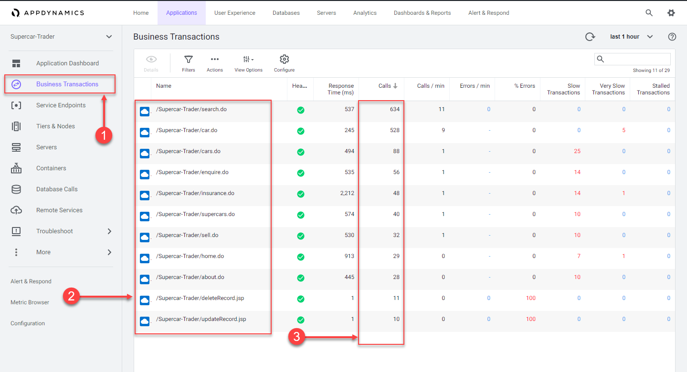

## Login to the Controller

Log into the [AppDynamics SE Lab Controller](https://se-lab.saas.appdynamics.com/controller/) using your Cisco credentials.

## Verify transaction load to the application

Check the application flow map:

1. Select the last 1 hour time frame.
2. Verify you see the five different Tiers on the flow map.
3. Verify there has been consistent load over the last 1 hour.


Check the list of business transactions:

1. Click the Business Transactions option on the left menu.
2. Verify you see the eleven business transactions seen below.
3. Verify that they have some number of calls during the last hour.

Note: If you don’t see the Calls column, you can click the View Options toolbar button to show that column.



Check the agent status for the Nodes:

1. Click the Tiers & Nodes option on the left menu.
2. Click Grid View.
3. Verify that the App Agent Status for each Node is greater than 90% during the last hour.


## Restart the application and transaction load if needed

If any of the checks you performed in the previous steps could not be verified, SSH into your Application VM and follow these steps to restart the application and transaction load. Ensure you have the IP address of your EC2 instance, username and password required to ssh into the instance. Open a terminal on your local machine and type the following:

``` bash
ssh -P 2222 [username]@http://[ec2-ip-address]
```

You will be prompted for the password.

Use the following command to stop the running instance of Apache Tomcat.

```bash
cd /usr/local/apache/apache-tomcat-9/bin
./shutdown.sh
```

Use the command below to check for remaining application JVMs still running.

```bash
ps -ef | grep Supercar-Trader
```

If you find any remaining application JVMs still running, kill the remaining JVMs using the command below.

```bash
sudo pkill -f Supercar-Trader
```

Use the following commands to stop the load generation for the application.

```bash
cd /opt/appdynamics/lab-artifacts/phantomjs
./stop_load.sh
```

You should see output similar to the following image.


Now use the following commands to start Apache Tomcat.

```bash
cd /usr/local/apache/apache-tomcat-9/bin
./startup.sh
```

Wait for two minutes and use the following command to ensure Apache Tomcat is running on port 8080.

```bash
sudo netstat -tulpn | grep LISTEN
```

You should see output similar to the following image showing that port 8080 is in use by Apache Tomcat.


Use the following commands to start the load generation for the application.

```bash
cd /opt/appdynamics/lab-artifacts/phantomjs
./start_load.sh
```

You should see output similar to the following image.


