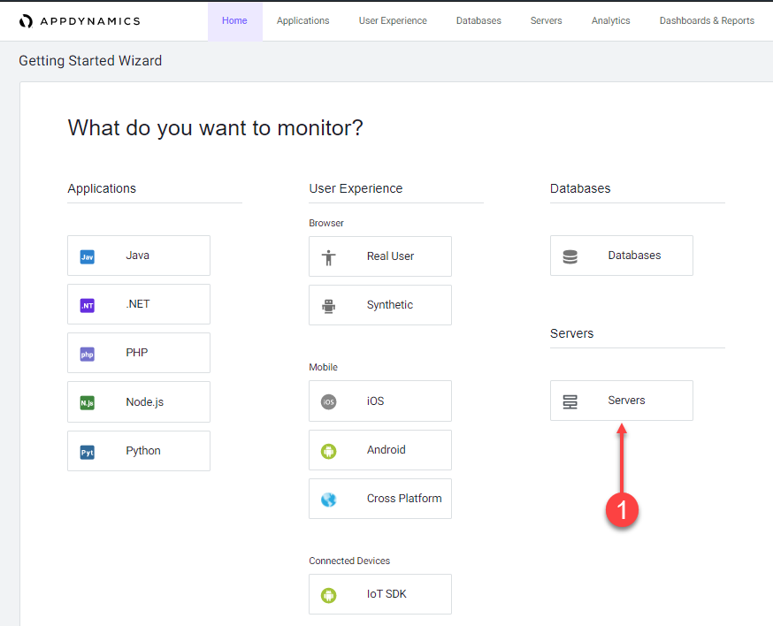

{}
This is a continuation of the Application Performance Monitoring lab. Verify that your application is running and has load for the past hour. If needed return to the generate-application-load section to restart the load generator. 
{}

Follow the steps seen below until you get to the Select the agent type for download section and if you do not see the Servers tile then you will need to use the Deploy Server Agent - Option 2 approach.

The advantage to using the Option 1 is that the agent will be pre-configured to connect to your controller VS using Option 2 will require that you edit the configuration of the agent to connect to the controller.

## Login to the Controller
Log into the [AppDynamics SE Lab Controller](https://se-lab.saas.appdynamics.com/controller/) using your Cisco credentials.

## Navigate to the Getting Started Wizard

1. Select the Home tab at the top left of the screen.
2. Select the Getting Started tab.
3. Click Getting Started Wizard.


## Select the agent type for download

1. Click on the Servers button.



## Download the Server Agent

1. Leave the Platform Bundle set to Linux and 64-bit.
2. Accept defaults for the Controller connection.
2. Click Click Here to Download.


Save the Server Visibility Agent file to your file local workstation.

Your browser should prompt you to save the agent file to your local file system, similar to the following image (depending on your OS).


## Upload Server Agent to Application VM

The process of uploading the Server agent file will vary depending on your workstation’s operating system. Copy the Server agent ZIP file either using SCP if your OS is MAC/Linux or using WinSCP if your OS is Window

## Install the Server Agent

Create the directory structure where you will unzip the Server agent zip file.

```bash
cd /opt/appdynamics
mkdir machineagent
```

Use the following commands to copy the Server Visibility agent zip file to the directory and unzip the file. The name of your Server Visibility agent file may be slightly different than the example below. (assumes you uploaded the zip file to the /tmp directory)

```bash
cp /tmp/machineagent-bundle-64bit-linux-20.4.0.2571.zip /opt/appdynamics/machineagent/
cd /opt/appdynamics/machineagent
unzip machineagent-bundle-64bit-linux-20.4.0.2571.zip
```

## Start the Server Visibility agent

Use the following commands to start the Server Visibility agent and verify that it started.

```bash
cd /opt/appdynamics/machineagent/bin
nohup ./machine-agent &
ps -ef | grep machine
``` 

You should see output similar to the following image.


