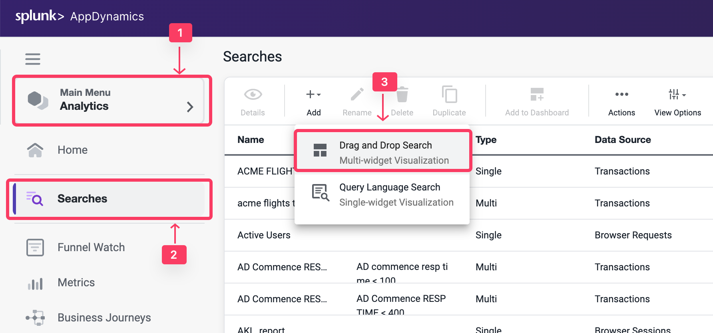

Data collectors enable you to supplement business transaction and transaction analytics data with application data. The application data can add context to business transaction performance issues. For example, they show the values of particular parameters or return value for business transactions affected by performance issues, such as the specific user, order, or product.

HTTP data collectors capture the URLs, parameter values, headers, and cookies of HTTP messages that are exchanged in a business transaction.

In this exercise you will perform the following tasks:

*   Enable all HTTP data collectors.
*   Observe and Select relevant HTTP data collectors.
*   Capture Business Data in Analytics using HTTP Params.
*   Validate Analytics on HTTP Parameters.

## Enable all HTTP data collectors

Initially, you can capture all HTTP data collectors to learn which useful parameters you can capture into Analytics and use it in your Dashboards

{}
It is strongly recommended that you perform this step on a UAT environment, not production.
{}

1. Select the **Applications** tab at the top left of the screen.
2. Select the **Supercar-Trader-YOURINITIALS** Application.
3. Select the **Configuration** Left tab.
4. Click on the **Instrumentation** Link.
5. Select the **Data Collectors** tab.
6. Click on the **Add** Button in the **HTTP Request Data Collectors**

You will now configure an HTTP data collector to capture all HTTP Parameters. You will only enable it on Transaction Snapshots to avoid any overheads until you identify the precise parameters that you need for Transaction Analytics

1. For the **Name**, specify **All HTTP Param**.
2. Under **Enable Data Collector for** check the box for **Transaction Snapshots**.
3. **Do not** enable Transaction Analytics.
4. Click on **\+ Add** in the HTTP Parameters section.
5. For the new Parameter, specify **All** as the Display Name
6. Then specify an asterisk **\*** in the HTTP Parameter name.
7. Click **Save** 

8. Click "Ok" to confirm the data collector.
9. Enable **/Supercar-Trader/sell.do** Transaction
10. Click **Save**

## Observe and Select Relevant HTTP Data Collectors

1. Apply load on the Application, specifically the **SellCar** transaction. Open one of its snapshots with Full Call Graph, and select the **Data Collectors Tab**.

You can now see all HTTP Parameters. You will see a number of key metrics, such as Car Price, Color, Year, and more.

2. Note the exact Parameter names to add them again in the **HTTP Parameters** list and enable them in Transaction Analytics.
3. Once they are added, delete the **All HTTP Param** HTTP data collector.

## Capture Business Data in Analytics with HTTP Params

You will now configure the HTTP data collector again, but this time you will capture only the useful HTTP Parameters and enable them in Transaction Analytics. Add a new HTTP Data Collector: Application -> Configuration -> Instrumentation -> Data Collector tab -> Click **Add** Under the **HTTP Request Data Collectors** section 

1. In the Name, specify **CarDetails**.
2. Enable **Transaction Snapshots**.
3. Enable **Transaction Analytics**.
4. Click **\+ Add** in the HTTP Parameters section.
5. For the new Parameter, specify **CarPrice\_http** as the Display Name
6. Then specify **carPrice** as the HTTP Parameter name.
7. Repeat for the rest of the Car Parameters as shown below.
8. Click **Save**
9. Click **Ok** to acknowledge the Data Collector implementation

10. Enable **/Supercar-Trader/sell.do** Transaction
11. Click **Save**

12. Delete the **All HTTP Param** Collector by Clicking on it, then click **Delete** button.

## Validate Analytics on HTTP Parameters

You will now validate whether the business data was captured by HTTP data collectors in AppDynamics Analytics.

1. Select the **Analytics** tab at the top left of the screen.
2. Select the **Searches** tab
3. Click the **+ Add** button and create a new **Drag and Drop Search**.

4. Click **+ Add Criteria** 
5. Select **Application** and Search For Your Application Name **Supercar-Trader-YOURINITIALS**
6. Under the **Fields** panel verify that the **Business Parameters** appear as a field in the Custom HTTP Request Data.
7. Check the box for **CarPrice_http** and Validate that the field has data.

