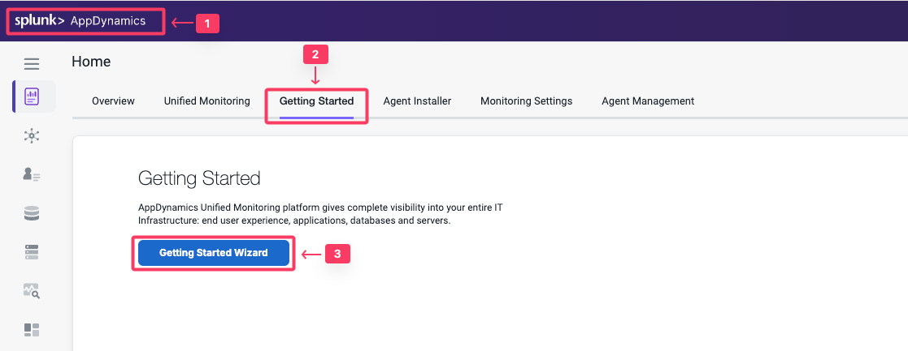

In this exercise you will access your AppDynamics Controller from your web browser and download the Database Visibility agent from there.

## Login to the Controller
Log into the [AppDynamics SE Lab Controller](https://se-lab.saas.appdynamics.com/controller/) using your Cisco credentials.

## Download the Database Agent

1. Select the Home tab at the top left of the screen.
2. Select the **Getting Started** tab.
3. Click **Getting Started Wizard**.

4. Click **Databases**.

## Download the Database Agent.

5. Select **MySQL** from the Select Database Type dropdown menu.
6. Accept the defaults for the Controller connection.
7. Click **Click Here to Download**.

Save the Database Visibility Agent file to your local file system.

Your browser should prompt you to save the agent file to your local file system, similar to the following image(depending on your OS).

