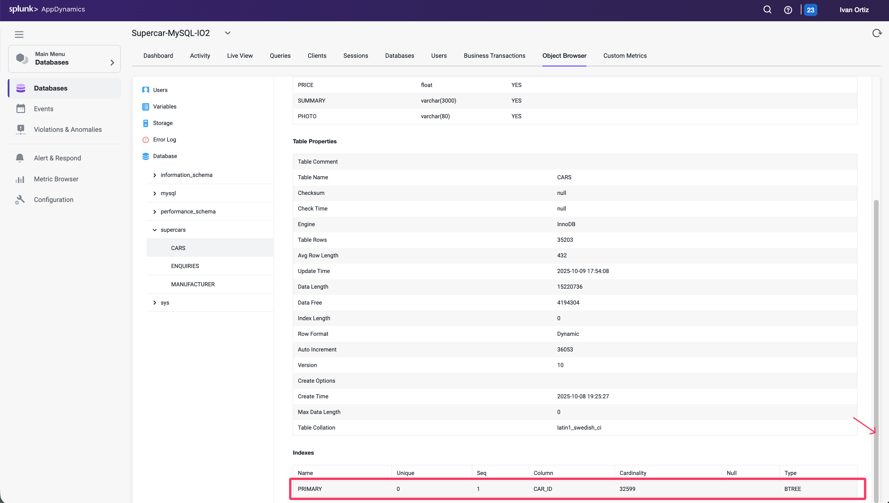

## Review the Queries Dashboard

The Queries window displays the SQL statements and stored procedures that consume the most time in the database. You can compare the query weights to other metrics such as SQL wait times to determine SQL that requires tuning.

1. **Queries** tab: Displays the queries window.
2. **Top Queries** dropdown: Displays the top 5, 10, 100 or 200 queries.
3. **Filter by Wait States**: Enables you to choose wait states to filter the Query list.
4. **Group Similar**: Groups together queries with the same syntax.
5. Click on the query that shows the largest **Weight (%)** used.
6. **View Query Details**: Drills into the query details.

## Review the details of an expensive query

Once you have identified the statements on the Database Queries window that are spending the most amount of time in the database, you can dig down deeper for details that can help you tune those SQL statements. The database instance Query Details window displays details about the query selected on the Database Queries window.

1. **Resource consumption over time**: Displays the amount of time the query spent in the database using resources, the number of executions, and the amount of CPU time consumed.
2. **Wait states**: The activities that contribute to the time it takes the database to service the selected SQL statement. The wait states consuming the most time may point to performance bottlenecks.
3. **Components Executing Similar Queries**: Displays the Nodes that execute queries similar to this query.
4. **Business Transactions Executing Similar Queries**: Displays the Java business transactions that execute queries similar to this query.

1. Use the outer scroll bar on the right to scroll down.
2. **Clients**: Displays the machines that executed the selected SQL statement and the percentage of the total time required to execute the statement performed by each machine.
3. **Sessions**: Session of each database instance usage
4. **Query Active in Database**: Displays the schemas that have been accessed by this SQL.
5. **Users**: Displays the users that executed this query.
6. **Query Hashcode**: Displays the unique ID for the query that allows the database server to more quickly locate this SQL statement in the cache.
7. **Query**: Displays the entire syntax of the selected SQL statement. You can click the pencil icon in the top right corner of the Query card to edit the query name so that it is easy to identify.
8. **Execution Plan**: Displays the the query execution plan window.

## Troubleshoot an expensive query

The Database Query Execution Plan window can help you to determine the most efficient execution plan for your queries. Once you’ve discovered a potentially problematic query, you can run the EXPLAIN PLAN statement to check the execution plan that the database created.

A query’s execution plan reveals whether the query is optimizing its use of indexes and executing efficiently. This information is useful for troubleshooting queries that are executing slowly.

1. Click on the **Execution Plan** tab
2. Notice that the join type in the **Type** column is ALL for each table.
3. Hover over one of the join types to see the description for the join type.
4. Examine the entries in the **Extras** column.
5. Hover over each of the entries to see the description for the entry.

Let’s investigate the indexes on the table using the Obect Browser next.

5. Click on the **Object Browser** option to view details of the schema for the tables
6. Click the **Database** option.
7. Click on the **supercars** schema to expand the list of tables.
8. Click on the **CARS** table to see the details of the table.
9. You can see that the CAR_ID column is defined as the primary key

10. Use the outer scroll bar to scroll down the page.
11. Notice the primary key index defined in the table.

12. Click on the **MANUFACTURER** table to view its details.
13. Notice the **MANUFACTURER_ID** column is not defined as a primary key.
14. Scroll down the page to see there are no indexes defined for the table.

The MANUFACTURER_ID column needs an index created for it to improve the performance of any queries on the table. If you analyzed a different query the underlying issue may be different but the most common issues shown in this lab come because the queries are either executing a join with the MANUFACTURER table or querying that table directly. 