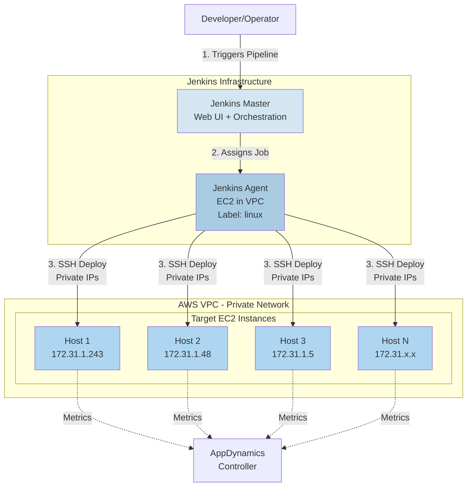
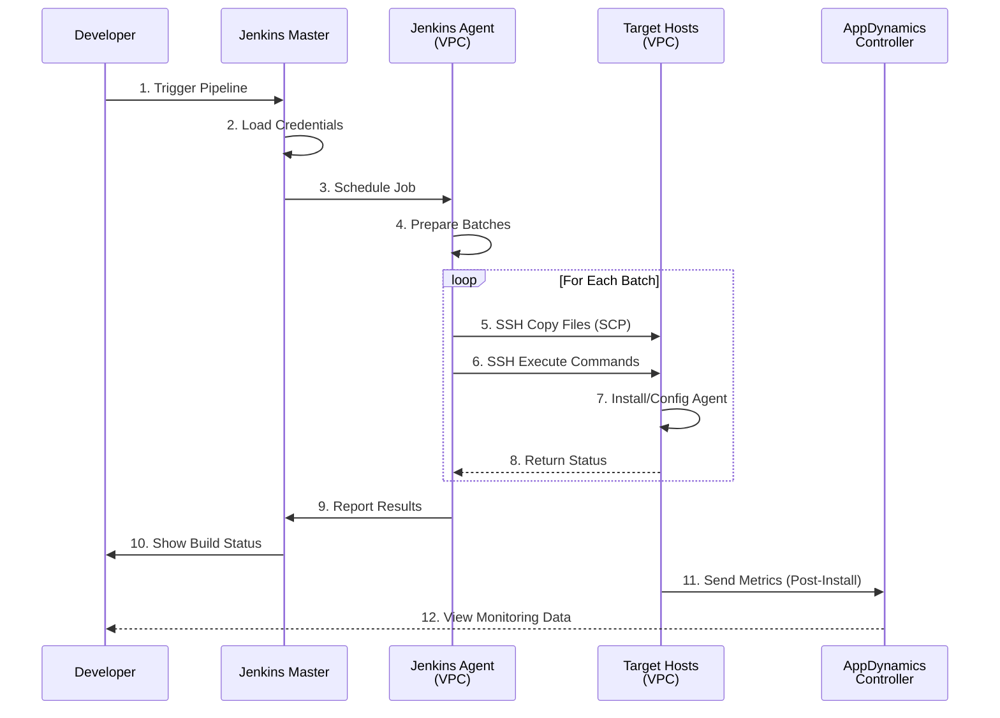
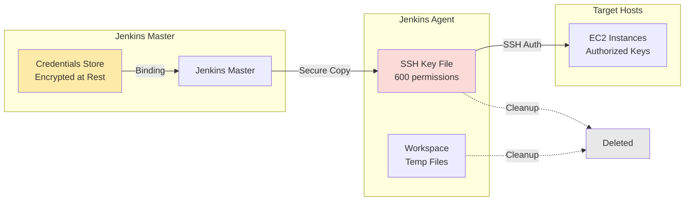

## System Architecture

The Jenkins-based Smart Agent deployment system uses a hub-and-spoke architecture where a Jenkins agent in your AWS VPC orchestrates deployments to multiple target hosts via SSH.

### High-Level Architecture



## Network Architecture

All infrastructure runs in a single AWS VPC with a shared security group. The Jenkins agent communicates with target hosts via private IPs, eliminating the need for public IP addresses on target hosts.

### VPC Layout

```
┌─────────────────────────────────────────────────────────────────┐
│                        AWS VPC (10.0.0.0/16)                    │
│  ┌───────────────────────────────────────────────────────────┐  │
│  │              Security Group: app-agents-sg                │  │
│  │  Rules:                                                   │  │
│  │  - Inbound: SSH (22) from Jenkins Agent only             │  │
│  │  - Outbound: HTTPS (443) to AppDynamics Controller       │  │
│  └───────────────────────────────────────────────────────────┘  │
│                                                                  │
│  ┌──────────────┐    ┌──────────────┐    ┌──────────────┐      │
│  │ Jenkins Agent│    │  Target EC2  │    │  Target EC2  │      │
│  │              │    │              │    │              │      │
│  │ Private IP:  │───▶│ Private IP:  │    │ Private IP:  │      │
│  │ 172.31.50.10 │SSH │ 172.31.1.243 │    │ 172.31.1.48  │      │
│  │              │───▶│              │    │              │      │
│  │ Label: linux │    │ Ubuntu 20.04 │    │ Ubuntu 20.04 │      │
│  └──────────────┘    └──────────────┘    └──────────────┘      │
│         │                    │                    │             │
│         │                    │                    │             │
│         └────────────────────┴────────────────────┘             │
│                              │                                  │
└──────────────────────────────┼──────────────────────────────────┘
                               │
                               ▼
                    ┌──────────────────┐
                    │   AppDynamics    │
                    │    Controller    │
                    │  (SaaS/On-Prem)  │
                    └──────────────────┘
```

## Deployment Flow

### Complete Deployment Sequence



## Component Details

### Jenkins Master

**Responsibilities:**
- Web UI for users
- Pipeline orchestration
- Credential management
- Build history & logs
- Job scheduling

**Requirements:**
- Jenkins 2.300+
- Plugins: Pipeline, SSH Agent, Credentials, Git
- Network access to agent

### Jenkins Agent

**Location:**
- AWS VPC (same as targets)
- Private network access

**Responsibilities:**
- Execute pipeline stages
- SSH to target hosts
- File transfers (SCP)
- Batching logic
- Error collection

**Requirements:**
- Label: `linux`
- Java 11+
- SSH client
- Network: SSH to all targets
- Disk: ~20GB for artifacts

### Target Hosts

**Pre-requisites:**
- Ubuntu 20.04+
- SSH server running
- User with sudo access
- Authorized SSH key

**Post-deployment:**
```
/opt/appdynamics/
└── appdsmartagent/
    ├── smartagentctl
    ├── config.ini
    └── agents/
        ├── machine/
        ├── java/
        ├── node/
        └── db/
```

## Security Architecture

### Security Layers

1. **AWS VPC Isolation**
   - Private subnet for agents
   - No direct internet access required
   - VPC flow logs enabled

2. **Security Groups**
   - Whitelist Jenkins Agent IP
   - Port 22 (SSH) only
   - Stateful firewall rules

3. **SSH Key Authentication**
   - No password authentication
   - Keys stored in Jenkins credentials
   - Temporary key files (600 perms)
   - Keys removed after each build

4. **Jenkins RBAC**
   - Role-based access control
   - Pipeline-level permissions
   - Credential access restrictions
   - Audit logging enabled

5. **Secrets Management**
   - No secrets in code/logs
   - Credentials binding only
   - Environment variable masking
   - Automatic secret rotation (optional)

### Credential Flow



## Batch Processing

The system uses automatic batching to support deployments at any scale. By default, hosts are processed in batches of 256, with all hosts within a batch deploying in parallel.

### How Batching Works

```
HOST LIST (1000 hosts)              BATCH_SIZE = 256

Host 001: 172.31.1.1                ┌──────────────────┐
Host 002: 172.31.1.2      ────────▶ │   BATCH 1        │
    ...                              │   Hosts 1-256    │ ───┐
Host 256: 172.31.1.256               │   Sequential     │    │
                                     └──────────────────┘    │
Host 257: 172.31.1.257               ┌──────────────────┐    │
Host 258: 172.31.1.258   ────────▶  │   BATCH 2        │    │ SEQUENTIAL
    ...                              │   Hosts 257-512  │    │ EXECUTION
Host 512: 172.31.1.512               │   Sequential     │    │
                                     └──────────────────┘    │
Host 513: 172.31.1.513               ┌──────────────────┐    │
    ...                              │   BATCH 3        │    │
Host 768: 172.31.1.768   ────────▶  │   Hosts 513-768  │ ───┘
                                     └──────────────────┘
Host 769: 172.31.1.769               ┌──────────────────┐
    ...                              │   BATCH 4        │
Host 1000: 172.31.2.232  ────────▶  │   Hosts 769-1000 │
                                     │   (232 hosts)    │
                                     └──────────────────┘

WITHIN EACH BATCH:
┌────────────────────────────────────────┐
│  All hosts deploy in PARALLEL          │
│                                        │
│  Host 1 ──┐                           │
│  Host 2 ──┤                           │
│  Host 3 ──┼─▶ Background processes (&)│
│    ...    │                           │
│  Host 256─┘   └─▶ wait command        │
└────────────────────────────────────────┘
```

### Scaling Characteristics

**Deployment Speed (default BATCH_SIZE=256):**
- 10 hosts → 1 batch → ~2 minutes
- 100 hosts → 1 batch → ~3 minutes
- 500 hosts → 2 batches → ~6 minutes
- 1,000 hosts → 4 batches → ~12 minutes
- 5,000 hosts → 20 batches → ~60 minutes

**Factors affecting speed:**
- Network bandwidth (19MB package per host)
- SSH connection overhead (~1s per host)
- Target host CPU/disk speed
- Jenkins agent resources

## Next Steps

Now that you understand the architecture, let's move on to setting up Jenkins and configuring credentials.
