In this section, we'll explore how to use the [**Count Connector**](https://github.com/open-telemetry/opentelemetry-collector-contrib/tree/main/connector/countconnector) to extract attribute values from logs and convert them into meaningful metrics.

Specifically, we'll use the Count Connector to track the number of "Star Wars" and "Lord of the Rings" quotes appearing in our logs, turning them into measurable data points.

{}

- Inside the `[WORKSHOP]` directory, create a new subdirectory named `9-sum-count`.
- Next, copy `*.yaml` from the `8-routing-data` directory into `9-sum-count`.
- Change **all** terminal windows to the `[WORKSHOP]/9-sum-count` directory.

```text { title="Updated Directory Structure" }
.
├── agent.yaml
└── gateway.yaml
```

- **Update the agent.yaml** to change the frequency that we read logs.
Find the `filelog/quotes` receiver in the `agent.yaml` and add a `poll_interval` attribute:

```yaml
  filelog/quotes:                      # Receiver Type/Name
    poll_interval: 10s                 # Only read every ten seconds 
```
  
{}

The reason for the delay is that the Count Connector in the OpenTelemetry Collector counts logs only within each processing interval. This means that every time the data is read, the count resets to zero for the next interval. With the default `Filelog reciever` interval of 200ms, it reads every line the loadgen writes, giving us counts of 1. With this interval we make sure we have multiple entries to count.

The Collector can maintain a running count for each read interval by omitting conditions, as shown below. However, it’s best practice to let your backend handle running counts since it can track them over a longer time period.

{}

- **Add the Count Connector**

Include the Count Connector in the connector's section of your configuration and define the metrics counters we want to use:

```yaml
connectors:
  count:
    logs:
      logs.full.count:
        description: "Running count of all logs read in interval"
      logs.sw.count:
        description: "StarWarsCount"
        conditions:
        - attributes["movie"] == "SW"
      logs.lotr.count:
        description: "LOTRCount"
        conditions:
        - attributes["movie"] == "LOTR"
      logs.error.count:
        description: "ErrorCount"
        conditions:
        - attributes["level"] == "ERROR"
```

- **Explanation of the Metrics Counters**

  - `logs.full.count`: Tracks the total number of logs processed during each read interval.  
  Since this metric has no filtering conditions, every log that passes through the system is included in the count. 
  - `logs.sw.count` Counts logs that contain a quote from a Star Wars movie.
  - `logs.lotr.count`: Counts logs that contain a quote from a Lord of the Rings movie.
  - `logs.error.count`: Represents a real-world scenario by counting logs with a severity level of ERROR for the read interval.

- **Configure the Count Connector in the pipelines**  
In the pipeline configuration below, the connector exporter is added to the `logs` section, while the connector receiver is added to the `metrics` section.

```yaml
  pipelines:
    traces:
      receivers:
      - otlp
      processors:
      - memory_limiter
      - attributes/update              # Update, hash, and remove attributes
      - redaction/redact               # Redact sensitive fields using regex
      - resourcedetection
      - resource/add_mode
      - batch
      exporters:
      - debug
      - file
      - otlphttp
    metrics:
      receivers:
      - count                           # Count Connector that receives count metric from logs count exporter in logs pipeline. 
      - otlp
      #- hostmetrics                    # Host Metrics Receiver
      processors:
      - memory_limiter
      - resourcedetection
      - resource/add_mode
      - batch
      exporters:
      - debug
      - otlphttp
    logs:
      receivers:
      - otlp
      - filelog/quotes
      processors:
      - memory_limiter
      - resourcedetection
      - resource/add_mode
      - transform/logs                 # Transform logs processor
      - batch
      exporters:
      - count                          # Count Connector that exports count as a metric to metrics pipeline.
      - debug
      - otlphttp
```

{}

We count logs based on their attributes. If your log data is stored in the log body instead of attributes, you’ll need to use a `Transform` processor in your pipeline to extract key/value pairs and add them as attributes.

In this workshop, we’ve already added `merge_maps(attributes, cache, "upsert")` in the `07-transform` section. This ensures that all relevant data is included in the log attributes for processing.

When selecting fields to create attributes from, be mindful—adding all fields indiscriminately is generally not ideal for production environments. Instead, choose only the fields that are truly necessary to avoid unnecessary data clutter.

{}

- **Validate** the agent configuration using **[otelbin.io](https://www.otelbin.io/)**. For reference, the `logs` and `metrics:` sections of your pipelines will look like this:

```mermaid
%%{init:{"fontFamily":"monospace"}}%%
graph LR
    %% Nodes
    REC1(otlp<br>fa:fa-download):::receiver
    REC2(filelog<br>fa:fa-download<br>quotes):::receiver
    REC3(otlp<br>fa:fa-download):::receiver
    PRO1(memory_limiter<br>fa:fa-microchip):::processor
    PRO2(memory_limiter<br>fa:fa-microchip):::processor
    PRO3(resource<br>fa:fa-microchip<br>add_mode):::processor
    PRO4(resource<br>fa:fa-microchip<br>add_mode):::processor
    PRO5(batch<br>fa:fa-microchip):::processor
    PRO6(batch<br>fa:fa-microchip):::processor
    PRO7(resourcedetection<br>fa:fa-microchip):::processor
    PRO8(resourcedetection<br>fa:fa-microchip):::processor
    PRO9(transfrom<br>fa:fa-microchip<br>logs):::processor
    EXP1(&nbsp;&ensp;debug&nbsp;&ensp;<br>fa:fa-upload):::exporter
    EXP2(&emsp;&emsp;otlphttp&emsp;&emsp;<br>fa:fa-upload):::exporter
    EXP3(&nbsp;&ensp;debug&nbsp;&ensp;<br>fa:fa-upload):::exporter
    EXP4(&emsp;&emsp;otlphttp&emsp;&emsp;<br>fa:fa-upload):::exporter
    ROUTE1(&nbsp;count&nbsp;<br>fa:fa-route):::con-export
    ROUTE2(&nbsp;count&nbsp;<br>fa:fa-route):::con-receive

    %% Links
    subID1:::sub-logs
    subID2:::sub-metrics
    subgraph " " 
      direction LR
      subgraph subID1[**Logs**]
      direction LR
      REC1 --> PRO1
      REC2 --> PRO1
      PRO1 --> PRO7
      PRO7 --> PRO3
      PRO3 --> PRO9
      PRO9 --> PRO5
      PRO5 --> ROUTE1
      PRO5 --> EXP1
      PRO5 --> EXP2
      end
      
      subgraph subID2[**Metrics**]
      direction LR
      ROUTE1 --> ROUTE2       
      ROUTE2 --> PRO2
      REC3 --> PRO2
      PRO2 --> PRO8
      PRO8 --> PRO4
      PRO4 --> PRO6
      PRO6 --> EXP3
      PRO6 --> EXP4
      end
    end
classDef receiver,exporter fill:#8b5cf6,stroke:#333,stroke-width:1px,color:#fff;
classDef processor fill:#6366f1,stroke:#333,stroke-width:1px,color:#fff;
classDef con-receive,con-export fill:#45c175,stroke:#333,stroke-width:1px,color:#fff;
classDef sub-logs stroke:#34d399,stroke-width:1px, color:#34d399,stroke-dasharray: 3 3;
classDef sub-metrics stroke:#38bdf8,stroke-width:1px, color:#38bdf8,stroke-dasharray: 3 3;
```



{}
