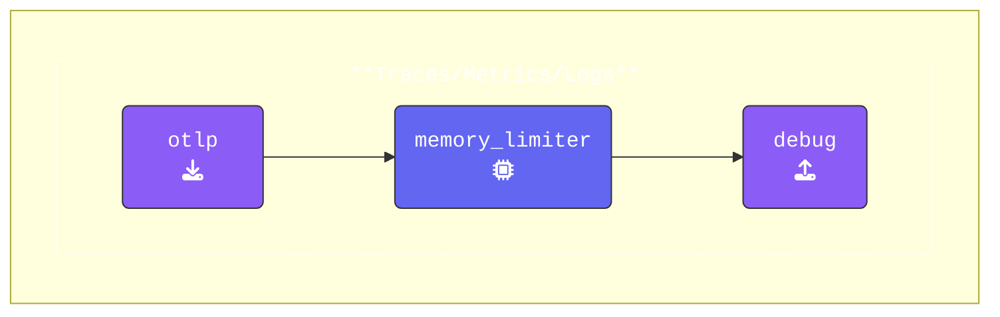

In this workshop, we’ll use [**otelbin.io**](https://otelbin.io) to quickly validate YAML syntax and ensure your OpenTelemetry configurations are accurate. This step helps avoid errors before running tests during the session.

Here’s how to validate your configuration:

1. Open **otelbin.io** and replace the existing configuration by pasting your YAML into the left pane.  
2. At the top of the page, make sure **Splunk OpenTelemetry Collector** is selected as the validation target.  
3. Once validated, refer to the image representation below to confirm your pipelines are set up correctly.  

In most cases, we’ll display only the **key pipeline**. However, if all three pipelines (Traces, Metrics, and Logs) share the same structure, we’ll note this instead of showing each one individually.

