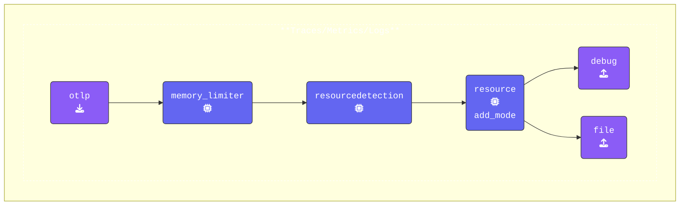

To capture more than just debug output on the screen, we also want to generate output during the export phase of the pipeline. For this, we'll add a **File Exporter** to write OTLP data to files for comparison.

The difference between the OpenTelemetry **debug exporter** and the **file exporter** lies in their purpose and output destination:

| Feature             | Debug Exporter                  | File Exporter                 |
|---------------------|---------------------------------|-------------------------------|
| **Output Location** | Console/Log                     | File on disk                  |
| **Purpose**         | Real-time debugging             | Persistent offline analysis   |
| **Best for**        | Quick inspection during testing | Temporary storage and sharing |
| **Production Use**  | No                              | Rare, but possible            |
| **Persistence**     | No                              | Yes                           |

In summary, the **Debug Exporter** is great for real-time, in-development troubleshooting, while the **File Exporter** is better suited for storing telemetry data locally for later use.

{}

Find your **Agent terminal** window, and stop the running collector by pressing `Ctrl-C`. Once the `agent` has stopped, open the `agent.yaml` and configure the **File Exporter**:

1. **Configuring a `file` exporter**: The [**File Exporter**](https://github.com/open-telemetry/opentelemetry-collector-contrib/blob/main/exporter/fileexporter/README.md) writes telemetry data to files on disk.

    ```yaml
      file:                           # Exporter Type
        path: "./agent.out"           # Save path (OTLP JSON)
        append: false                 # Overwrite the file each time
    ```

1. **Update the Pipelines Section**: Add the `file` exporter to the `traces` pipelines:

    ```yaml
      pipelines:
        traces:
          receivers:                  # Enable Receivers
          - otlp                      # OTLP Receiver
          processors:                 # Enable Processors
          - memory_limiter            # Memory Limiter processor
          - resourcedetection         # Add system attributes to the data
          - resource/add_mode         # Add collector mode metadata
          exporters:
          - debug                     # Debug Exporter
          - file                      # File Exporter
        metrics:
          receivers:
          - otlp
          processors:
          - memory_limiter
          - resourcedetection
          - resource/add_mode
          exporters:
          - debug
        logs:
          receivers:
          - otlp
          processors:
          - memory_limiter
          - resourcedetection
          - resource/add_mode
          exporters:
          - debug
    ```

{}

Validate the agent configuration using **[otelbin.io](https://www.otelbin.io/)**:


