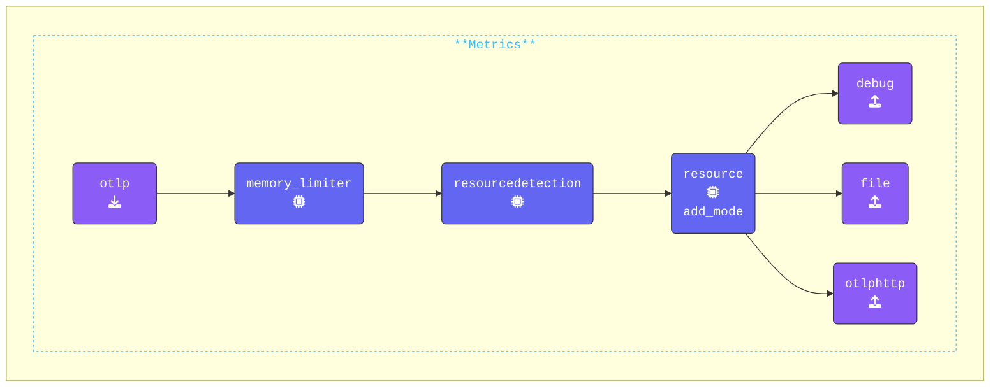

In this exercise, we will update the `extensions:` section of the `agent.yaml` file. This section is part of the OpenTelemetry configuration YAML and defines optional components that enhance or modify the OpenTelemetry Collector’s behavior.

While these components do not process telemetry data directly, they provide valuable capabilities and services to improve the Collector’s functionality.

{}

> [!IMPORTANT]
> **Change _ALL_ terminal windows to the `2-building-resilience` directory and run the `clear` command.**

Your directory structure will look like this:

```text { title="Updated Directory Structure" }
.
├── agent.yaml
└── gateway.yaml
```

**Update the `agent.yaml`**: In the **Agent terminal** window, add the `file_storage` extension under the existing `health_check` extension:

```yaml
  file_storage/checkpoint:             # Extension Type/Name
    directory: "./checkpoint-dir"      # Define directory
    create_directory: true             # Create directory
    timeout: 1s                        # Timeout for file operations
    compaction:                        # Compaction settings
      on_start: true                   # Start compaction at Collector startup
      # Define compaction directory
      directory: "./checkpoint-dir/tmp"
      max_transaction_size: 65536      # Max. size limit before compaction occurs
```

**Add `file_storage` to the exporter**: Modify the `otlphttp` exporter to configure retry and queuing mechanisms, ensuring data is retained and resent if failures occur. Add the following under the `endpoint: "http://localhost:5318"` and make sure the indentation matches `endpoint`:

```yaml
    retry_on_failure:
      enabled: true                    # Enable retry on failure
    sending_queue:                     # 
      enabled: true                    # Enable sending queue
      num_consumers: 10                # No. of consumers
      queue_size: 10000                # Max. queue size
      storage: file_storage/checkpoint # File storage extension
```

**Update the `services` section**: Add the `file_storage/checkpoint` extension to the existing `extensions:` section and the configuration needs to look like this:

```yaml
service:
  extensions:
  - health_check
  - file_storage/checkpoint            # Enabled extensions for this collector
```

**Update the `metrics` pipeline**: For this exercise we are going to comment out the `hostmetrics` receiver from the Metric pipeline to reduce debug and log noise, again the configuration needs to look like this:

```yaml
    metrics:
      receivers:
      # - hostmetrics                    # Hostmetric reciever (cpu only)
      - otlp
```

{}

Validate the **Agent** configuration using **[otelbin.io](https://www.otelbin.io/)**. For reference, the `metrics:` section of your pipelines will look similar to this:


