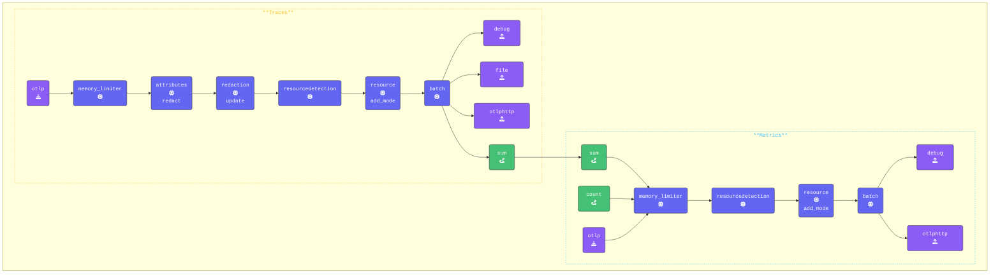

In this section, we’ll explore how the [**Sum Connector**](https://github.com/open-telemetry/opentelemetry-collector-contrib/tree/main/connector/sumconnector) can extract values from spans and convert them into metrics.  

We’ll specifically use the credit card charges from our base spans and leverage the Sum Connector to retrieve the total charges as a metric.

The connector can be used to collect (**sum**) attribute values from spans, span events, metrics, data points, and log records. It captures each individual value, transforms it into a metric, and passes it along. However, it’s the **backend’s** job to use these metrics and their attributes for calculations and further processing.

{}

Switch to your **Agent terminal** window and open the `agent.yaml` file in your editor.

- **Add the Sum Connector**  
Include the Sum Connector in the connectors section of your configuration and define the metrics counters:

```yaml
  sum:
    spans:
       user.card-charge:
        source_attribute: payment.amount
        conditions:
          - attributes["payment.amount"] != "NULL"
        attributes:
          - key: user.name
    
```

{}

In the example above, we check for the `payment.amount` attribute in spans. If it has a valid value, the **Sum** connector generates a metric called `user.card-charge` and includes the `user.name` as an attribute. This enables the backend to track and display a user’s total charges over an extended period, such as a billing cycle.

In the pipeline configuration below, the connector exporter is added to the traces section, while the connector receiver is added to the metrics section.

{}

- **Configure the Count Connector in the pipelines**

```yaml
  pipelines:
    traces:
      receivers:
      - otlp
      processors:
      - memory_limiter
      - attributes/update              # Update, hash, and remove attributes
      - redaction/redact               # Redact sensitive fields using regex
      - resourcedetection
      - resource/add_mode
      - batch
      exporters:
      - debug
      - file
      - otlphttp
      - sum                            # Sum connector which aggregates payment.amount from spans and sends to metrics pipeline
    metrics:
      receivers:
      - sum                            # Receives metrics from the sum exporter in the traces pipeline
      - count                          # Receives count metric from logs count exporter in logs pipeline. 
      - otlp
      #- hostmetrics                   # Host Metrics Receiver
      processors:
      - memory_limiter
      - resourcedetection
      - resource/add_mode
      - batch
      exporters:
      - debug
      - otlphttp
    logs:
      receivers:
      - otlp
      - filelog/quotes
      processors:
      - memory_limiter
      - resourcedetection
      - resource/add_mode
      - transform/logs                 # Transform logs processor
      - batch
      exporters:
      - count                          # Count Connector that exports count as a metric to metrics pipeline.
      - debug
      - otlphttp
```

- **Validate** the agent configuration using **[otelbin.io](https://www.otelbin.io/)**. For reference, the `traces` and `metrics:` sections of your pipelines will look like this:



{}
