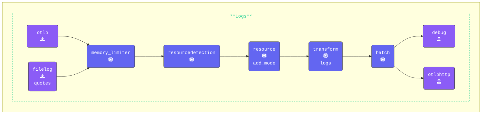

{}
**Add a `transform` processor**: Switch to your **Agent terminal** window and edit the `agent.yaml` and add the following `transform` processor:

```yaml
  transform/logs:                      # Processor Type/Name
    log_statements:                    # Log Processing Statements
      - context: resource              # Log Context
        statements:                    # List of attribute keys to keep
          - keep_keys(attributes, ["com.splunk.sourcetype", "host.name", "otelcol.service.mode"])
```

By using the `-context: resource` key we are targeting the `resourceLog` attributes of logs.

This configuration ensures that only the relevant resource attributes (`com.splunk.sourcetype`, `host.name`, `otelcol.service.mode`) are retained, improving log efficiency and reducing unnecessary metadata.

**Adding a Context Block for Log Severity Mapping**: To properly set the `severity_text` and `severity_number` fields of a log record, we add another log `context` block within `log_statements`.

This configuration extracts the `level` value from the log body, maps it to `severity_text`, and assigns the appropriate `severity_number`:

```yaml
      - context: log                   # Log Context
        statements:                    # Transform Statements Array
          - set(cache, ParseJSON(body)) where IsMatch(body, "^\\{")
          - flatten(cache, "")        
          - merge_maps(attributes, cache, "upsert")
          - set(severity_text, attributes["level"])
          - set(severity_number, 1) where severity_text == "TRACE"
          - set(severity_number, 5) where severity_text == "DEBUG"
          - set(severity_number, 9) where severity_text == "INFO"
          - set(severity_number, 13) where severity_text == "WARN"
          - set(severity_number, 17) where severity_text == "ERROR"
          - set(severity_number, 21) where severity_text == "FATAL"
```

**Summary of Key Transformations**:

- **Parse JSON**: Extracts structured data from the log body.
- **Flatten JSON**: Converts nested JSON objects into a flat structure.
- **Merge Attributes**: Integrates extracted data into log attributes.
- **Map Severity Text**: Assigns severity_text from the log’s level attribute.
- **Assign Severity Numbers**: Converts severity levels into standardized numerical values.

You should have a **single** `transform` processor containing two context blocks: one for `resource` and one for `log`.

This configuration ensures that log severity is correctly extracted, standardized, and structured for efficient processing.

{}
This method of mapping all JSON fields to top-level attributes should only be used for **testing and debugging OTTL**. It will result in high cardinality in a production scenario.
{}

**Update the `logs` pipeline**: Add the `transform/logs:` processor into the `logs:` pipeline:

```yaml
    logs:
      receivers:
      - otlp
      - filelog/quotes
      processors:
      - memory_limiter
      - resourcedetection
      - resource/add_mode
      - transform/logs                 # Transform logs processor
      - batch
      exporters:
      - debug
      - otlphttp
```

{}

Validate the agent configuration using [**https://otelbin.io**](https://.otelbin.io/). For reference, the `logs:` section of your pipelines will look similar to this:


