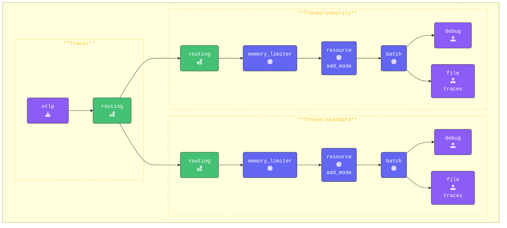

{}

**Add both the `standard` and `security` traces pipelines**:

1. **Add the Standard pipeline**: This pipeline processes all spans that do not match the routing rule.  
This pipeline is using `routing` as its receiver. Place it below the existing `traces:` pipeline, keeping its configuration unchanged for now:

    ```yaml
        traces/standard:              # Default pipeline for unmatched spans
          receivers: 
          - routing                   # Receive data from the routing connector
          processors:
          - memory_limiter            # Memory Limiter Processor
          - resource/add_mode         # Adds collector mode metadata
          - batch
          exporters:
          - debug                     # Debug exporter
          - file/traces/standard      # File exporter for unmatched spans
    ```

2. **Configure the Security pipeline**: This pipeline will handle all spans that match the routing rule.  
This also uses `routing` as its receiver. Add this below the Standard one:

    ```yaml
        traces/security:              # New Security Traces/Spans Pipeline
          receivers: 
          - routing                   # Routing Connector, Only receives data from Connector
          processors:
          - memory_limiter            # Memory Limiter Processor
          - resource/add_mode         # Adds collector mode metadata
          - batch
          exporters:
          - debug                     # Debug Exporter 
          - file/traces/security      # File Exporter for spans matching rule
    ```

**Update the `traces` pipeline to use routing**:

1. To enable `routing`, update the original `traces:` pipeline by using `routing` as the only exporter.  
This ensures all span data is sent through the routing connector for evaluation.
2. Remove all processors and replace it with an empty array (`[]`). These are now defined in the `traces/standard` and `traces/security` pipelines.

    ```yaml
      pipelines:
        traces:                           # Original traces pipeline
          receivers: 
          - otlp                          # OTLP Receiver
          processors: []
          exporters: 
          - routing                       # Routing Connector
    ```

{}

Validate the agent configuration using **[otelbin.io](https://www.otelbin.io/)**. For reference, the `traces:` section of your pipelines will look similar to this:



Lets' test our configuration!
