In this section, we will explore how we can use the [**Sum Connector**](https://github.com/open-telemetry/opentelemetry-collector-contrib/tree/main/connector/sumconnector) to retrieve values from the spans and turn them in to metrics.

In this section we will use the credit card charge that are part of our base spans with the sum connector to metricize the total charges.

{}

- **Add and configure the Sum Connector**

Include the Sum Connector in the connectors section of your configuration and define the metrics counters:

```yaml
  sum:
    spans:
       user-card-total:
        source_attribute: payment.amount
        conditions:
          - attributes["payment.amount"] != "NULL"
        attributes:
          - key: user.name
```

TBD

- **Explanation of the Metrics Counters**

  - `logs.full.count`: Tracks the total number of logs processed during each interval
  - `logs.sw.count` Counts logs that contain a quote from a Star Wars movie.
  - `logs.lotr.count`: Counts logs that contain a quote from a Lord of the Rings movie.
  - `logs.error.count`: Represents a real-world scenario by counting logs with a severity level of ERROR.

{}

We count logs based on their attributes. If your log data is stored in the log body instead of attributes, you’ll need to use a Transform processor in your pipeline to extract key/value pairs and add them as attributes.

In this workshop, we’ve already included `merge_maps(attributes, cache, "upsert")` in the Transform section. This ensures that all relevant data is available in the log attributes for processing.

{}

- **Validate** the agent configuration using **[otelbin.io](https://www.otelbin.io/)**. For reference, the `logs` and `metrics:` sections of your pipelines will look like this:

```mermaid
%%{init:{"fontFamily":"monospace"}}%%
graph LR
    %% Nodes
    REC1(otlp<br>fa:fa-download):::receiver
    REC2(filelog<br>fa:fa-download<br>quotes):::receiver
    REC3(otlp<br>fa:fa-download):::receiver
    PRO1(memory_limiter<br>fa:fa-microchip):::processor
    PRO2(memory_limiter<br>fa:fa-microchip):::processor
    PRO3(resource<br>fa:fa-microchip<br>add_mode):::processor
    PRO4(resource<br>fa:fa-microchip<br>add_mode):::processor
    PRO5(batch<br>fa:fa-microchip):::processor
    PRO6(batch<br>fa:fa-microchip):::processor
    PRO7(resourcedetection<br>fa:fa-microchip):::processor
    PRO8(resourcedetection<br>fa:fa-microchip):::processor
    PRO9(transfrom<br>fa:fa-microchip<br>logs):::processor
    EXP1(&nbsp;&ensp;debug&nbsp;&ensp;<br>fa:fa-upload):::exporter
    EXP2(&emsp;&emsp;otlphttp&emsp;&emsp;<br>fa:fa-upload):::exporter
    EXP3(&nbsp;&ensp;debug&nbsp;&ensp;<br>fa:fa-upload):::exporter
    EXP4(&emsp;&emsp;otlphttp&emsp;&emsp;<br>fa:fa-upload):::exporter
    ROUTE1(&nbsp;count&nbsp;<br>fa:fa-route):::con-export
    ROUTE2(&nbsp;count&nbsp;<br>fa:fa-route):::con-receive

    %% Links
    subID1:::sub-logs
    subID2:::sub-metrics
    subgraph " " 
      direction LR
      subgraph subID1[**Logs**]
      direction LR
      REC1 --> PRO1
      REC2 --> PRO1
      PRO1 --> PRO7
      PRO7 --> PRO3
      PRO3 --> PRO9
      PRO9 --> PRO5
      PRO5 --> ROUTE1
      PRO5 --> EXP1
      PRO5 --> EXP2
      end
      
      subgraph subID2[**Metrics**]
      direction LR
      ROUTE1 --> ROUTE2       
      ROUTE2 --> PRO2
      REC3 --> PRO2
      PRO2 --> PRO8
      PRO8 --> PRO4
      PRO4 --> PRO6
      PRO6 --> EXP3
      PRO6 --> EXP4
      end
    end
classDef receiver,exporter fill:#8b5cf6,stroke:#333,stroke-width:1px,color:#fff;
classDef processor fill:#6366f1,stroke:#333,stroke-width:1px,color:#fff;
classDef con-receive,con-export fill:#45c175,stroke:#333,stroke-width:1px,color:#fff;
classDef sub-logs stroke:#34d399,stroke-width:1px, color:#34d399,stroke-dasharray: 3 3;
classDef sub-metrics stroke:#38bdf8,stroke-width:1px, color:#38bdf8,stroke-dasharray: 3 3;
```



{}
