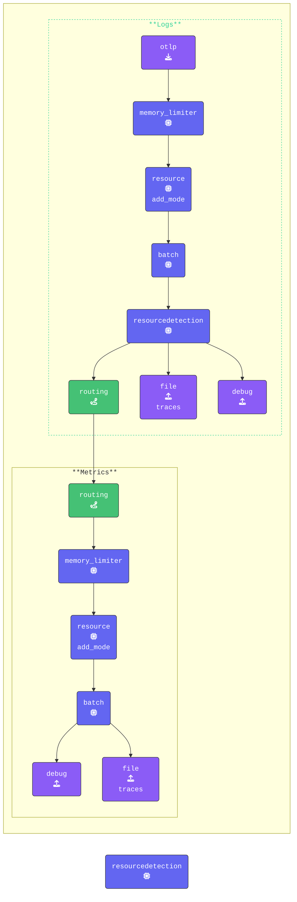

In this section, we will explore how we can use the [**Count**](https://github.com/open-telemetry/opentelemetry-collector-contrib/tree/main/connector/countconnector) and [**Sum**](https://github.com/open-telemetry/opentelemetry-collector-contrib/tree/main/connector/sumconnector) Connectors to count attribute values from the logs and retrieve values from spans and turn them in to metrics.

In this section we will use the count connector to count the number of Star Wars or Lord of the Rings quotes provided by our logs.

{}

- Inside the `[WORKSHOP]` directory, create a new subdirectory named `9-sum-count`.
- Next, copy all contents from the `8-routing-data` directory into `9-sum-count`.
- After copying, remove any `*.out` and `*.log` files.
- Change **all** terminal windows to the `[WORKSHOP]/9-sum-count` directory.

```text { title="Updated Directory Structure" }
[WORKSHOP]
└── 9-sum-count
    ├── agent.yaml
    └── gateway.yaml
```

- **Update the agent.yaml** to change the frequency that we read logs.
Find the `filelog/quotes` receiver in the agent.yaml and add a poll_interval attribute:

```yaml
  filelog/quotes:                      # Receiver Type/Name
    poll_interval: 10s                 # Only read every ten seconds 
```
  
{}

The reason for the delay is that the Count Connector in the OpenTelemetry Collector counts logs only within each processing interval. This means that every time the data is read, the count resets to zero for the next interval. With the default `Filelog reciever` interval of 200ms it reads every line the loadgen writes, giving us counts of 1. With this interval we make sure we have multiple entries to count.

{}

- **Add and configure the Count Connector**

Include the Count Connector in the connectors section of your configuration and define the metrics counters:

```yaml
  count:
    logs:
      logs.full.count:
        description: "FullCount"
      logs.sw.count:
        description: "StarWarsCount"
        conditions:
        - attributes["movie"] == "SW"
      logs.lotr.count:
        description: "LOTRCount"
        conditions:
        - attributes["movie"] == "LOTR"
      logs.error.count:
        description: "ErrorCount"
        conditions:
        - attributes["level"] == "ERROR"
```

- **Explanation of the Metrics Counters**

  - `logs.full.count`: Tracks the total number of logs processed during each interval
  - `logs.sw.count` Counts logs that contain a quote from a Star Wars movie.
  - `logs.lotr.count`: Counts logs that contain a quote from a Lord of the Rings movie.
  - `logs.error.count`: Represents a real-world scenario by counting logs with a severity level of ERROR.

{}

We count logs based on their attributes. If your log data is stored in the log body instead of attributes, you’ll need to use a Transform processor in your pipeline to extract key/value pairs and add them as attributes.

In this workshop, we’ve already included `merge_maps(attributes, cache, "upsert")` in the Transform section. This ensures that all relevant data is available in the log attributes for processing.

Validate the agent configuration using **[otelbin.io](https://www.otelbin.io/)**. For reference, the `metrics:` section of your pipelines will look similar to this:




