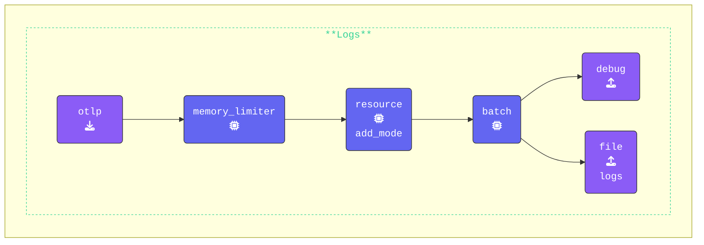

The configuration for the `gateway` does not need any additional configuration changes to function. This has been done to save time and focus on the core concepts of the **Gateway**.

Validate the `gateway` configuration using **[otelbin.io](https://www.otelbin.io/)**. For reference, the `logs:` section of your pipelines will look similar to this:



{}

**Start the Gateway**:

1. Find your **Gateway terminal** window.
2. Navigate to the`[WORKSHOP]/2-gateway` directory.
3. Run the following command to start the `gateway`:

```sh {title="Gateway"}
../otelcol --config=gateway.yaml
```

If everything is configured correctly, the first and last lines of the output should look like:

```text
2025/01/15 15:33:53 settings.go:478: Set config to [gateway.yaml]
<snip to the end>
2025-01-13T12:43:51.747+0100 info service@v0.116.0/service.go:261 Everything is ready. Begin running and processing data.
```

{}

Next, we will configure the `agent` to send data to the newly created `gateway`.
