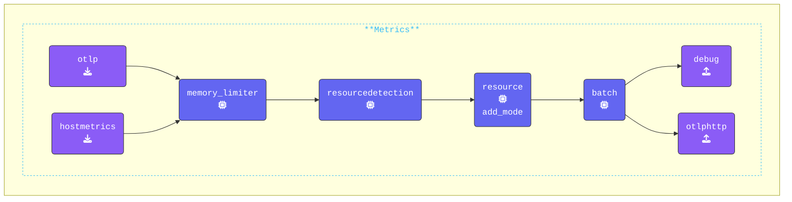

{}

**Update `agent.yaml`**:

1. Switch to your **Agent terminal** window.
2. Make sure you are in the `[WORKSHOP]/2-gateway` directory.
3. Open the `agent.yaml` file that you copied earlier in your editor.

**Add the `otlphttp` exporter**:

1. The [**OTLP/HTTP Exporter**](https://docs.splunk.com/observability/en/gdi/opentelemetry/components/otlphttp-exporter.html) is used to send data from the agent to the gateway using the OTLP/HTTP protocol. This is now the preferred method for exporting data to Splunk Observability Cloud (more details in section 2.5 Addendum).
2. Ensure the `endpoint` is set to the gateway endpoint and port number.
<!--
3. Add the `X-SF-Token` header with a random value. During this workshop, you can use **any** value for `X-SF-TOKEN`. However, if you are connecting to Splunk Observability Cloud, this is where you will need to enter your Splunk Access Token (more details in Section 2.5 Addendum).
-->

```yaml
  otlphttp:                           # Exporter Type
    endpoint: "http://localhost:5318" # Gateway OTLP endpoint
```

**Add a Batch Processor configuration**: Use the [**Batch Processor**](https://github.com/open-telemetry/opentelemetry-collector/blob/main/processor/batchprocessor/README.md). It will accept spans, metrics, or logs and places them into batches. Batching helps better compress the data and reduce the number of outgoing connections required to transmit the data. It is highly recommended configuring the batch processor on every collector.

```yaml
  batch:                          # Processor Type
```

**Update the pipelines**:

1. Add `hostmetrics` to the `metrics` pipeline. The [**HostMetrics Receiver**](https://github.com/open-telemetry/opentelemetry-collector-contrib/tree/main/receiver/hostmetricsreceiver#readme) will generate host CPU metrics once per hour with the current configuration.
2. Add the `batch` processor after the `resource/add_mode` processor in the `traces`, `metrics`, and `logs` pipelines.
3. Replace the `file` exporter with the `otlphttp` exporter in the `traces`, `metrics`, and `logs` pipelines.

```yaml
  pipelines:                        # Array of configured pipelines
    traces:
      receivers: 
      - otlp                        # OTLP Receiver
      processors:
      - memory_limiter              # Memory Limiter Processor
      - resourcedetection           # System attributes metadata
      - resource/add_mode           # Collector mode metadata
      - batch                       # Batch Processor, groups data before send
      exporters:
      - debug                       # Debug Exporter 
      - otlphttp                    # OTLP/HTTP Exporter
    metrics:
      receivers: 
      - otlp                        # OTLP Receiver
      - hostmetrics                 # Hostmetrics Receiver
      processors:
      - memory_limiter              # Memory Limiter Processor
      - resourcedetection           # System attributes metadata
      - resource/add_mode           # Collector mode metadata
      - batch                       # Batch Processor, groups data before send
      exporters:
      - debug                       # Debug Exporter 
      - otlphttp                    # OTLP/HTTP Exporter
    logs:
      receivers: 
      - otlp                        # OTLP Receiver
      processors:
      - memory_limiter              # Memory Limiter Processor
      - resourcedetection           # System attributes metadata
      - resource/add_mode           # Collector mode metadata
      - batch                       # Batch Processor, groups data before send
      exporters:
      - debug                       # Debug Exporter 
      - otlphttp                    # OTLP/HTTP Exporter
```

{}

Validate the agent configuration using **[otelbin.io](https://www.otelbin.io/)**. For reference, the `metrics:` section of your pipelines will look similar to this:


