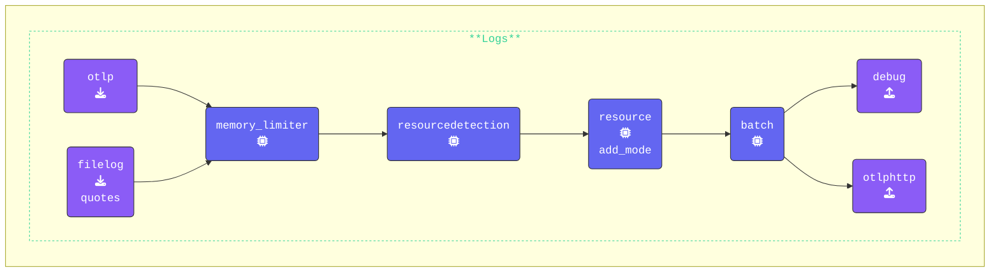

{}
Move to the **Agent** terminal window and change into the `[WORKSHOP]/3-filelog` directory.  Open the `agent.yaml` copied across earlier and in your editor add the `filelog` receiver to the `agent.yaml`.

**Create the `filelog` receiver and name it `quotes`**: The **FileLog** receiver reads log data from a file and includes custom resource attributes in the log data:

```yaml
  filelog/quotes:                      # Receiver Type/Name
    include: ./quotes.log              # The file to read log data from
    include_file_path: true            # Include file path in the log data
    include_file_name: false           # Exclude file name from the log data
    resource:                          # Add custom resource attributes
      com.splunk.source: ./quotes.log  # Source of the log data
      com.splunk.sourcetype: quotes    # Source type of the log data
```

**Add `filelog/quotes` receiver**: In the `logs:` pipeline only, add the `filelog/quotes:` receiver.

```yaml
    logs:
      receivers:
      - otlp                      # OTLP Receiver
      - filelog/quotes            # Filelog Receiver reading quotes.log
      processors:
      - memory_limiter            # Memory Limiter Processor
      - resourcedetection         # Adds system attributes to the data
      - resource/add_mode         # Adds collector mode metadata
      - batch                     # Batch Processor, groups data before send
      exporters:
      - debug                     # Debug Exporter
      - otlphttp                  # OTLP/HTTP EXporter
```

{}

Validate the agent configuration using **[otelbin.io](https://www.otelbin.io/)**. For reference, the `logs:` section of your pipelines will look similar to this:


