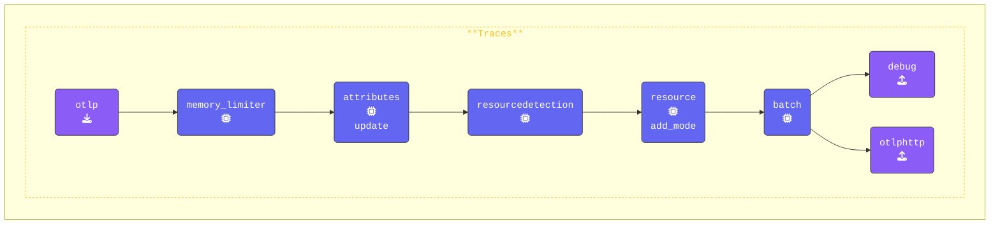

In this step, we'll modify `agent.yaml` to include the `attributes` and `redaction` processors. These processors will help ensure that sensitive data within span attributes is properly handled before being logged or exported.

Previously, you may have noticed that some span attributes displayed in the console contained personal and sensitive data. We'll now configure the necessary processors to filter out and redact this information effectively.

```text
<snip>
Attributes:
     -> user.name: Str(George Lucas)
     -> user.phone_number: Str(+1555-867-5309)
     -> user.email: Str(george@deathstar.email)
     -> user.account_password: Str(LOTR>StarWars1-2-3)
     -> user.visa: Str(4111 1111 1111 1111)
     -> user.amex: Str(3782 822463 10005)
     -> user.mastercard: Str(5555 5555 5555 4444)
  {"kind": "exporter", "data_type": "traces", "name": "debug"}
```

{}

Switch to your **Agent terminal** window. Navigate to the `[WORKSHOP]/6-sensitive-data` directory and open the `agent.yaml` file in your editor.

**Add an `attributes` Processor**: The [**Attributes Processor**](https://github.com/open-telemetry/opentelemetry-collector-contrib/tree/main/processor/attributesprocessor) allows you to update, delete, or hash specific attributes (tags) within spans.  
We'll **update** the `user.phone_number`, **hash** the `user.email`, and **delete** the `user.account_password`:

```yaml
  attributes/update:               # Processor Type/Name
    actions:                       # List of actions
      - key: user.phone_number     # Target key
        action: update             # Replace value with "UNKNOWN NUMBER"
        value: "UNKNOWN NUMBER"
      - key: user.email            # Hash the email value
        action: hash               
      - key: user.account_password # Remove the password
        action: delete
  ```

**Add a `redaction` Processor**: [**The Redaction Processor**](https://github.com/open-telemetry/opentelemetry-collector-contrib/tree/main/processor/redactionprocessor) will detect and redact sensitive data values based on predefined patterns. We'll block credit card numbers using regular expressions.

```yaml
  redaction/redact:               # Processor Type/Name
    allow_all_keys: true          # If false, only allowed keys will be retained
    blocked_values:               # List of regex patterns to hash
      - '\b4[0-9]{3}[\s-]?[0-9]{4}[\s-]?[0-9]{4}[\s-]?[0-9]{4}\b'  # Visa card
      - '\b5[1-5][0-9]{2}[\s-]?[0-9]{4}[\s-]?[0-9]{4}[\s-]?[0-9]{4}\b'  # MasterCard
    summary: debug  # Show debug details about redaction
```

**Update the `traces` Pipeline**: Integrate both processors into the `traces` pipeline. Make sure that you comment out the redaction processor at first: (We will enable it later)

```yaml
    traces:
      receivers:
      - otlp                      # OTLP Receiver
      processors:
      - memory_limiter            # Manage memory usage
      - attributes/update         # Update, hash, and remove attributes
      #- redaction/redact          # Redact sensitive fields using regex
      - resourcedetection         # Add system attributes
      - resource/add_mode         # Add metadata about collector mode
      - batch                     # Batch Processor, groups data before send
      exporters:
      - debug                     # Debug Exporter
      - otlphttp                  # OTLP/HTTP EXporter used by Splunk O11Y 
```

{}

Validate the agent configuration using **[otelbin.io](https://www.otelbin.io/)**. For reference, the `traces:` section of your pipelines will look similar to this:


