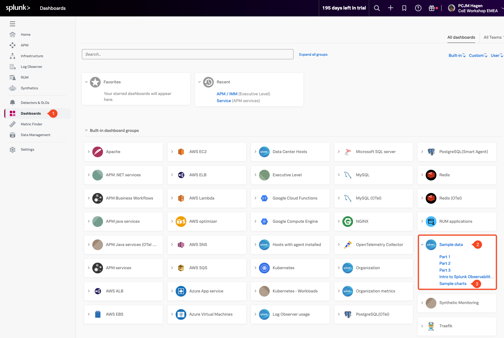

## 1. Dashboards

Dashboards are collections of charts and visualizations that display key metrics in one place. A well-designed dashboard gives you quick, actionable insights into the health and performance of your system. They can be as simple or as detailed as needed—ranging from a few focused charts to complex views across multiple services.

In this module, you’ll build several charts and bring them together into the following custom dashboard.

---

## 2. Accessing Dashboards

To begin, let’s locate the dashboards in Splunk Observability suite.

Click the **Dashboards (1)** button in the left-hand navigation menu. If the menu is collapsed, you can expand it by clicking the hamburger icon in the top-left corner of the screen.

This will take you to the main Dashboard view, where you’ll see all available dashboards—including the pre-built ones provided by Splunk Observability.

If your organization is already ingesting data from a Cloud API integration or through the Splunk OpenTelemetry Agent, you may also see additional dashboards relevant to those services.

