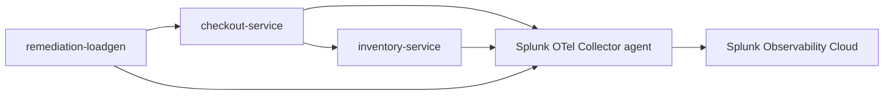

The lab application is a small checkout workflow designed for this workshop. It is intentionally smaller than the OpenTelemetry Demo or PetClinic so students can understand the failure mode quickly.

The source lives in `workshop/ai-troubleshooting-remediation`.



| Component | Purpose |
|-----------|---------|
| `checkout-service` | Receives `/checkout` requests and calls `inventory-service`. |
| `inventory-service` | Reserves inventory and contains the injectable issue. |
| `remediation-loadgen` | Sends steady traffic so APM has traces and service metrics. |
| Splunk OpenTelemetry Collector | Collects Kubernetes infrastructure telemetry, logs, and OTLP traces. |

The app supports two issue modes:

| Mode | What happens | Best alert type |
|------|--------------|-----------------|
| `latency-errors` | `inventory-service` sleeps and fails a percentage of requests. `checkout-service` becomes slow and returns errors. | APM service latency or error-rate alert. |
| `crashloop` | `inventory-service` exits at startup, causing Kubernetes restarts. | Kubernetes pod restart, unavailable workload, or crash-loop alert. |
| `healthy` | Services respond normally. | Used for remediation. |

{}

* Clone or open this repository on the machine where you will run the workshop commands.
* Change into the lab app directory:

```bash
cd workshop/ai-troubleshooting-remediation
```

* Review the directory structure:

```bash
find . -maxdepth 3 -type f | sort
```

* Open these files and identify where telemetry and issue modes are configured:
  * `app/checkout_service.py`
  * `app/inventory_service.py`
  * `k8s/app.yaml`
  * `scripts/inject-issue.sh`


{}
**Why does this workshop use Kubernetes even for local laptop deployment?**
{}
{}
**The feature supports APM service alerts and Kubernetes Infrastructure Monitoring alerts. Running the app in Kubernetes lets students practice both supported alert paths with the same sample app.**
{}


{}
