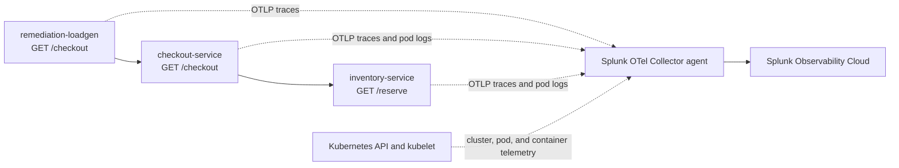

The lab application is a small checkout workflow designed for this workshop. It is intentionally smaller than the OpenTelemetry Demo or PetClinic so students can understand the failure mode quickly.

The source lives in `workshop/ai-troubleshooting-remediation`.

## What the App Does

The app models one customer-facing action: a shopper submits a checkout request and the checkout service reserves inventory before accepting the order. The workflow has three running components:

1. `remediation-loadgen` sends one checkout request about every second.
2. `checkout-service` receives `/checkout` requests, chooses a cart type and product SKU, then calls `inventory-service`.
3. `inventory-service` receives `/reserve` requests and either reserves inventory normally or behaves badly when an issue mode is enabled.



Component roles:

- `checkout-service`: FastAPI service that receives `/checkout` requests, creates checkout context, and calls `inventory-service`.
- `inventory-service`: FastAPI service that reserves inventory and contains the injectable latency, error, and crash-loop behavior.
- `remediation-loadgen`: Python process that sends steady traffic so APM has traces and service metrics before, during, and after the incident.
- Splunk OpenTelemetry Collector: Kubernetes agent that receives OTLP traces from the app and collects pod logs, Kubernetes events, and infrastructure metrics.

## How Instrumentation Is Added

The app intentionally shows both OpenTelemetry automatic instrumentation and small custom instrumentation additions. Automatic instrumentation creates the baseline service map, request spans, and dependency spans. Custom instrumentation adds the domain-specific attributes that make the traces useful during an incident.

### Auto Instrumentation Example

The container image installs OpenTelemetry packages for FastAPI, outbound HTTP requests, logging, and OTLP export:

```text
opentelemetry-distro
opentelemetry-exporter-otlp
opentelemetry-instrumentation-fastapi
opentelemetry-instrumentation-requests
opentelemetry-instrumentation-logging
```

During the Docker build, the image runs:

```dockerfile
RUN opentelemetry-bootstrap -a install
```

That command installs the instrumentation dependencies detected for the Python application. At runtime, Kubernetes starts each app process through the OpenTelemetry launcher:

```yaml
command:
  - opentelemetry-instrument
  - uvicorn
  - checkout_service:app
```

The same pattern is used for `inventory-service`, and the load generator starts with:

```yaml
command:
  - opentelemetry-instrument
  - python
  - loadgen.py
```

This automatic instrumentation creates spans for inbound FastAPI requests and outbound `requests` calls. The `tracecontext` propagator keeps the load generator, checkout service, and inventory service in one distributed trace without adding manual trace propagation code.

The Kubernetes manifest supplies the service identity and export path:

- `OTEL_SERVICE_NAME` names each APM service as `checkout-service`, `inventory-service`, or `remediation-loadgen`.
- `OTEL_RESOURCE_ATTRIBUTES` adds `deployment.environment=ai-remediation-workshop`, `service.version=1.0.0`, and `app.workshop=ai-troubleshooting-remediation` for filtering and correlation.
- `OTEL_EXPORTER_OTLP_ENDPOINT=http://$(NODE_IP):4317` sends telemetry to the node-local Splunk OpenTelemetry Collector agent.
- `OTEL_EXPORTER_OTLP_PROTOCOL=grpc` uses the OTLP gRPC receiver exposed by the collector agent.

### Custom Instrumentation Example

Automatic instrumentation explains that a request was slow or failed. Custom instrumentation explains what the request was doing when that happened.

In `checkout_service.py`, the service gets the current request span, adds business context, and creates a child span around the inventory dependency call:

```python
span = trace.get_current_span()
span.set_attribute("app.cart.type", cart)
span.set_attribute("app.cart.value", cart_value)
span.set_attribute("app.sku", sku)
span.set_attribute("service.version", SERVICE_VERSION)

with tracer.start_as_current_span("checkout.reserve_inventory") as reserve_span:
    reserve_span.set_attribute("app.sku", sku)
    reserve_span.set_attribute("app.quantity", quantity)
```

When the inventory call fails, the code records the exception and marks the span as an error:

```python
reserve_span.record_exception(exc)
reserve_span.set_status(Status(StatusCode.ERROR, str(exc)))
span.set_status(Status(StatusCode.ERROR, "inventory request failed"))
```

In `inventory_service.py`, the service adds the active issue mode to the span so the trace shows whether the pod was healthy, slow, erroring, or crash-looping:

```python
span = trace.get_current_span()
span.set_attribute("app.issue_mode", mode)
span.set_attribute("app.sku", sku)
span.set_attribute("app.quantity", quantity)
span.set_attribute("app.cart.type", cart)
```

Those custom attributes are intentionally simple. They give students a concrete pattern they can reuse: keep automatic instrumentation for the common framework and network spans, then add a small number of domain attributes that explain customer impact and remediation context.

The Python code adds these workshop-specific span attributes:

- `app.cart.type`: set by `checkout-service` and `inventory-service` to show which simulated cart path the request used.
- `app.cart.value`: set by `checkout-service` to show the approximate business value of the checkout request.
- `app.sku`: set by `checkout-service` and `inventory-service` to show the product involved in the checkout.
- `app.quantity`: set by `checkout-service` and `inventory-service` to show the quantity reserved.
- `app.issue_mode`: set by `inventory-service` to show whether the service is healthy, slow, erroring, or crash-looping.
- `app.checkout.duration_ms`: set by `checkout-service` to show end-to-end checkout duration observed by the service.

This gives the AI troubleshooting agent multiple signal types to compare: APM service latency and error rate, trace spans, span attributes, Kubernetes pod health, restarts, and logs.

## Issue Modes

The app supports three operating modes:

- `latency-errors`: `inventory-service` sleeps and fails a percentage of requests. `checkout-service` becomes slow and returns errors. Use this for an APM service latency or error-rate alert.
- `crashloop`: `inventory-service` exits at startup, causing Kubernetes restarts. Use this for a Kubernetes pod restart, unavailable workload, or crash-loop alert.
- `healthy`: services respond normally. Use this for remediation and recovery validation.

{}

* Clone or open this repository on the machine where you will run the workshop commands.
* Change into the lab app directory:

```bash
cd workshop/ai-troubleshooting-remediation
```

* Review the directory structure:

```bash
find . -maxdepth 3 -type f | sort
```

* Open these files and identify where telemetry and issue modes are configured:
  * `app/checkout_service.py`
  * `app/inventory_service.py`
  * `k8s/app.yaml`
  * `scripts/inject-issue.sh`


{}
**Why does this workshop use Kubernetes even for local laptop deployment?**
{}
{}
**The feature supports APM service alerts and Kubernetes Infrastructure Monitoring alerts. Running the app in Kubernetes lets students practice both supported alert paths with the same sample app.**
{}


{}
