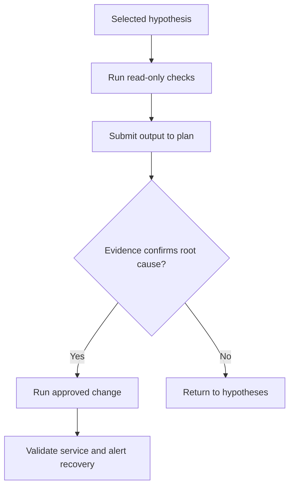

After you have reviewed suspected root causes and supporting evidence, open the AI remediation plan. The plan organizes hypotheses, root causes, and recommended actions so responders can move from investigation to controlled remediation.

{}

* On the alert page, return to the suspected root cause you want to investigate.
* Select {}View AI-generated action plan{}.
* Review the available hypotheses and root causes.
* Select the hypothesis that best matches the evidence you audited in the previous chapter.
* Review the high-level graph that connects the selected hypothesis, root cause, and action steps.
* For each step, classify it before execution:

| Step type | Examples | Approval needed |
|-----------|----------|-----------------|
| Read-only | `kubectl get`, chart review, log search, trace inspection. | Usually low risk, follow normal access policy. |
| Diagnostic with load | Debug endpoint calls, temporary profiling, high-cardinality searches. | Confirm performance and cost impact. |
| State-changing | Scale deployment, restart pod, change config, roll back release. | Follow incident change policy. |
| Code change | Patch source, rebuild image, update manifest. | Follow engineering review and deployment process. |


{}
**What is the safest first action when a plan includes both diagnostic and state-changing steps?**
{}
{}
**Run the read-only diagnostic steps first, then use their output to decide whether a state-changing step is justified and approved.**
{}


{}

