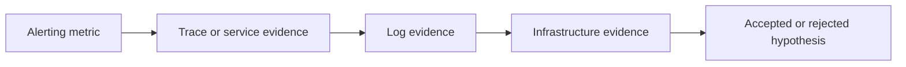

The best investigations connect metrics, traces, logs, and infrastructure evidence. AI can propose a path through those signals, but responders still need to check time alignment and causality.

{}

Build a cross-signal evidence chain for your alert.

* Start with the alerting signal. Write the exact metric behavior that caused the alert.
* Add one trace or APM service observation that shows how requests were affected.
* Add one log observation that explains or confirms an error mode.
* Add one infrastructure observation that either supports or rules out a platform cause.
* Convert the chain into a short statement:

```text
At <time>, <alert metric> changed for <component>. Traces show <request impact>. Logs show <error pattern>. Infrastructure shows <platform observation>. Therefore, <hypothesis> is currently the strongest explanation.
```

* If the chain has a gap, return to the **Evidence** tab or related product view to fill it.
* If two signals disagree, mark the hypothesis as lower confidence until you understand why.


{}
**What is the most common failure mode when teams skip cross-signal correlation?**
{}
{}
**They remediate the loudest symptom instead of the root cause, which can clear one alert while leaving the incident unresolved.**
{}


{}



## Confidence Levels

| Confidence | Standard |
|------------|----------|
| High | Multiple signals agree, and the timeline supports causality. |
| Medium | The hypothesis is plausible, but one signal is missing or indirect. |
| Low | The hypothesis explains symptoms but lacks component-specific evidence. |
| Rejected | Evidence contradicts the hypothesis or shows a different primary cause. |

