When an alert fires, responders need to answer three questions quickly: what is impacted, why is it happening, and what should we do next? The **AI troubleshooting agent** and **AI remediation plan** in Splunk Observability Cloud bring root cause analysis, evidence review, and guided action planning into the alert workflow.

This workshop is designed for advanced users who already know the basics of Splunk Observability Cloud alerting, APM, Infrastructure Monitoring, and Kubernetes. You will practice using AI-assisted troubleshooting as a disciplined incident workflow instead of treating AI output as a black box.

## Workshop Overview

In this 3-hour hands-on session, you'll cover:

- **Deploy the Lab App** - Run the instrumented checkout application on a local laptop or cloud Kubernetes cluster and send telemetry to Splunk Observability Cloud.
- **Prepare the Incident** - Confirm feature availability, select a supported alert, and capture the incident context the agent needs.
- **Troubleshoot With the Agent** - Review the alert overview, suspected root causes, impact analysis, and supporting evidence.
- **Remediate With the Action Plan** - Use AI-generated hypotheses and guided steps while keeping humans in control of production changes.
- **Advanced Use Cases** - Apply the workflow to deployment regressions, Kubernetes infrastructure alerts, cross-signal investigations, and incident command.
- **Operationalize the Feature** - Build readiness checklists, runbook templates, and success metrics for teams adopting AI-assisted remediation.

{}
The AI troubleshooting agent and remediation plan are currently available only for Splunk Observability Cloud customers in the `us1` realm. The feature supports alerts for Splunk APM services and Kubernetes in Infrastructure Monitoring when the detector uses standard, default metrics. Custom metric detectors are not supported at this time.

Before running this workshop, review the current product documentation: [AI troubleshooting agent and remediation plan in Splunk Observability Cloud](https://help.splunk.com/en/splunk-observability-cloud/create-alerts-detectors-and-service-level-objectives/create-alerts-and-detectors/ai-troubleshooting-agent-and-remediation-plan).
{}

## Incident Flow

```mermaid
flowchart LR
    Deploy["Deploy app and collector"] --> Issue["Inject example issue"]
    Issue --> Alert["Supported alert opens"]
    Alert --> Overview["Overview tab"]
    Overview --> RCA["Root Cause Analysis"]
    RCA --> Evidence["Evidence tab"]
    Evidence --> Plan["AI-generated action plan"]
    Plan --> Execute["Run guarded steps"]
    Execute --> Validate["Validate recovery"]
    Validate --> Resolve["Resolve alert and update incident record"]
```

## What You Need

- Access to a Splunk Observability Cloud organization in the `us1` realm where the feature is enabled.
- Docker, `kubectl`, Helm, and either a local `kind` cluster or a cloud Kubernetes cluster.
- A Splunk Observability Cloud access token that can send telemetry.
- A supported alert from Splunk APM or Kubernetes in Infrastructure Monitoring.
- Permission to view APM, Infrastructure Monitoring, logs, traces, detectors, and active alerts.
- For remediation exercises, access to a non-production Kubernetes or application environment where you can run approved commands.
- A collaboration channel or incident document where you can record the hypotheses, evidence, actions, and validation results.

You can complete the investigation chapters with a historical or demo alert. Complete the remediation chapters only in a lab or controlled environment unless your normal change process approves the action.
