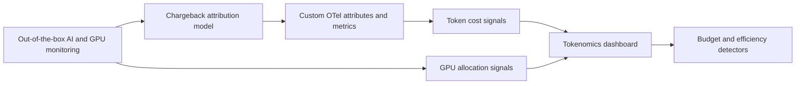

AI platforms need cost visibility at two levels: the application layer that consumes
tokens, and the infrastructure layer that runs shared GPU capacity. **Splunk
Observability Cloud** gives teams out-of-the-box visibility into AI infrastructure,
LLM application traces, Kubernetes, and GPU telemetry. Chargeback requires one
additional layer of intent: stable business attribution and cost metrics that connect
that telemetry to teams, tenants, workloads, and models.

This workshop shows how to combine both approaches:

* Use out-of-the-box AI infrastructure and AI application monitoring data.
* Identify the token, latency, request, GPU, and Kubernetes metrics that already exist.
* Add custom OpenTelemetry attributes and metrics for chargeback attribution.
* Estimate token cost per request, tenant, team, workload, and model.
* Allocate shared GPU cost from utilization, allocation, or energy data.
* Build dashboard views and detectors that FinOps, platform, and application teams can
  use without exporting data to a separate spreadsheet.

## Workshop Flow

## What You Need

* Access to a Splunk Observability Cloud organization.
* A monitored Kubernetes or OpenShift environment with GPU workloads.
* The Cisco AI Pods collector and NIM examples from the **Monitoring Cisco AI Pods**
  workshop, or equivalent NVIDIA DCGM and NIM Prometheus metrics.
* Permission to view dashboards, Infrastructure Monitoring, APM, traces, detectors, and
  Metric Finder.
* A sample rate card for workshop calculations. The examples use fictional rates; replace
  them with your organization's approved rates before using this in production.

{}
This workshop is designed as a follow-on to the **Monitoring Cisco AI Pods** and
**Monitoring Agentic AI Applications** workshops. It does not replace those setup labs.
It focuses on the telemetry model needed to make tokenomics and chargeback defensible.
{}

## What You Will Build

By the end of the workshop, you will have a working pattern for:

* AI request attribution with `ai.team`, `ai.cost_center`, `ai.tenant.id`,
  `ai.workload.name`, and `gen_ai.request.model`.
* Token counters for prompt, completion, and total tokens.
* Request-level estimated cost metrics.
* GPU pool allocation formulas based on shared workload usage.
* A dashboard layout for executive summary, team breakdown, model economics, and GPU
  efficiency.
* Detectors for cost spikes, budget burn, inefficient GPU use, and runaway token growth.
