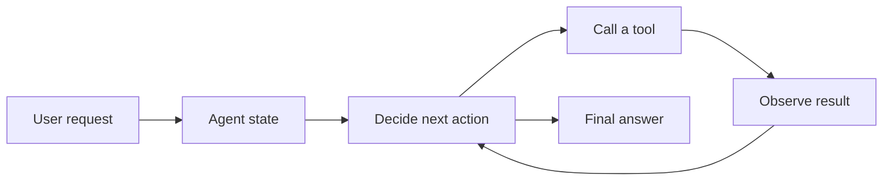

AI agents are applications that can use a model, a goal, and a set of tools to make
progress through a task. The important idea is not the framework. The important idea is
the loop: observe the user request, decide what to do next, call a tool when needed,
inspect the result, and produce a useful answer.

This workshop starts with a local LLM exercise. You will create an assistant that can
look up a profile, create tasks, and draft a message. The default path uses Ollama and a
local model for the next-action decision. If you have an API key, the same agent can use
an OpenAI-compatible hosted endpoint instead.

## Workshop Flow

## What You Will Build

By the end of the workshop, you will have:

* A small command-line agent that accepts a user request.
* A profile file that makes the agent feel personal to the participant.
* Three tools: profile lookup, task creation, and message drafting.
* A model-backed observe-plan-act loop.
* A local LLM default path and an API-key hosted path.
* A repeatable checklist for moving from a demo agent to a production-ready agent.

## What You Need

* A terminal with Python 3.10 or later.
* A local copy of this workshop repository.
* Ollama or another local OpenAI-compatible model server.
* A local chat model such as `llama3.2`.
* Optional: an API key for an OpenAI-compatible hosted provider.

{}
This is a beginner workshop. It teaches the mechanics of an agent first. For production
agent monitoring and traces, use this as a foundation before continuing to the
**Monitoring Agentic AI Applications** workshop.
{}
