Customer-facing AI workflows need observability that starts with the digital experience and ends with a governed action. In this workshop, you will run an AI claims support portal, trigger a deterministic cache-pressure incident, gather evidence from Splunk Observability Cloud, and approve a narrow remediation action through a human-in-the-loop operator console.

The runnable lab app is included in this repository at `workshop/support-portal-remediation-agent`.

## Workshop Overview

In this hands-on session, you will cover:

- **Lab Overview** - Understand the support portal, operator console, service topology, and remediation boundary.
- **Prepare the Environment** - Configure local prerequisites, credentials, student identity, and port checks.
- **Run the Lab Stack** - Start the collector and app services, then create a healthy baseline.
- **Investigate Cache Pressure** - Trigger the `cache-disk-pressure` scenario and validate customer, APM, and infrastructure evidence.
- **Govern Remediation** - Gather evidence, explain the incident, propose `clean_claims_knowledge_cache`, approve execution, and validate recovery.
- **Observe the Agent** - Inspect remediation spans in Splunk and use Galileo showcase and experiment runs for agent monitoring.
- **Troubleshoot the Lab** - Recover from common workshop-day failures without changing the story.

{}
This workshop demonstrates a separate remediation workflow that uses Splunk Observability Cloud as the evidence and investigation layer. It does not imply that Splunk directly invokes arbitrary external actions. The action is bounded, policy-checked, operator-approved, and validated after execution.
{}

## Incident Flow

```mermaid
flowchart LR
    Baseline["Healthy support journeys"] --> Trigger["Trigger cache pressure"]
    Trigger --> Impact["AI Claim Status slows"]
    Impact --> Evidence["Gather Splunk evidence"]
    Evidence --> Policy["Apply policy and confidence checks"]
    Policy --> Proposal["Propose clean_claims_knowledge_cache"]
    Proposal --> Approval["Operator approval"]
    Approval --> Execute["Remediation agent executes"]
    Execute --> Validate["Validate portal and telemetry recovery"]
```

## What You Need

- Node.js 22 and npm.
- Python 3.11 or newer.
- Docker Desktop or another Docker daemon if you want the local Splunk OpenTelemetry Collector or Docker Compose flow.
- A Splunk Observability Cloud organization and access token for live telemetry export.
- A browser RUM token if you want frontend RUM evidence.
- Optional OpenAI and Galileo credentials for model-backed remediation and agent monitoring.
- A unique `INSTANCE` value for each student when sharing one Splunk Observability Cloud organization.

You can run the local app without credentials. Missing Splunk, OpenAI, or Galileo credentials reduce the live evidence and monitoring paths, but the app and fallback remediation flow still run.
