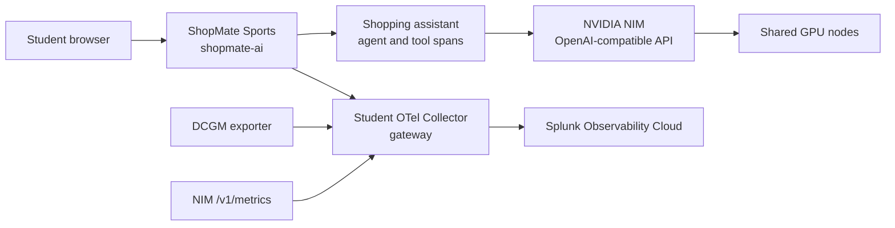

This workshop ports the `CLUS-LTROBS-2001` ShopMate Sports lab into the Observability Workshop structure. Students work as AI platform operators in a shared Cisco AI POD-inspired environment. The goal is to follow a retail AI request from the browser through the ShopMate app, OpenAI-compatible NVIDIA NIM, GPU metrics, and Splunk Observability Cloud.

The runnable source copy is included in this repository at `workshop/clus-shopmate-exercises`.

## Workshop Overview

In this 4-hour hands-on lab, you will cover:

- **Orientation** - Understand ShopMate Sports, the shared GPU-backed lab, and the telemetry path.
- **Prepare the Environment** - Set student identity, namespace, Splunk realm, and local tool prerequisites.
- **Student Collector** - Deploy a namespace-scoped Splunk OpenTelemetry Collector gateway.
- **App Instrumentation** - Deploy ShopMate Sports and verify AI assistant traces in Splunk.
- **GPU and NIM Scraping** - Extend the collector to scrape DCGM and NVIDIA NIM Prometheus metrics.
- **Correlation** - Connect a single ShopMate request to app spans, model-serving latency, GPU signals, and Kubernetes health.
- **Tokenomics** - Investigate token usage, expensive conversations, and bounded agent-loop behavior.
- **Final Review** - Turn evidence into an operator-ready conclusion.

{}
Students do not build the shared cluster, GPU platform, NVIDIA NIM service, or prebuilt ShopMate image during the lab. Those pieces are instructor-managed. Student work happens inside an assigned Kubernetes namespace and Splunk environment filter.
{}

## Signal Path

## What You Need

- A browser and terminal.
- `kubectl`, Helm, `curl`, and `jq`.
- Your assigned Kubernetes namespace.
- Your assigned `deployment.environment` value.
- Splunk Observability Cloud login access.
- A preloaded Kubernetes Secret that contains the Splunk Observability ingest token.
- Instructor-provided access to the shared GPU, NIM, and ShopMate environment.

The local source copy also contains a standalone `shopmate-sports` app for maintainers and instructors, but the main student path uses the prebuilt image and shared Kubernetes environment.
