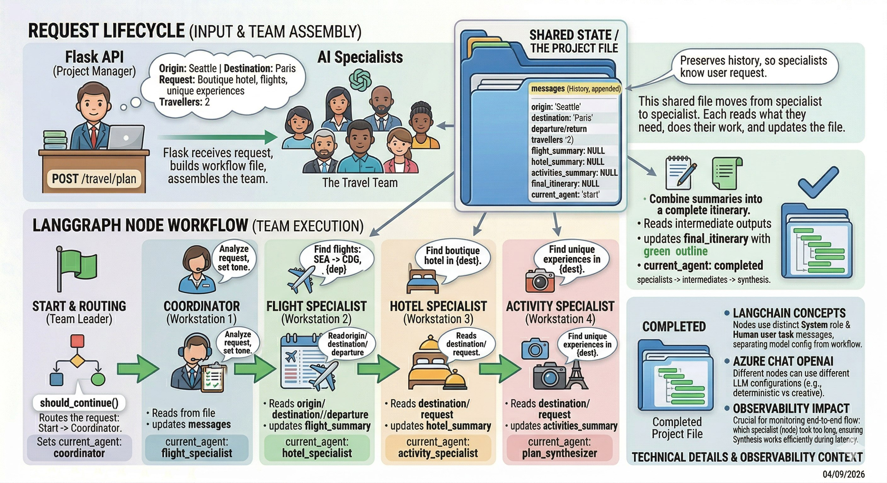

## Application Overview

This workshop utilizes an **Agentic AI** application for booking travel.
In this section, we'll walk through the application architecture and
highlight the key **LangChain** and **LangGraph** concepts it uses.

{}

**LangChain** provides the core building blocks for working with large language models,
such as prompts, tools, and model integrations. **LangGraph** builds on those concepts
to orchestrate complex, stateful workflows between those components. In simple terms,
**LangChain** helps you define what an LLM-powered step does, while **LangGraph** helps
control how those steps flow together in an agentic application.

{}

Although the primary goal of the workshop is to instrument the application with **OpenTelemetry**,
having a basic understanding of how the application is structured will make the observability
work much clearer. Seeing how the agents, tools, and workflows are built will help you
recognize what the telemetry represents once we begin tracing and analyzing the system.

If you’d like to explore the implementation while we go through the architecture,
the application source code is available on your EC2 instance at:

`~/workshop/agentic-ai/base-app/main.py`.

The application is a **Flask API** that accepts a travel planning request and runs it through
a **LangGraph** workflow made up of several LangChain-powered LLM nodes. Each node plays a specific
role, updates shared state, and hands off to the next step.

In this part of the workshop, we will review:

* the request lifecycle
* the shared state model
* how LangGraph nodes work
* the LangChain abstractions used in the code
* where observability will matter later

Navigate to the subsections to learn more about the application architecture and implementation.