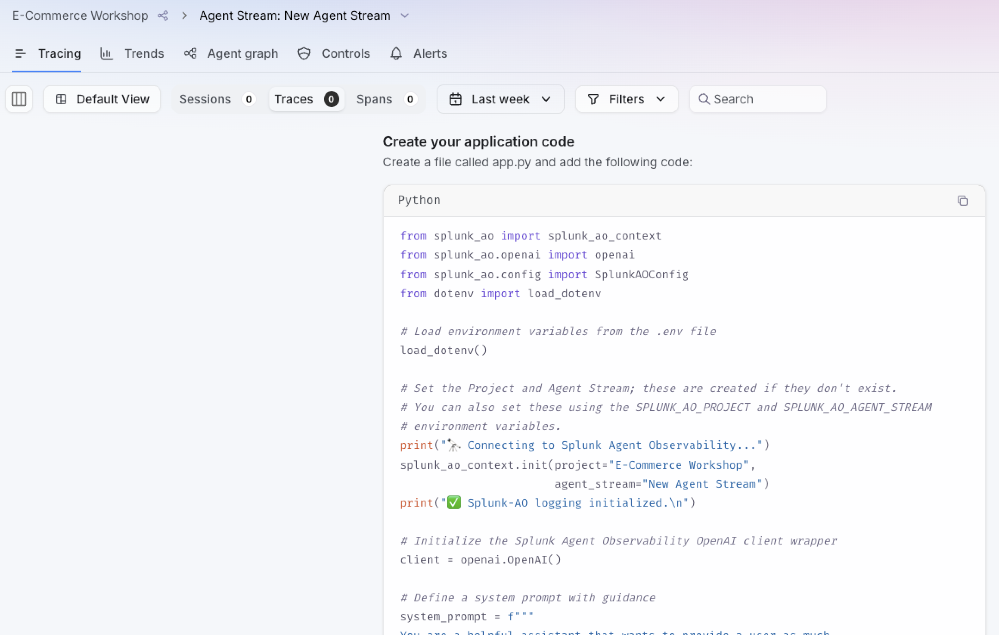

Before we talk about all the data we collect, and the amazing insights we can generate from it,
let's first understand how Splunk Agent Observability can collect this data.

Since instrumentation by itself is an entire workshop, we are going to take a very quick and
simple look into how it works, with a very simple code example.

In a nutshell, instrumentation can be done:

* Leveraging the out-of-the-box Splunk Agent Observability SDK, for minimal coding effort;
* Using OpenTelemetry, to maximize reusability;
* Integrating directly with the Splunk Agent Observability API, for full control of instrumentation and support 
for any development language.

> How much effort is required to collect the observability data we need?

Not much, as you will be able to see for yourself once you log into Splunk Agent Observability's UI.
The project you have access to (E-Commerce Workshop), contains an empty Agent Stream, which includes
information on how to instrument your agent:

In this code example, the only change we've made to the original code was to import the `openai` module
from the Splunk Agent Observability package, instead of importing it from the OpenAI package. The extra
code lines are just printing debug information to the terminal.

This 1-line code change is all we need to collect data from this particular script. Additional configurations
such as server address, credentials, etc. are managed through Environment Variables.

To be clear, there are different integration approaches for different technologies. Splunk Agent Observability
provides simple integration with the most popular agentic development frameworks:

* A2A Protocol
* CrewAI
* Google ADK
* LangChain/LangGraph
* OpenAI
* OpenAI Agents SDK
* Microsoft Agent Framework
* Strands Agents
* *and more...*

We also provide comprehensive support for OpenTelemetry and OpenInference.



What was the reason to import the `openai` module from Splunk, instead of using the one from OpenAI?


The Splunk Agent Observability SDK package contains an `openai` module that includes all the necessary
instrumentation code, greatly simplifying the instrumentation process, without impacting the functionality
provided by the OpenAI package.
