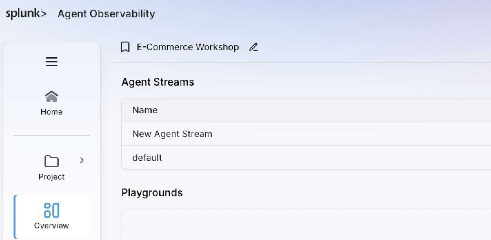

## Architecture

Our AI Shopping Assistant uses React, LangGraph, an AWS Bedrock model, PostgreSQL with pgvector, and a number of tools.
User questions around returns, refunds, policies and similar Q&A topics usually trigger a vector search to 
retrieve chunks from a knowledge base. Questions about products are handled by tools that will query the product &
inventory systems. Any request for action, such as add to cart, checkout, etc, are handled by specific tools.
This Shopping Assistant AI agent is instrumented into Splunk Agent Observability with the use of callbacks
(following our LangGraph integration approach).

Requests into our assistant are recorded as sessions, traces, and spans.

* A **session** is an end-to-end conversation with multiple turns
* A **trace** is one end-to-end agent request, starting from an input and ending with its output. One turn of the conversation.
* A **span** is one step of the trace such as an LLM call, retrieval, or tool call.

## Investigating the Interaction Trace

The workshop presenter has shown an example navigation and interaction between user and AI. In this exercise,
we will investigate a similar trace, from the perspective of token usage, costs and outcomes.



**1.** In your browser, go to the Splunk Agent Observability console at `https://console.multitenant.galileocloud.io` 

**2.** Login using the provided credentials.

**3.** Open the **`E-Commerce Workshop`** project.

**4.** Select the `default` agent stream





**1.** Go to the **Sessions** Tab

 
(*PS: the numbers shown for sessions, traces and spans might be different in your project*).

Each row in this list represents an entire session -- the end-to-end interaction between customer and AI Shopping Assistant. Let's see what we can learn from this interaction.

**2.** Click on the first row in the list. The Session page will load.

**3.** The Session page shows:
- On the left panel, the traces associated with this session (each individual input-output cycle)
- On the center panel, a visual representation of the interaction between user and AI; this allows non-technical users to understand what was discussed.
- The right-side panel shows a list of Evaluators, along with Parameters and Annotations for the Session and its elements (Traces and Spans). This panel will be refreshed automatically to reflect the element selected on the left-side panel, as there are different evaluators for Session, Trace and Span elements.

 

**2.** On the left-side panel, we can see Session-level evaluators that help us understand the outcome of this session at a glance:
- Quality Evaluators:
    - **Action Completion**: Determines whether the agent successfully accomplished all of the user’s goals.
    - **Agent Efficiency**: Determines if an agent provided precise answers or resolution to every user ask, with an efficient path.
    - By having a value of **True**, the evals confirm that the agent is providing service with the quality that we expect.
    - Hovering over the eval output will allow us to read (and tune, if needed) the reasoning behind the eval.
- Custom Evaluators:
    - Business-specific evaluators leveraging LLM-as-a-judge.
        - **Model Selection Match**: was the correct model chosen for the task?
        - **Purchase Decision**: did the agent help the user make a purchase decision (in this case, add a product to the shopping cart)?
        - **Revenue Impact**: how much potential revenue (in USD) has the agent supported by helping customers make purchase decisions?

**3.** Click on the second Trace (where the customer asks for help to find a product) to expand it.

Here we see all the steps taken by the agent to fulfill the user's request. We follow the execution as the agent classifies the request (meaning, it must decide what is the proper tool to help with this request), calls the tool to retrieve the necessary data, and prepares a response to the customer. In the LLM Spans (the ones with the brain icon), we can see the instructions sent to the LLM, along with the input data from the customer and the output sent to the customer.

Along the way, evals are providing context and meaning to these actions, to determine if they are in line with the business' expectations for this agent:
- Quality Evaluators:
    - **Tool Error Rate**: Are tools failing? Which tools are failing, and what errors are being reported?
    - **Tool Selection Quality**: is the LLM selecting the correct tool to fulfill the user's request?
- System Metrics:
    - **Agent Costs**: Estimated cost based on token counts and LLM used.
    - **Latency**: including LLM, tool calls and other internal routines.
    - **Token Counts**: including input, output and total.

If we are interested in understanding how time was spent in this interaction, we can check the **Latency** tab for this session:

This will show us how tool calls and LLM invocations are impacting latency. It also reflects the time spent by the user between interactions; longer pauses could mean that the LLM is generating confusing output messages for the user; or it could mean lack of attention/user disengaging from the interaction. It might be used as a signal to review this part of the user experience.

Going back to the Session element (first at the top on the left-side panel), the Session evals will tell us at a glance that this was a successful interaction between customer and AI Shopping Assistant. This gives us immediate context and feedback, without requiring that we read through the entire record. However, this applies to a single interaction, out of thousands (or millions!) that will happen during the course of the day. 

How can we get this same type of contextualized view and feedback at an aggregate level?





**1.** In the navigation bar, click on the **arrow pointing left**, next to the Messages/Latency/Trace Graph tabs. It will lead you back to the list of sessions in the Agent Stream.

**2.** Go to the **Trends** tab. Set the Time Range is set to **Last Week** and the aggregation interval to **30 minutes**.

**3.** This 'traditional' dashboard view allows us to understand metric performance over time.

**4.** Take some time to explore the metrics in this page. Notice how metrics that have more than one value (True/False, for example) can be filtered.

**5.** Dashboard data can also be grouped and filtered, to allow for better understanding of some business aspects. For instance, we can Group the data by `session_theme` and compare the performance of our System Metrics and Evals between `product-shopping` and `customer-support` session types.

**6.** We can also filter the data. Let's say, for instance, that I'm only interested in one type of operation: product search. I can filter the data in this dashboard by any parameter collected from the agents. In this case, I want to filter by `intent` = (Equal to) `product_search`.

Finally, Splunk Agent Observability provides a way to understand how processing flows within the agent: the Agent Graph view.





**1.** Open the **Agent Graph** tab.

**2.** Zoom in to get a better view of the flow.

This visibility is created from the observability data collected from the agent; there is no need for additional instrumentation or data collection in order to generate the agent graph. This graph is also available at a Session level, so it can be isolated to each individual interaction between customer and AI Shopping Assistant.

**3.** You can use the mouse to scroll around the screen in order to see all components. In this visualization, the rectangular boxes represent the *Nodes* (the components of your agentic application), while the dotted lines represent the *Edges* (the paths between components).

Clicking on a node will retrieve some of the metrics from that node, plus a count of the number of spans associated with that node.

Click on an edge to see a panel that contains some statistics about that edge, including *frequency*: how often does the agentic path go through that edge?

Also, the thickness of the dotted line represents its popularity: thicker edges are used more frequently than thinner ones. This should allow us to see, even at a glance, what are the most common paths taken by our agents. This can help us understand where to focus our efforts in terms of investigation: while the most common paths must perform flawlessly, they are also well known; the least used paths are the ones we need to drill down and understand, as they could be caused by the agent running outside of its boundaries, or being led down paths that it should not take.



## Conclusion

In this section, we learned how Splunk Agent Observability provides real-time visibility over agentic applications and workflows. We saw how the observability data splits between Session, Trace and Span, ensuring visibility and insights from the high-level, down to each individual step of the agentic process.

We also discussed how Evals are critical to contextualize the observability data collected from the agents, and how they allow us to know, even at a glance, if a particular interaction between customer and AI was successful.

Finally, we've seen some of the high-level visibility resources available within Splunk Agent Observability, including the Trends dashboard and the Agent Graph flowchart.

Next, we return to the three causes of agent inefficiency. Besides the real-time visibility we just saw, we will also leverage new resources to help validate and prove the agents before they are deployed to interact with consumers.



Why are Evaluations important, when we can read the inputs and outputs of every interaction, to detect quality or behavioral issues with our agent?


Evals automate the task of reasoning over the actions taken by the agent, validating whether those action were correct, or even expected. Evals can be aggregated over time, allowing us to track agent performance and alert on deviations. Agents will have thousands, if not millions of interactions per year; the idea of measuring agent quality by having a person read through the records is not economically viable; the idea of determining agent quality by evaluating a sample of the interactions is extremely risky.

Only Splunk Agent Observability provides the necessary tooling to ensure evals for 100% of the interactions, without dramatically escalating inferencing costs. 

Want to know more? Read on!
