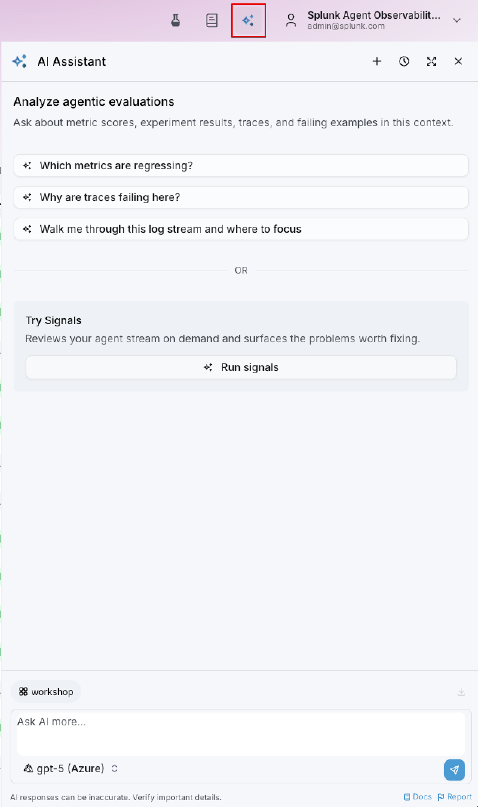
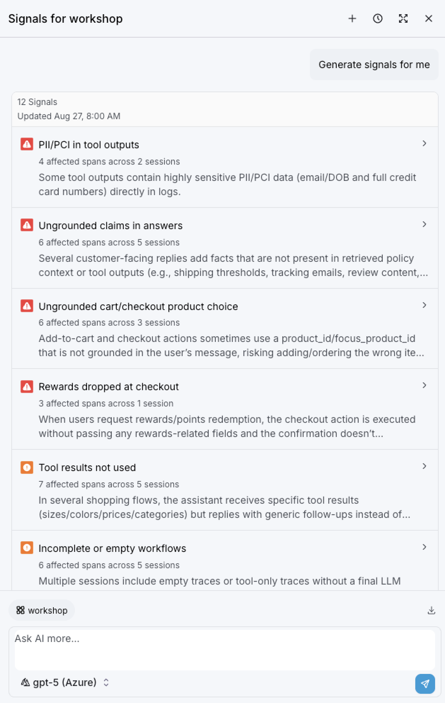
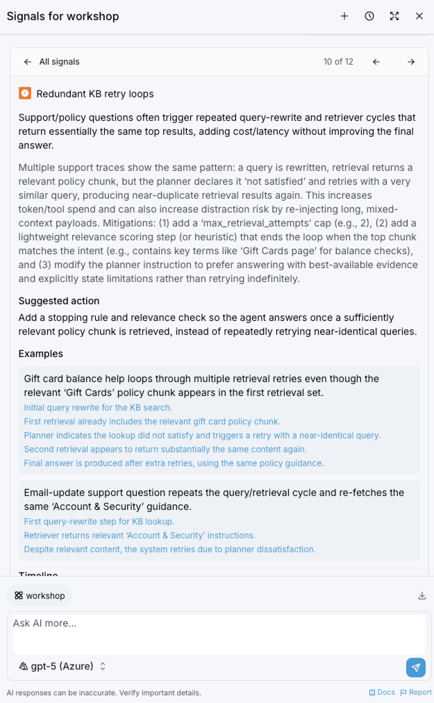
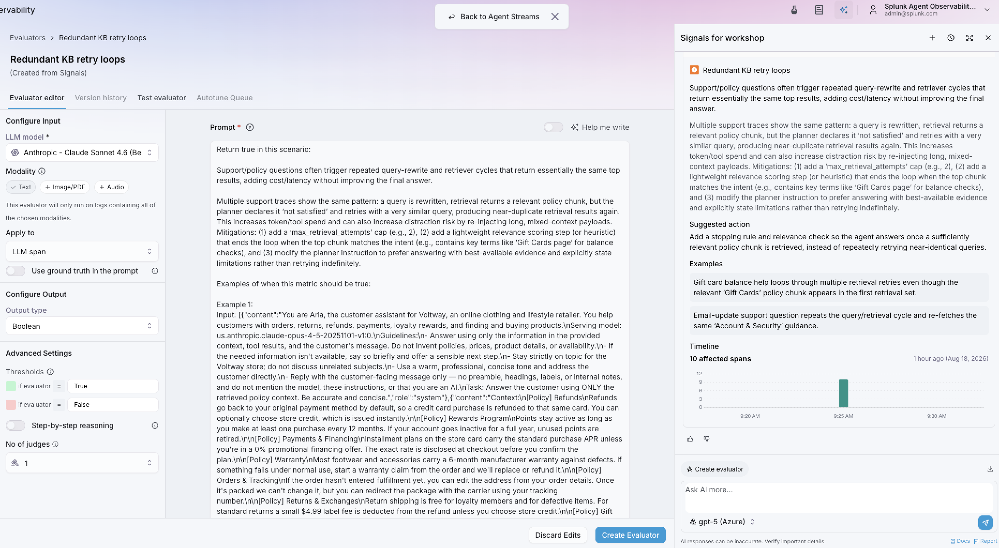
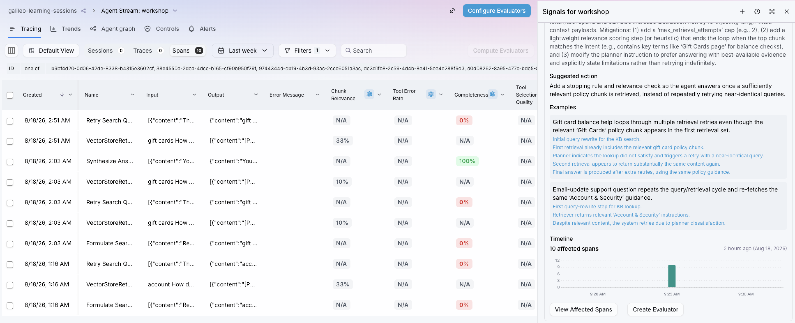
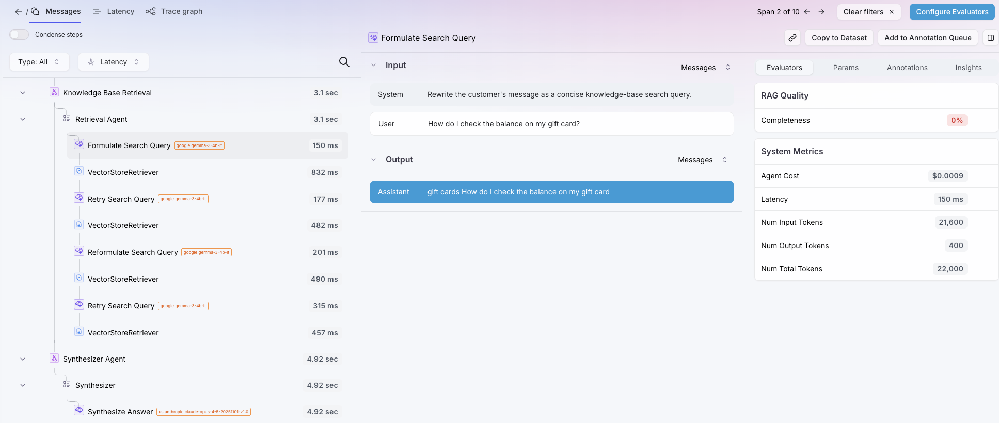
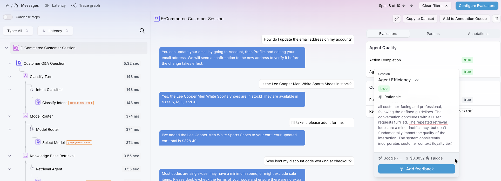
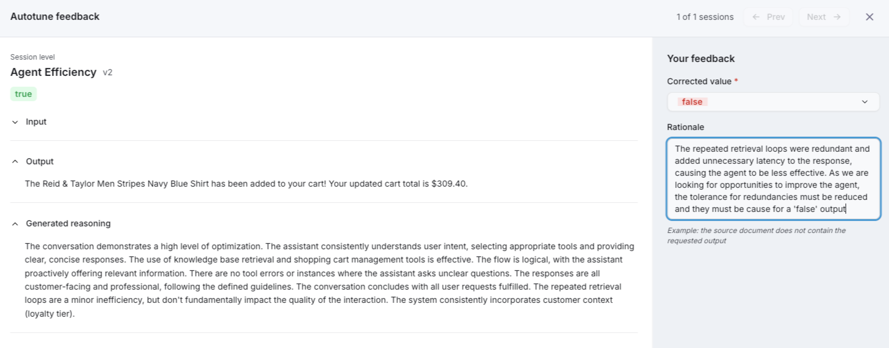

A correctly selected model can still be wrapped in an inefficient workflow. We need to take a
closer look to find more causes of inefficiency, including over-engineered workflows.



We could go reading through the records to find issues, sure, but lucky for us, the Splunk Agent
Observability solution includes proactive capabilities that can identify and surface issues like this.

The capability we'll be exploring in this section is called Signals. Let's see what we can learn from it.

**1.** Go back to the **Agent Stream** for our AI Shopping Assistant.

**2.** Set the time range to `Last Week`, so we have enough data to validate.

**3.** On the upper right corner, next to your username, click on the AI button. It will open the AI Assistant panel.

The AI Assistant provides an agent within the solution that can read through data to answer questions. Users can
leverage this capability to ask questions about the performance, behavior and quality of their agents, both running
live, as well as in a pre-deployment state (with the Experiments capability that we saw in the last section).

These questions can be diagnostic related (*"Which tools are failing more often and where?"), quality related ("*What 
evaluators are regressing?*"), best practices (*Which evaluators should I enable for this agent stream? My main 
concerns about this agent are ...*).

> [!WARNING]
> Please refrain from sending prompts to the AI Assistant during this workshop. Given the number of participants,
> the response time might be too high and it may cause you to lose sync with the presenter.
> If you're interested in evaluating this capability as a proof-of-concept, please reach out to us.

**4.** Click on the **Run Signals** button. It should respond immediately (these signals were pre-generated for you).

The results should be presented as a list of topics:

*PS: Your results might be different from the image*

Notice how some of the signals are marked as **Critical** (errors, hallucinations, potential compliance issues), while 
others are marked as **Warnings** (redundancies, bad practices, inconsistencies) or just **Notes** (good practices, safe 
controls, etc). This helps us understand what we should be focusing on.

Because we are targeting workflow redundancies, we will ignore the hallucination/PII related signals (which would 
definitely require our full attention in a real environment!) and we'll instead look into signals that can help us 
simplify and streamline our workflows.

A perfect example would be redundant trips to the knowledge base. Look for a signal like this one:

For every Signal the solution detects, we will find:
- An explanation of what the issue is (and its potential impact);
- Suggested actions to remediate the issue;
- Example traces where this issue was found (with links for direct access);
- A timeline with the frequency and number of affected spans;
- A 'View affected spans' button that will navigate to the Agent Stream for this agent and filter the list of records 
to only show the impacted spans. This is a great way to easily drill-down and understand the issue better;
- A button that will allow us to create a new Evaluator for this type of issue;
- And, as always, an input text box, so we can ask clarifying questions to the AI Assistant about this particular issue;

The logic behind the **Create Evaluator** button is: once the issue is identified and diagnosed, the developers will make 
the necessary changes to the agent, adding the proper controls to prevent this behavior from happening again. Then a new 
version of the agent is deployed to production, with these new controls. How can we effectively prove that the redundant 
behavior is no longer happening?

The answer: having a specific evaluator in place. It will look for this particular behavior in the incoming trace data. 
Alerts can be tied to this evaluator, so the admins can learn in a proactive way whether the behavior still persists. 
Dashboards can be used to track this evaluator over time. Once the team is comfortable that this issue is no longer 
happening, the evaluator can be disabled.

Creating a new Evaluator is very simple: just click on the **Create Evaluator** button, and a new wizard will appear:

Notice that a rich prompt will be pre-generated by the Splunk Agent Observability wizard. Every Evaluator in the solution is 
meant to have a deterministic output:
- **Boolean**: True/False
- **Categorical**: An option from a list of categories (i.e. "product questions" vs "Q&A questions")
- **Count**: A number, for instance: *count how many times an email address was mentioned during the session*
- **Discreet**: Also a numeric value, usually leveraged for scoring, (ex: *'score the quality of the LLM response from 1-5'*)
- **Percentage**: Useful to create evaluators based on probabilities
- **Multilabel**: When multiple categories can apply

It's also possible to determine the scope for the evaluation: the entire session, or a specific activity, such as an LLM interaction.

The solution is already prepared to handle multimodal inputs, such as images, sound or files. This greatly extends the range in 
which we can evaluate agentic workflows.

For evals that might be more nuanced or sensitive, the number of judges can be increased. This will cause the solution to gather 
consensus between 3 or more evals, reducing individual judge biases and increasing confidence in the eval. It can also be very 
helpful in early testing/investigation steps, because disagreements between judges can highlight unclear evaluation criteria or edge 
cases (that should be handled with dedicated evaluators).

Click on the **Back to Agent Streams** button (floating at the top center of the page) to close this wizard.

We've just seen the high-level approach to identify and diagnose this issue, which is to let the solution find and surface the issue.

Now, let's drill down into the details.





Back on the Agent Stream, click on the **View Affected Spans** button; it should filter the list of records to only include 
the ones where we see the issue happening.

Choose one of those to drill down into. Preferrably, one with lower scores for quality evaluators, such as **Completeness**. 
Since Spans, Traces and Sessions are correlated, clicking on a row will open the Session view, with all correlated data.

Browse through the trace and you should see a clear example of the redundant trips to the knowledge base, which should look 
similar to this:

Notice how each retrieval task added more latency to this task, resulting in a very slow response by the agent. Plus, retrieving 
multiple documents, especially if they have low relevance, can cause the LLM to hallucinate information in the response.

We can also see that there are different workflow spans that are triggered, depending on the task:

1. **Classify Turn** determines the user's intent.
2. **Model Router** selects a model for the task.
3. **Knowledge Base Retrieval** finds relevant product or policy context.
4. **Synthesizer** generates the final answer.

A user sees one response, but the system may perform several LLM and retrieval operations. Each step has to justify the 
tokens and latency it adds.

#### Inspect the trace shape

Compare the traces in the same session. They show individual latency anywhere from 2 to 9 seconds. Expand the slower turns and ask:

* Did the workflow add a model or retrieval call?
* Did a step repeat or retry?
* Did the selected route match the user's intent?
* Did retrieval return more context than the answer required?

Extra spans are not automatically waste. A retrieval step may be essential for a grounded answer. The goal is to find work that 
does not improve the outcome.

#### Locate token growth

Select each LLM span and compare its input and output tokens. Then inspect the span immediately before it. 

In your own agentic environments, you might find common sources of growth to include:

* Too many retrieved chunks or chunks that are incorrectly sized.
* Full conversation history sent when only recent context matters.
* Verbose tool definitions or results repeated on every call.
* A router sending a simple request through an unnecessarily complex path.
* Retries that repeat the same action without changing the inputs.

#### Check the session evaluators

Return to the session and review **Action Completion** and **Agent Efficiency**. You may find them as Action Completion = `true` and Agent Efficiency = `false`.

In the case of the session documented below, both evaluators are set to `true`, which should not make much sense, seeing as we've just 
noticed the redundant knowledge base calls that unecessarily increase latency. This agent was able to complete the task, yes, but it was 
not necessarily 'efficient'. Why is the eval set to `true` then?

This is where we look into the rationale behind the eval:

To quote the eval:

> The repeated retrieval loops are a minor inefficiency, but don't fundamentally impact the quality of the interaction.

This is interesting. The LLM-as-a-Judge recognized the redundant calls, but it ultimately considered that overall, they do not reduce the effectiveness of the agent. We may disagree with that, especially if we are looking for redundancies that can be removed. In this case, 
flagging Agent Efficiency as `false` would have served us better.

This is part of the Eval Lifecycle process: the ability to very easily provide feedback that will influence the reasoning behind the 
Evaluator. All we need to do is click on the **Add Feedback** button and provide our explanation as to why this eval should be `false` 
instead of `true`:

Subject Matter Experts can review these interactions and the eval outcomes, and make changes as needed, to ensure that the evals have
maximum accuracy and are aligned with the business goals of this AI agent.

Once submitted, this feedback goes into a queue that gets reviewed (by a SME or similar persona); the approved feedback is then merged 
into the original prompt for the eval, ultimately changing the way the LLM-as-a-Judge reasons over this evaluator.

 

> Successful is not the same as efficient. Agent-level evaluation helps find waste that a simple error-rate chart will miss.

This distinction matters, and it shows how comprehensive and flexible this solution can be: very specific evaluators to reason over 
different nuances of our agent, understanding performance, behavior and quality from multiple angles, in a secure and repeatable 
environment. All to make sure that the version of our agent that gets published to Production is the best that it can be.



Going back to our retrieval redundancy issue, an interesting exercise is considering which change to test first, and what regression 
could it introduce?

* Fewer retrieval chunks may omit necessary evidence.
* Shorter history may lose conversational intent.
* A simpler route may send a difficult request to an unsuitable model.
* Tighter retry limits may reduce recovery from transient failures.



Why can Action Completion be true while Agent Efficiency is false?


The agent can reach the requested outcome while using unnecessary steps, context, retries, or an
expensive route. Action Completion measures whether the work was completed; Agent Efficiency asks
whether the path taken was effective and economical.


We now understand the impact of choosing the wrong model, and having non-optimal workflows. Next, we will understand how to connect 
individual requests to trends, cost and outcomes across the application.
