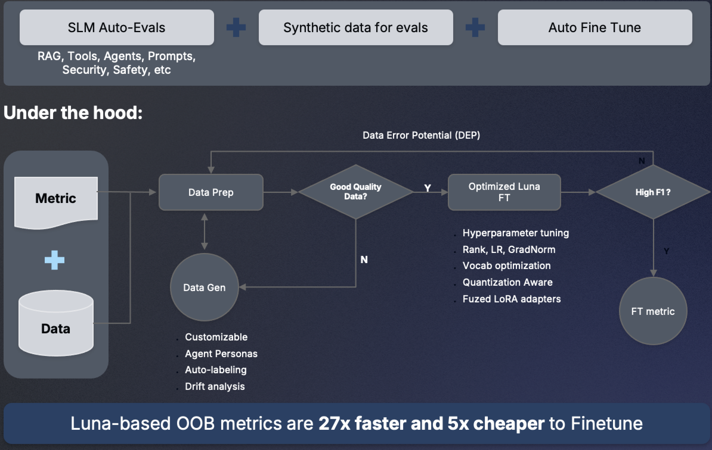
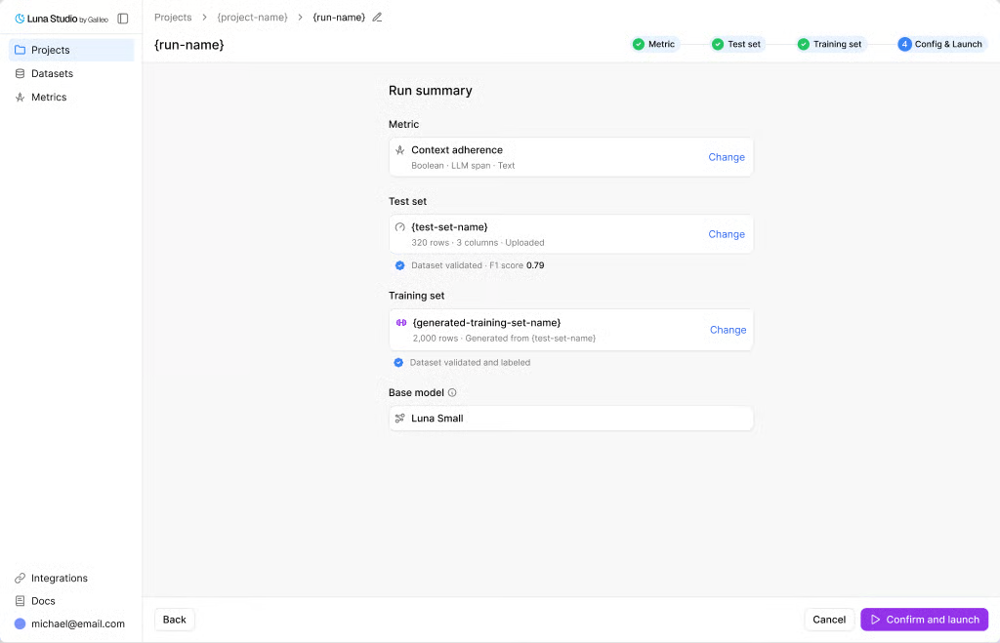
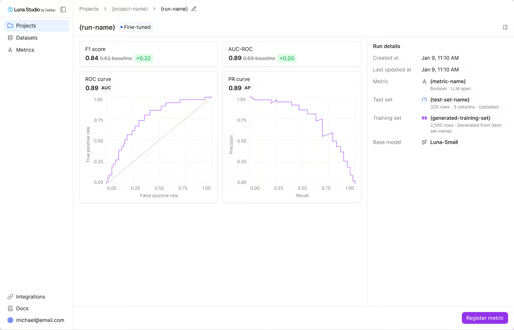

In this workshop, we've seen the value of Evaluators, and the type of understanding and visibility
they can provide. It's a game-changing approach that was only made possible through the evolution
of Large Language Models.

Evals allow us to get a deep understanding of an AI agent's performance, behavior and quality of
service. As we've seen in the presentation, evals have a lifecycle that starts at development/
research time, receives feedback from real production data, to become part of the development/
research process for the next version of our agent. A positive loop of feedback and improvement,
which is what agent needs to tackle the ever-changing nature of production environments, and the
new threats, trends and opportunities that appear every day.

### 1. The Cost of Evals

Large Language Models are expensive, especially when we think about Production scale, where 
millions of interactions will happen over the year. Computing evals for each and every one 
of them becomes cost prohibitive.

In fact, evals can easily cost $0.05 per call with an LLM-as-judge (depending on the model and
the size of the context window). At 5 evals per trace and 1,000 traces an hour, that's $6k per day, 
or $2.5M per year. And that's not considering specialized evals for your domain, which would have
much longer prompts for better reasoning. 

In fact, one of our customers was designing an external-facing chatbot, to support the millions 
of customers they have. Given the expected traffic and number of interactions per year, they 
estimated their eval costs at $25,000,000 per year! To be clear, this is not the cost to
actually run the agent; this is just the cost to evaluate all the interactions.

And they do need to evaluate every interaction, because this chatbot speaks on behalf of the company.

### 2. Solving the Eval Cost Challenge: Alternatives

The most common options when it comes to LLM costs are:

**1. Don't run evals at all**
- Flying blind
- This is worst case scenario, because AI failures usually do not throw errors or raise exceptions
- AI fails silently, and destructively. We mostly learn about it on social media or news sites.

**2. Sample the Evals**
- Flying almost blind
- Some solution providers will recommend sampling 5-10% of traffic for evals
- This leaves 90-95% of traffic without any context; quality and behavior issues cannot be assessed.

**3. Use a locally hosted LLM**
- Heavy and slow, will need considerable scale to handle production workloads
- Not reliable for eval-based guardrails (too slow)

**4. Leverage the Luna Small Language Model, provided by Splunk Agent Observability**
- A finetuned SLM, specialized in running evals
- Included in the deployment, with out-of-the-box integration
- A number of pre-defined evals
- New evals can be created and finetuned to reach LLM-level accuracy
- A fraction of the cost and time when compared to LLMs

Splunk Agent Observability includes its own Small Language Model, specialized in generating evals.
It provides a number of evals out-of-the-box, along with the necessary tools to create and finetune
new evals, based on the LLM evals and new edge cases that appear in the Eval Lifecycle.

### 4. Splunk Agent Observability - The Luna models

Luna is a family of purpose-built small language models for evaluation. Its role is to make broad,
fast evaluation practical so quality can remain beside token, cost, and latency telemetry across
the application lifecycle.

Luna models are small (3b/8b) and were designed to be finetuned, using an approach called LoRA 
(Low-Rank Adaptation). A short definition of LoRA would be:

> LoRA (Low-Rank Adaptation) is a parameter-efficient method to fine-tune language models. It freezes 
the original model weights and trains small, low-rank decomposition matrices (A and B) on the 
attention layers, reducing trainable parameters and VRAM usage by up to 90% without adding inference 
latency.

In short, LoRA is a quick and inexpensive way to finetune a model; plus, the concept of adapters 
allows us to work with multiple evals, each with its own finetune process maximize accuracy.

As we've seen in the presentation, the Eval Lifecycle is:

1. **Identify** the known evals for quality and behavior.
2. **Leverage** LLMs in pre-production to tune the evals for maximum accuracy. Leverage SME
feedback for zero-code autotune.
3. **Achieve** the required accuracy level for each eval
4. **Distill** the knowledge and learning from the LLM (related to each particular eval) into
the Luna SLM through a finetuning process. 
5. **Check** the accuracy of the Luna evals and repeat the finetuning process until the required
accuracy is achieved.
6. **Enable** the Luna evals for Production and provide evals for 100% of Production traffic.
7. **Reuse** the Luna evals as guardrails, to prevent harmful action from taking place.
8. **Detect** new evals based on Production patterns (the unknown unknowns).
9. **Define** these new LLM evals, increase their accuracy with SME feedback, distill the knowledge 
into the Luna models, enable the new Luna evals in Production.
10. **Rinse** and repeat for all new evals

Next, let's understand the Luna finetuning cycle:

The process to finetune a new SLM eval entails:

1. **Data preparation:** A labeled dataset must be generated for the finetuning process.
This dataset represents the 'ground truth' on which the model will be finetuned, so it's
critical that this dataset is properly curated by the subject matter experts. Data from
the LLM evals can be used to accelerate this process, and Splunk Agent Observability
provides the capabilities to created, edit, version, share and manage these datasets.
Even though the solution provides capabilities to help collect, organize and manage this
data, it's important to keep in mind that human involvement is expected and essential
for a successful finetuning exercise.
2. **Synthetic Data Generation:** generating a dataset is a time-consuming task, and
we provide resources to help optimize this process. One of them is the ability to create
synthetic datasets, based on the curated dataset. From an initial dataset of 300-500 samples,
labeled and reviewed by human SMEs, the solution generates thousands of synthetic records that 
will be used in the finetuning process. This process greatly reduces the finetuning preparation 
time, while ensuring high accuracy for the output.
3. **Run Finetuning Task:** this is handled transparently in the User UI, all it takes is one click.
4. **Improve:** change routing, prompts, tools, retrieval, or context.
5. **Repeat:** rerun the experiment before release.

To be clear, this process is fully supported by UI and code-based tools within Splunk Agent
Observability, in order to support manual and fully automated finetuning efforts:

The outcome of the finetuning process will be measured using metrics such as F1, AUC-ROC, etc:

The finetuning process can be repeated as many times as needed, with new labeled data, to ensure the 
high accuracy that is required for the eval in Production.

Once satisfied with the performance of the model, the new eval can be registered in Splunk Agent
Observability and used for both monitoring and guardrails.

It's also important to clarify that Luna-based evals will not change the cost of running your
AI agents; this is an approach to reduce and control the costs incurred when generating the 
evals. The previous sections in this workshop explored ways to optimize and reduce agent cost,
while this section is about optimizing eval costs.

> Luna does not directly reduce the application's generation tokens. It changes the economics of
> the evaluation layer, helping teams find generation waste without replacing it with an equally
> expensive evaluation problem.

Luna SLMs can run evaluations and guardrails on 100% of traffic at **up to 98% lower cost than LLM-as-judge**,
while also delivering much lower latency.



Why should we generate evals for every interaction, instead of just sampling? Won't a sample be
representative of the data?


Samples are only representative for deterministic metrics: collecting CPU usage once per minute vs once
per second can cause the system to miss a few issues, but it will still provide a very representative
view of the CPU performance. 

Probabilistic evals, on the other hand, are completely different: no two
interactions between customer and AI will be the same; every single one must be evaluated. A certain 
question may have received a correct response in one session , while a complete hallucination was provided 
by the LLM in a different session for the same question. The probabilistic nature of LLMs all but ensures
that responses will have minor (or major) differences, depending on many factors.

Also, because evals require reasoning, raw log data has very little value when it comes to observability
for AI agents, unless a person reads through the interactions, it will be impossible to assess the
quality and behavior of the AI agent to fulfill the user's request.

100% evals are a must have for any Production environment that relies on AI agents.
 

As we've learned in this workshop, evals have a lifecycle: we start with the known ones: hallucination,
completeness, efficiency, tool quality, etc. Then, as our system runs in Production, it will receive 
prompts and information that it wasn't necessarily trained for; this can expose new behaviors, trends, 
risks or threats that should be mapped, observed and tracked. And evals are the best way to 
achieve this level of visibility.

Optimization is a cycle, not a one-time model swap: instrument, attribute, evaluate, compare,
release, and continuously validate.

So far, we've learned how to optimize costs for running agents and generating evals. There is more cost
we have yet to cover: the cost of building agents (and applications in general). In the next section, 
we're going to talk about Tokenomics.