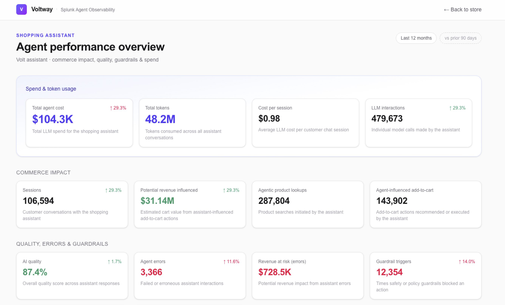
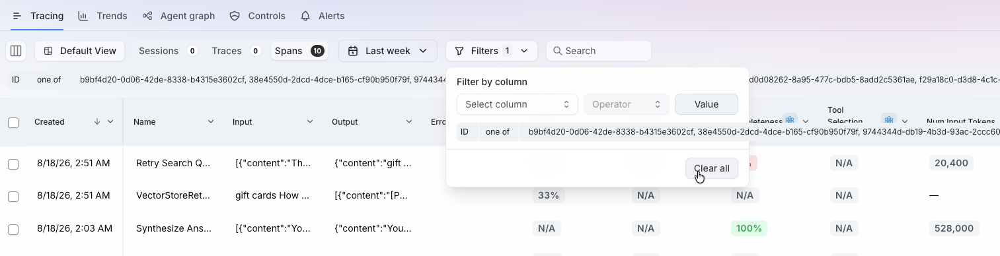
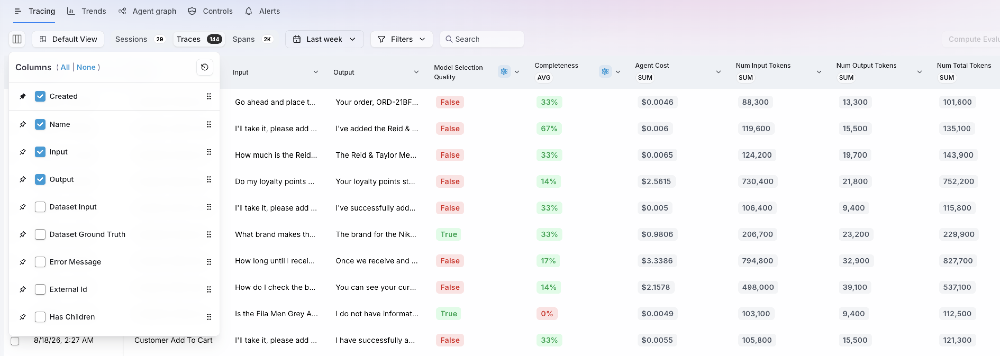
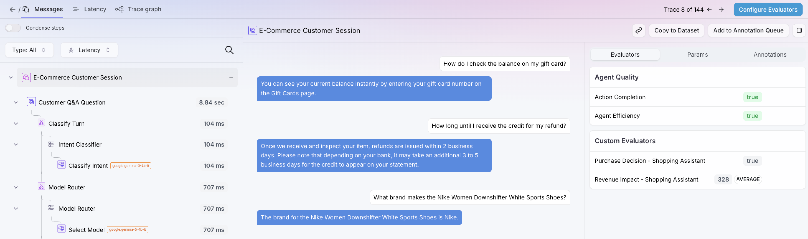
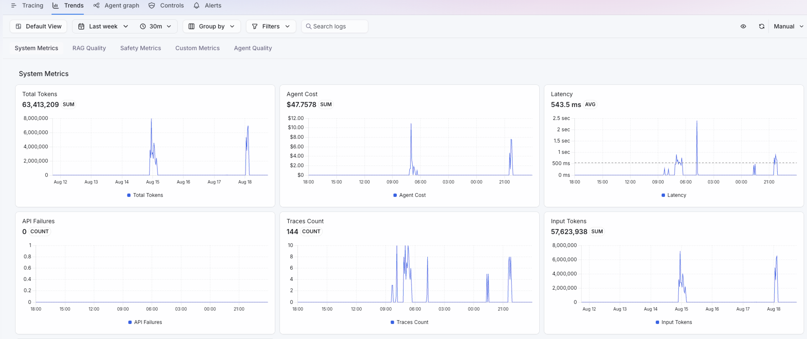
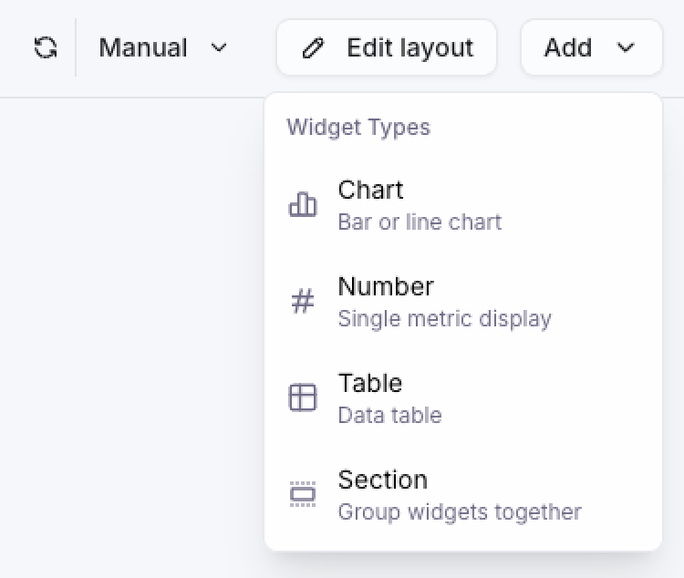
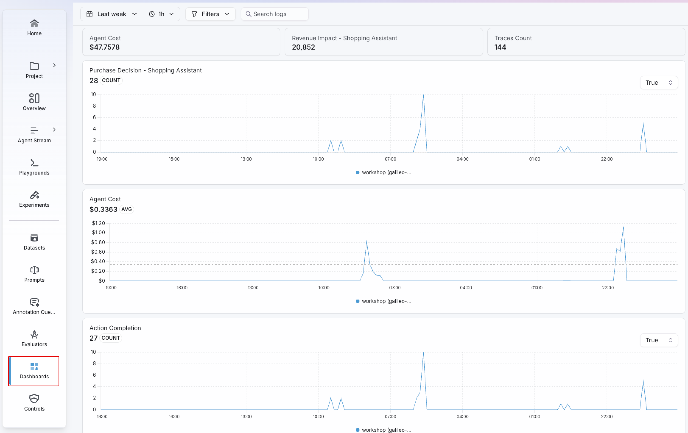

*Or rather, spend that is not correlated with outcomes*

Understanding the outcomes produced by AI agents can only be done with Evaluators; or, alternatively,
with enough people to read and provide feedback on every single agentic interaction, which is not
viable at scale.

To the quality and behavior evaluators that we've been using in this lab, we can now add revenue impact
visibility; this AI Shopping Assistant helps customers make decisions. If it's able to help a customer 
find and purchase the perfect product, it will have *positively* impacted revenue. If it drove the 
customer away because of a hallucination (for instance, wrongfully informing the customer that a
certain product was out of stock), it will have *negatively* impacted revenue.

Evaluating and understanding these outcomes is absolutely critical for application owners and business
teams. In the demo we saw previously, we got a glimpse of how that data can be visualized, in this
case through a custom executive dashboard:



Splunk Agent Observability collects data from running agents to understand the technical aspects of the
agentic workflow (paths, tools used, errors, latency, etc), as well as to assess quality and behavior 
through the proper evaluators. 

Cost also becomes a factor, as agents can get stuck on loops that will greatly impact the token costs;
or, as we've seen, expensive models might be handling tasks that a cheaper model should be able to
take care of. Identifying and mitigating these issues is a critical aspect of Agent Observability.

We should also consider Revenue impact. This will not apply to every use case, of course, but since
this is an AI Shopping Assistant, its actions will have a potential impact to revenue (to be clear, it's
hard to claim *direct* impact, seeing as the customer can abandon the shopping cart, or remove the product
from it; however, there is still value in understanding the *potential* impact. Also, note that for this
lab environment, we are not evaluating the *negative* revenue impact, only the positive).

Let's take a closer look at the data Splunk Agent Observability collects.

**1.** Make sure you are in the **Agent Stream** page for our agent. 

**2.** If the filter from the last section is still active (only showing the spans with the redundant
retrieval steps), click on the **Filters** dropdown and then click on **Clear All**. Also, make sure
to navigate to the **Trends** view.

This should ensure that we can see all records for this agent. Now, let's explore the 
out-of-the-box capabilties that allow us to correlate cost with outcomes.

Individual traces explain one interaction. Trends show whether the same behavior is isolated or
repeated across production traffic.

In the list of Traces, we can use the **Columns** dropdown to select only the metrics and evals that
make sense to us now.

In this view, we can see the `SUM` of Agent Cost; Splunk Agent Observability calculates the agent cost per
span (for the relevant spans), providing an extremely granular view on what is pushing the costs of the
agent; at the same time, this data is aggregated for easier visualization.

You will also notice an eval called **Model Selection Quality**. This is a custom evaluator that determines
whether the best model was used for each interaction. As we've seen previously on this lab, a cheaper model
can handle Q&A questions well, while the more expensive model should be reserved for product-related questions.
This eval help us keep track of this behavior to see if the correct LLM is being used. Based on the eval values,
it is safe to say that this rule is not being respected in production, which may impact not only the quality 
of the responses, but also token costs for the LLMs.

This is not the only custom eval we've created, however. Open one of the traces and go to the Session (very
first element on the left-side panel).

We have a couple of session-level evals:

- **Purchase Decision - Shopping Assistant**: this is a `boolean` eval that determines whether the AI Shopping
Assistant helped the customer make a purchase decision in this session. Not every interaction will lead to a
purchase, of course, but we do want to identify when that happens. PS: For the purposes of this lab, we are 
considering the 'Add to Cart' action to be a purchase decision, which is, of course, arguable.

- **Revenue Impact - Shopping Assistant**: (*or more adequately called 'Potential Revenue Impact'*) this eval 
looks at the entire session data to see if, at any point, the Assistant helped the user add a product to 
the shopping cart. If so, it will capture the dollar amount for that product. The intuition here is that,
without help from the Assistant to find (or better understand) the product, the customer might not
have made that purchasing decision. Of course, the eval will disregard the product if the user later decided
to remove it from the cart. Even though we cannot directly correlate this action with revenue, there's still
value in understanding the behaviors and actions taken by the agent that helped influence customers to
make a purchase.

As we've seen previously, Splunk Agent Observability collects monitoring data to determine the cost of each LLM 
interaction. And it can be further augmented with custom evals that are tuned to track time & cost savings, as 
well as revenue impact.

This helps provide a comprehensive understanding of costs vs outcome, from a technical, quality, behavior and 
returns perspective.

Next, we'll revisit a high-level approach to understand costs and outcomes.





Back on the Agent Stream, go to the **Trends** tab. Adjust the time range to **Last Week** and the Aggregation Interval to **30 Minutes**.

This time, let's interpret the Trends data from the perspective of Cost vs Outcomes.

#### Compare consumption with demand

Under **System Metrics**, review:

* Total Tokens
* Input Tokens and Output Tokens
* Agent Cost
* Latency
* Traces Count
* API Failures

Numbers will be low because this is workshop data; typical production volumes or costs will be much higher.

Start with the relationship between metrics rather than the total alone:

* Did tokens rise because trace volume also rose?
* Did cost increase faster than traffic?
* Was the spike driven by input tokens, output tokens, or both?
* Did latency or failures change at the same time?

A bill from your LLM provider can show the cost spike. These trends show whether it came from healthy demand or a 
change in cost per interaction.

#### Segment the trend

Use **Group by** and **Filters** to narrow the time window and isolate the dimensions present in the telemetry, such as 
model, project, agent stream, environment, or application attributes.

The objective is to move from:

> Token usage increased.

To a statement that can be acted on:

> Input tokens increased for one route after a version change, while trace volume remained stable.

#### Add custom and agent-quality metrics

Scroll to **Custom Metrics** and **Agent Quality**. 

* `model_selection_match`, showing whether the selected model matched the expected route.
* **Agent Efficiency**, showing whether the agent took an effective path.
* **Action Completion**, showing whether the user's requested action was completed.

These metrics connect consumption to behavior and outcome. For example, a token spike accompanied by lower 
`model_selection_match` suggests a routing problem. Stable Action Completion with falling Agent Efficiency 
suggests that tasks still finish, but with more work than necessary.

Next, we're going to look into another way to understand cost vs outcome at a high level: Dashboards!





In Splunk Agent Observability, users can create new dashboards to track and correlate metrics and evals 
as needed. There are different types of widgets that can be used to display data:

User can also resize and rearrange the widgets in the UI using drag & drop.

**1.** In the **Dashboards** page, open the **Agent Tokenomics** dashboard. 

**2.** Change the Time Range to **Last Week** and the Aggregation Interval to **30 Minutes**.

**3.**  Search for potential correlations in the data:

* How does Agent Cost compare to Revenue Impact?
* Do we see a cost increase correlated with purchase decisions?
* Are Purchase Decision and Action Completion aligned?
* Do we see an increase in Tool Errors impacting Purchase Decisions?



There are multiple ways to correlate costs with outcomes in Splunk Agent Observability. Understanding the cost of each
LLM interaction and correlating it with quality evals is only the first step. Understanding time and effort savings, or
potential revenue impacted is a way to bring observability closer to the business.



A token spike appears, but Traces Count is unchanged. What should you inspect next?


Compare input and output tokens, group by model or route, and inspect Agent Efficiency and `model_selection_match`. 
Then open traces from the spike to look for larger context, verbose outputs, retries, loops, or an unexpected model choice.


Attribution tells us where to focus. The next step is to find an approach to keep evals working in production, at the
scale of millions of interactions per year, without losing control of the budget.
