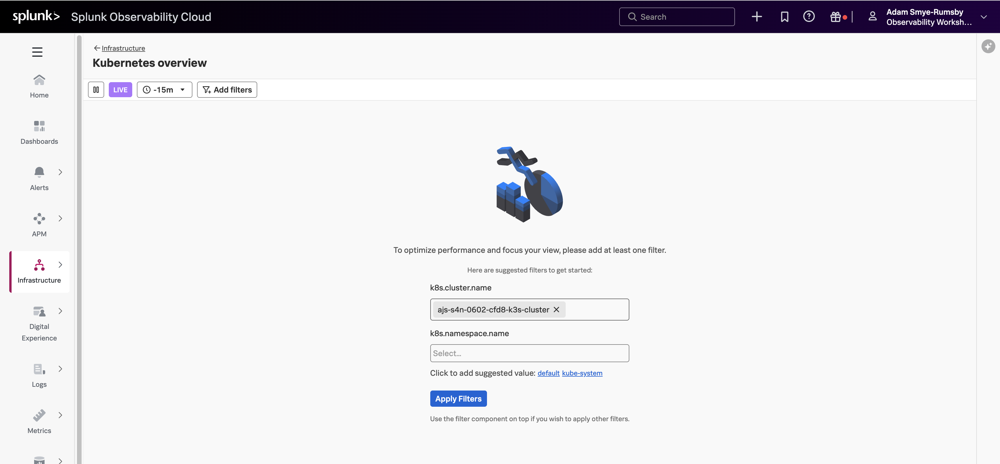
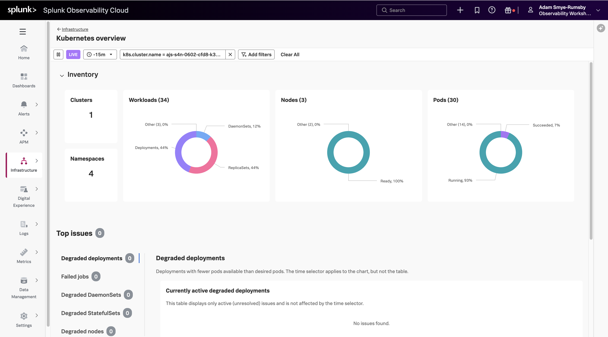
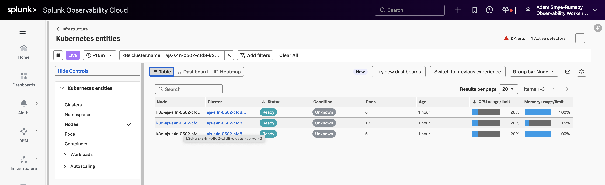
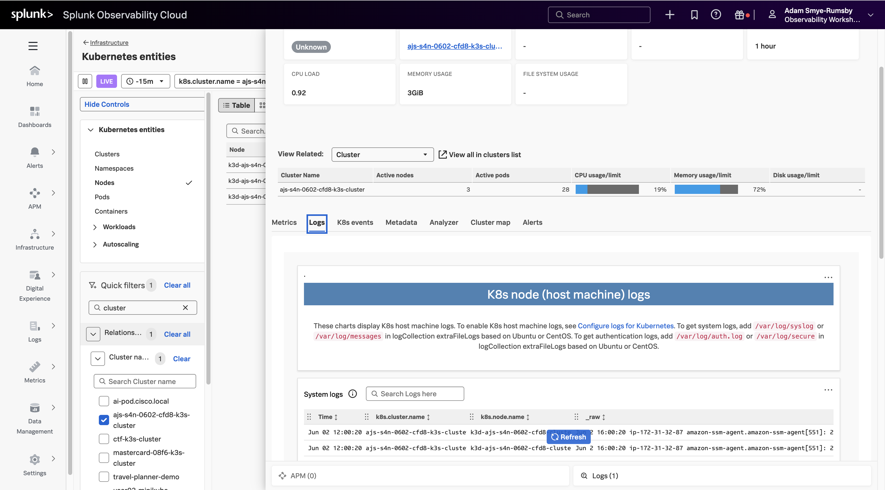

Once the installation has completed, you can log in to **Splunk Observability Cloud** and verify that the metrics are flowing in from your Kubernetes cluster.

From the left-hand menu, click on **Infrastructure** and select **Kubernetes overview**. You will be prompted to apply at least one filter. Click inside the **k8s.cluster.name** field, then select `<INSTANCE>-k3s-cluster` (where`<INSTANCE>` is replaced with the value you noted down earlier). Click **Apply Filters**.

Once you are in the **Kubernetes overview**, select the **Nodes (3)** card title to list all the nodes in your cluster that are reporting metrics.

Next, in the **Kubernetes entities** panel, select the node that hosts the largest number of pods. It will be named `k3d-<INSTANCE>-cluster-server-0` or similar.

In the node panel, select the **Logs** tab to see the logs from the relevant node.

