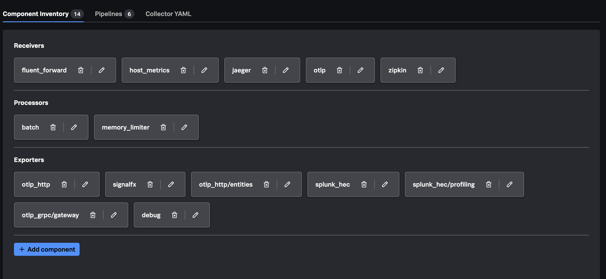

The starter file begins with Splunk Distribution's default Agent configuration
and adds local components for this workshop. Use Config Builder to see how each
component participates in a pipeline before modifying it in later chapters.

Reference: [Splunk Distribution default `agent_config.yaml`](https://github.com/signalfx/splunk-otel-collector/blob/main/cmd/otelcol/config/collector/agent_config.yaml).

{}

## Download `agent_config.yaml`

[Download the .conf26 `agent_config.yaml`](https://github.com/chentaow-splunk/observability-workshop/raw/refs/heads/codex/advanced-collector-conf2026/content/en/ninja-workshops/foundations/2-opentelemetry-collector-workshops/2-advanced-collector-conf2026/agent_config.yaml)

Save it to your local computer as `agent_config.yaml`. You can also run:

```bash
curl -fL \
  https://github.com/chentaow-splunk/observability-workshop/raw/refs/heads/codex/advanced-collector-conf2026/content/en/ninja-workshops/foundations/2-opentelemetry-collector-workshops/2-advanced-collector-conf2026/agent_config.yaml \
  -o agent_config.yaml
```

## Import it

1. Sign in to Splunk Observability Cloud.
2. Open **Data Management > OTel Collector Config Builder**.
3. Choose the action to upload or import an existing configuration.
4. Select `agent_config.yaml`.
5. Open the component inventory, pipeline view, and generated Collector YAML.

The precise button labels can change as Config Builder evolves. Use the action
that imports existing Collector YAML; do not start from an empty configuration.



## Components inherited from Splunk's default Agent config

- **Extensions:** header-based token handling, health check, API and OpAMP HTTP
  forwarders, OpAMP configuration, and zPages diagnostics. The OpAMP extension
  is present by default but is activated only when its feature gate is enabled.
- **Receivers:** Fluent Forward, host metrics, Jaeger, OTLP over gRPC and HTTP,
  the Collector's own Prometheus metrics, Smart Agent process-list monitoring,
  Zipkin, and `nop` for a dynamically populated entity pipeline.
- **Processors:** memory limiting, batching, and cloud/host resource detection.
- **Exporters:** `otlp_http` for APM traces, `signalfx` for metrics/events and
  host metadata, the entity event exporter, Splunk HEC exporters for logs and
  profiling.
- **Pipelines:** `traces`, `metrics`, `metrics/internal`, `logs/signalfx`,
  `logs/entities`, and `logs`.

This configuration keeps the active Agent pipelines connected directly to
Splunk Observability Cloud. It does not use a Gateway Collector.

## Components added by this workshop

- `file_log/quotes` reads the synthetic `quotes.log` file.
- `resource/add_mode` marks processed data with
  `otelcol.service.mode=agent`.
- `debug` prints detailed telemetry in the foreground Agent console.
- `file/traces`, `file/metrics`, and `file/logs` write local OTLP JSON so tests
  do not depend on a backend.

The `debug` and file exporters make it possible to inspect each signal locally
before validating it in a backend.

In the pipeline view, confirm:

- `traces` ends at the default `otlp_http` exporter plus workshop `debug` and
  `file/traces` exporters.
- `metrics` ends at the default `signalfx` exporter plus workshop `debug` and
  `file/metrics` exporters.
- `logs` receives `file_log/quotes` in addition to the default log receivers and
  ends at the default HEC exporters plus workshop `debug` and `file/logs`.
- The three internal/default support pipelines remain connected to their
  Splunk exporters.

{}
The YAML contains environment-variable references, not token values. Never
paste `workshop-env.sh` or a real access/HEC token into Config Builder.
{}

Keep this Config Builder project open. You will modify this configuration in
Chapters 2, 3, and 4.

{}


