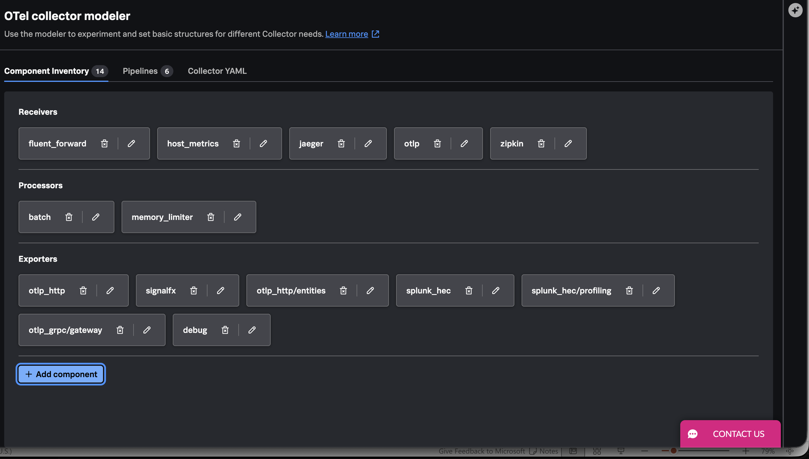
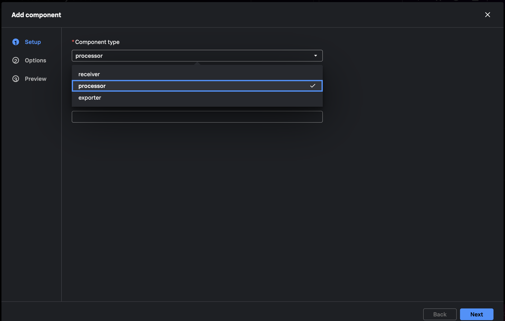
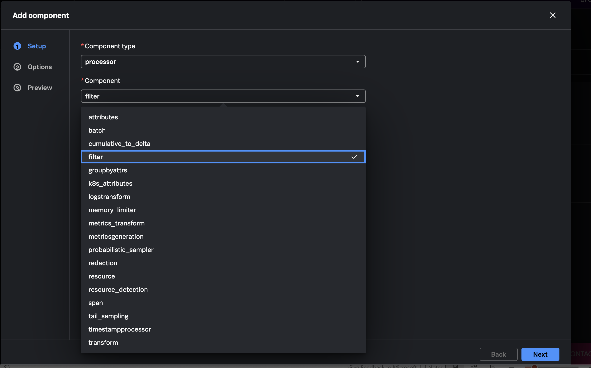
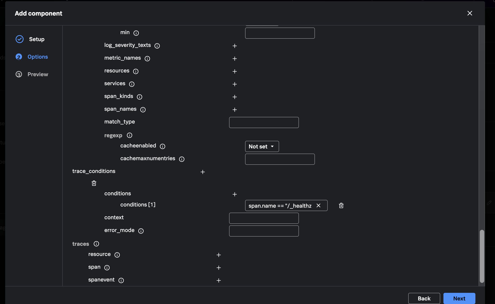
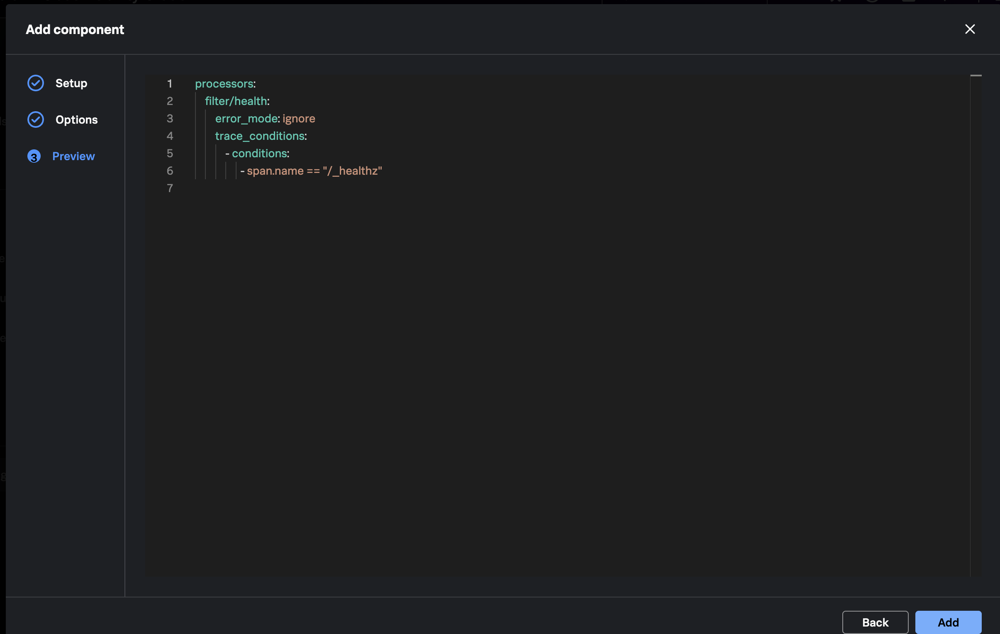
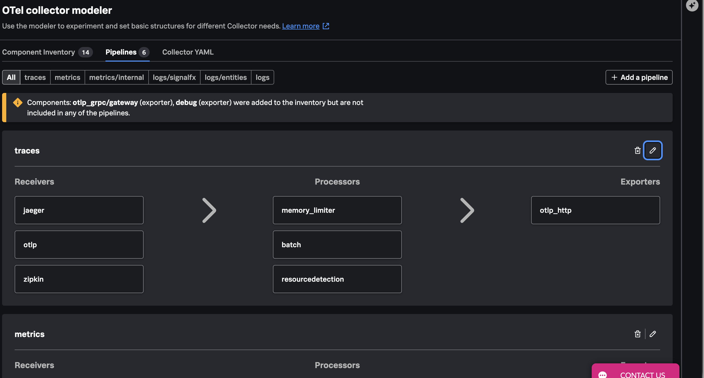
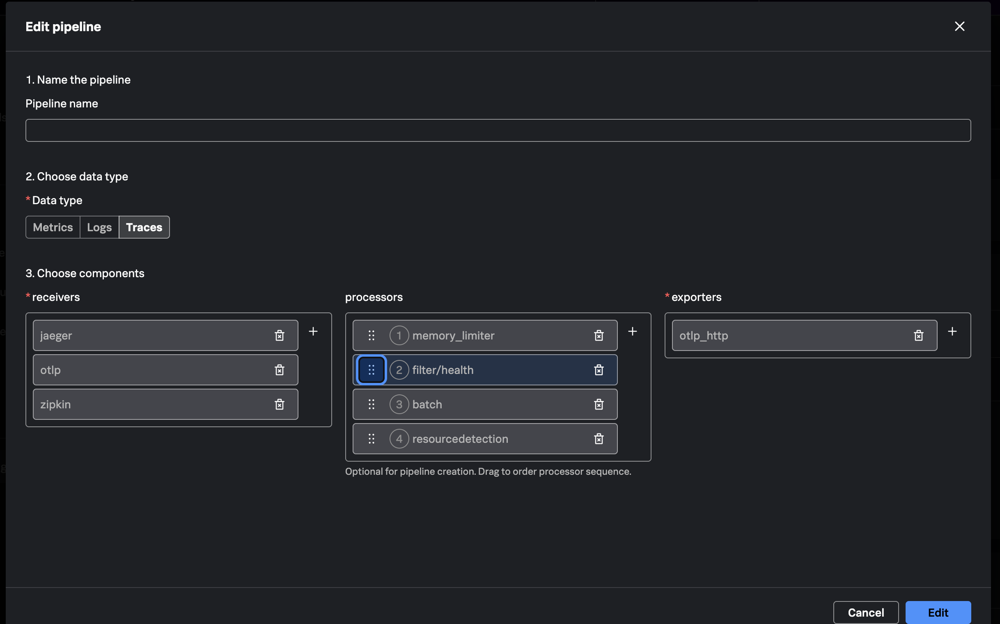

{}



Open **Data Management > OTel Collector Config Builder**, select
**Component Inventory**, and click **Add component**.



For **Component type**, select `processor`.



For **Component**, select `filter`, then click **Next**.



Use `health` as the component name so its Collector component ID is
`filter/health`.

In **Options**, set the top-level `error_mode` to `ignore`. Beside
`trace_conditions`, click **+** to add a condition group. Inside that group,
beside `conditions`, click **+** and enter:

```ottl
span.name == "/_healthz"
```

Leave the condition group's `context` and `error_mode` fields empty. The
Collector infers the `span` context from `span.name`, and the group inherits
the top-level `error_mode`.

{}
The condition matches spans by name. Setting `error_mode` to `ignore` keeps the
pipeline running if a telemetry item cannot be evaluated.
{}

{}
The legacy `traces.span` filter configuration is deprecated. This workshop
uses `trace_conditions`. Config Builder represents the condition as a group
containing a `conditions` list.
{}



Select **Preview**, confirm the generated YAML defines
`processors.filter/health`, and click **Add**.







Select **Pipelines**, find `traces`, and click its pencil-shaped **Edit** icon.



In the **Edit pipeline** modal, click **+** beside **processors** and add
`filter/health`. Place it immediately after `memory_limiter`, then click
**Edit**.



{}
Keep every currently selected receiver, processor, and exporter. Add only the
`filter/health` processor.
{}





Select **Collector YAML** and confirm the generated configuration includes:

```yaml
processors:
  filter/health:
    error_mode: ignore
    trace_conditions:
      - conditions:
          - 'span.name == "/_healthz"'

service:
  pipelines:
    traces:
      receivers:
        - otlp
      processors:
        - memory_limiter
        - filter/health
        - resource_detection
        - resource/add_mode
      exporters:
        - debug
        - file/traces
```

If cloud export is enabled, `otlp_http` also appears under `exporters`. The
important check is that `filter/health` appears once and all existing
components remain connected.

Keep this Config Builder project open. You will download the completed
configuration in Chapter 5.



{}


