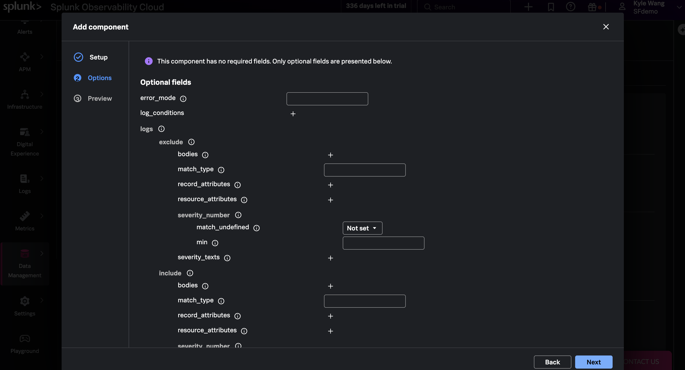
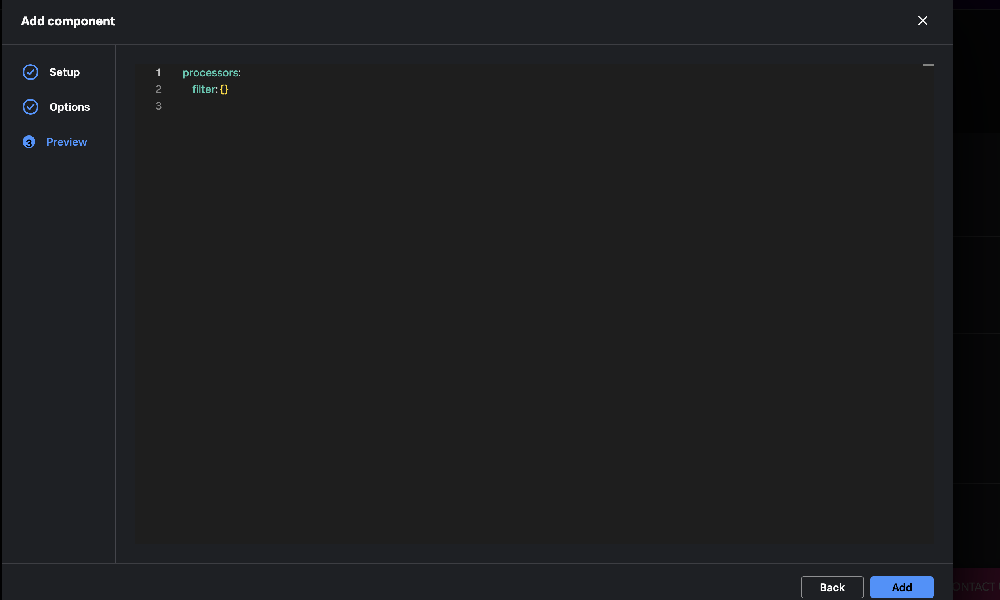
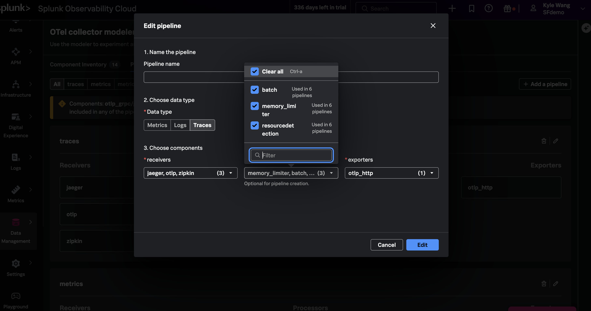

{}



Open **Data Management > OTel Collector Config Builder**, select
**Component Inventory**, and click **Add component**.


For **Component type**, select `processor`.


For **Component**, select `filter`, then click **Next**.


In **Options**, set `error_mode` to `ignore`. Under `trace_conditions`, add:

```ottl
span.name == "/_healthz"
```

{}
The condition matches spans by name. Setting `error_mode` to `ignore` keeps the
pipeline running if a telemetry item cannot be evaluated.
{}



Select **Preview**, confirm the generated YAML defines `processors.filter`,
and click **Add**.







Select **Pipelines**, find `traces`, and click its pencil-shaped **Edit** icon.


{}
The screenshot includes an unused `otlp_grpc/gateway` component. This workshop
uses one Agent and does not add that component to a pipeline.
{}

In the **Edit pipeline** modal, open the **processors** selector, select
`filter`, and click **Edit**.



{}
Keep every currently selected receiver, processor, and exporter. Add only the
`filter` processor. Clearing a checkbox removes that component from the
pipeline.
{}





Select **Collector YAML** and confirm the generated configuration includes:

```yaml
processors:
  filter:
    error_mode: ignore
    trace_conditions:
      - 'span.name == "/_healthz"'

service:
  pipelines:
    traces:
      processors:
        - memory_limiter
        - resource/add_mode
        - batch
        - resource_detection
        - filter
```

The important checks are that `filter` appears exactly once in
`traces.processors` and that the existing receivers, processors, and exporters
remain connected.

Keep this Config Builder project open. You will download the completed
configuration in Chapter 5.



{}


