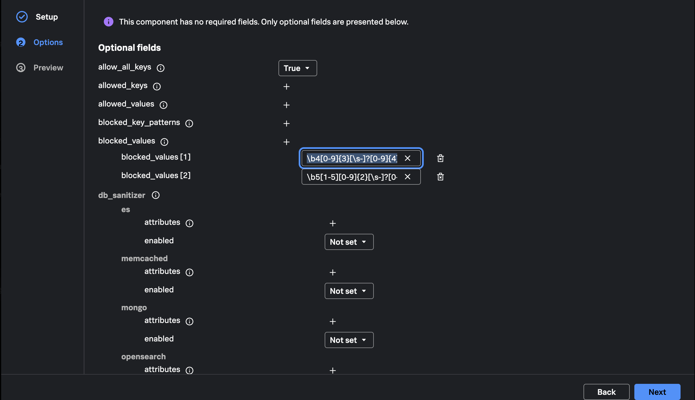

{}



In **Component Inventory**, click **Add component**. Select component type
`processor`, select component `attributes`, and click **Next**.

In **Options**, add these actions in order:

1. Update `user.phone_number` to `UNKNOWN NUMBER`.
2. Hash `user.email`.
3. Delete `user.password`.

Review **Preview** and click **Add**. The generated component should be
equivalent to:

```yaml
processors:
  attributes:
    actions:
      - key: user.phone_number
        action: update
        value: UNKNOWN NUMBER
      - key: user.email
        action: hash
      - key: user.password
        action: delete
```

{}
The load generator emits `user.password`. The processor key must match it
exactly or the password attribute will remain in the exported span.
{}





Click **Add component** again. Select component type `processor`, select
component `redaction`, and click **Next**.

In **Options**, set `allow_all_keys` to **True**. Beside `blocked_values`,
click **+** twice to create two entries, then paste one regular expression into
each entry:

```text
\b4[0-9]{3}[\s-]?[0-9]{4}[\s-]?[0-9]{4}[\s-]?[0-9]{4}\b
\b5[1-5][0-9]{2}[\s-]?[0-9]{4}[\s-]?[0-9]{4}[\s-]?[0-9]{4}\b
```

The first pattern matches the synthetic Visa value and the second matches the
Mastercard value. The Amex value is intentionally left unmatched so the test
can demonstrate an incomplete policy.



Scroll through the remaining options and set `summary` to `debug`. Leave the
database sanitizer options and all other optional fields unset.

{}
Setting `allow_all_keys` to `true` retains attributes whose values do not match
a blocked pattern. The two matching payment-card values are masked; the
unmatched Amex value remains visible so you can recognize an incomplete
redaction policy during validation.
{}

Review **Preview** and click **Add**. The generated component should be
equivalent to:

```yaml
processors:
  redaction:
    allow_all_keys: true
    blocked_values:
      - '\b4[0-9]{3}[\s-]?[0-9]{4}[\s-]?[0-9]{4}[\s-]?[0-9]{4}\b'
      - '\b5[1-5][0-9]{2}[\s-]?[0-9]{4}[\s-]?[0-9]{4}[\s-]?[0-9]{4}\b'
    summary: debug
```





Select **Pipelines** and click the pencil-shaped **Edit** icon for `traces`.
Click **+** beside **processors** to add `attributes`, then repeat to add
`redaction`. Keep every existing receiver, processor, and exporter. Use the
drag handles to place both new processors after `filter/health` and before
`resource/add_mode`, then click **Edit**.

Open **Collector YAML** and confirm:

- Both processor definitions are present.
- `attributes` and `redaction` each appear exactly once in
  `service.pipelines.traces.processors`.
- All existing trace receivers and exporters remain connected.

The relevant pipeline list should be equivalent to:

```yaml
service:
  pipelines:
    traces:
      processors:
        - memory_limiter
        - filter/health
        - attributes
        - redaction
        - resource/add_mode
        - batch
        - resource_detection
```

The order of `attributes` and `redaction` does not change this exercise's
result. Confirm that both appear exactly once and that the existing receivers,
processors, and exporters remain connected.

Keep the project open and continue to Chapter 4.



{}


