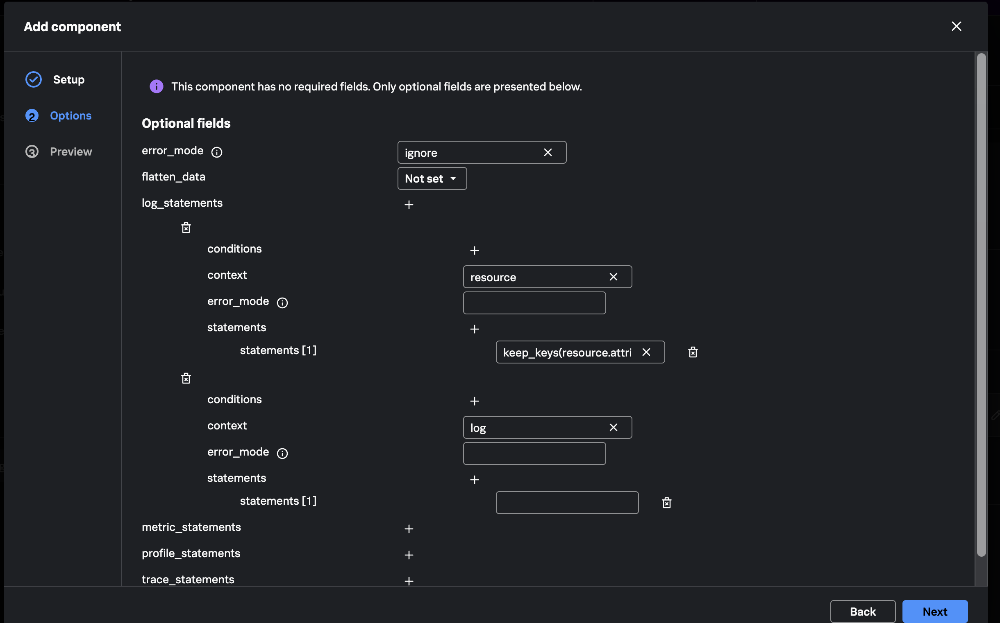
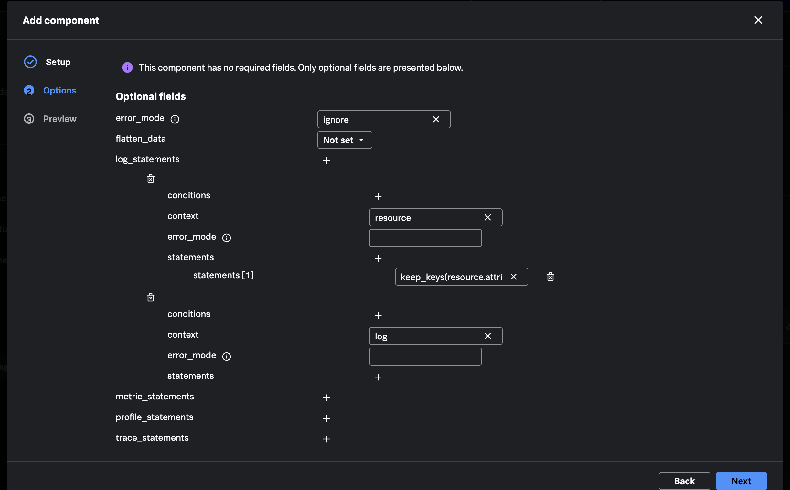
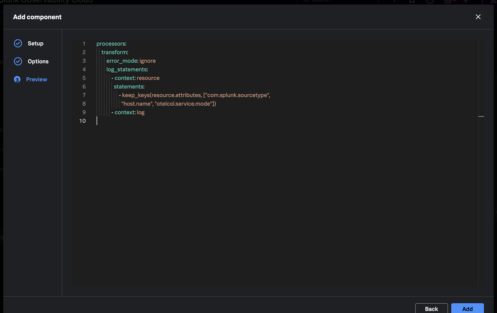
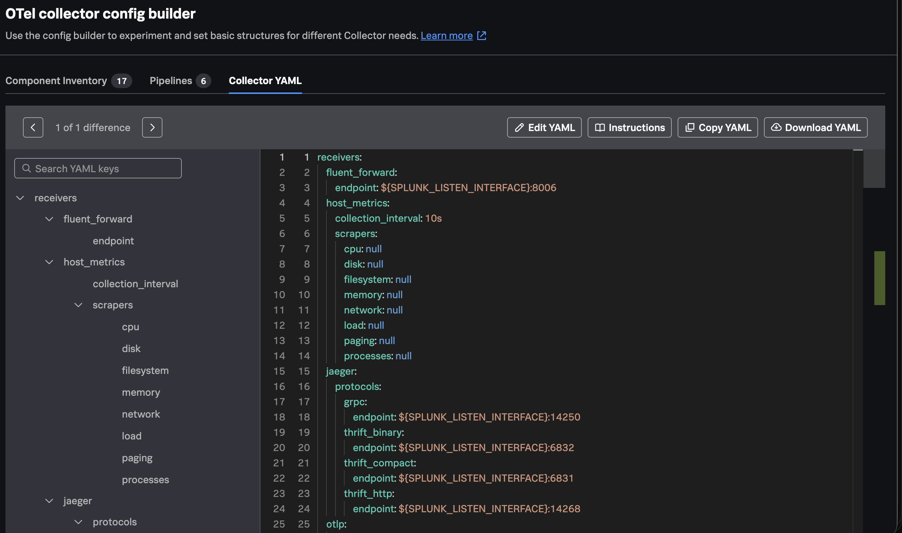
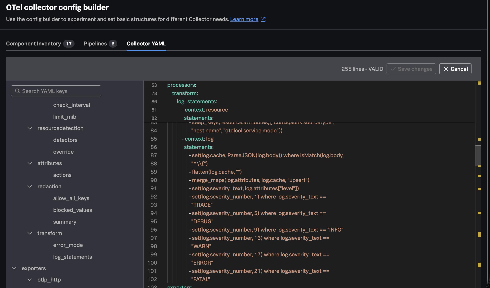

{}



In **Component Inventory**, click **Add component**. Select component type
`processor`, select component `transform`, and click **Next**.

Set `error_mode` to `ignore` so one malformed workshop line does not stop the
logs pipeline.

Under `log_statements`, click **+** to add a statement group and set its
context to `resource`. Under that group's `statements`, click **+** and enter:

```ottl
keep_keys(resource.attributes, ["com.splunk.sourcetype", "host.name", "otelcol.service.mode"])
```

This keeps the resource metadata used by the exercise and removes fields such
as `com.splunk.source`, `service.name`, and `os.type` from the exported log
resource.

Under `log_statements`, click **+** again to add a second statement group and
set its context to `log`. Leave its `statements` list empty for now. The
complete OTTL expressions are easier and safer to add in the Collector YAML
editor because several expressions are too long for the Options fields.



If an empty statement row was added under the `log` context, use its trash-can
icon to remove it. The `log` context should remain, with no statements beneath
it.



Select **Preview**. Confirm that the preview contains one `transform`
processor, a `resource` context with the `keep_keys` statement, and an empty
`log` context. Click **Add**.







Open **Collector YAML**, then click **Edit YAML**.



Find `processors`, then `transform`, then the empty `- context: log` entry.
Place the cursor on the next line below `- context: log`. Copy and paste the
entire indented block below exactly as shown:

```yaml
        statements:
          - set(log.cache, ParseJSON(log.body)) where IsMatch(log.body,
            "^\\{")
          - flatten(log.cache, "")
          - merge_maps(log.attributes, log.cache, "upsert")
          - set(log.severity_text, log.attributes["level"])
          - set(log.severity_number, 1) where log.severity_text ==
            "TRACE"
          - set(log.severity_number, 5) where log.severity_text ==
            "DEBUG"
          - set(log.severity_number, 9) where log.severity_text == "INFO"
          - set(log.severity_number, 13) where log.severity_text ==
            "WARN"
          - set(log.severity_number, 17) where log.severity_text ==
            "ERROR"
          - set(log.severity_number, 21) where log.severity_text ==
            "FATAL"
```

The indentation is part of the YAML. `statements:` must be nested beneath the
existing `- context: log` entry, and each `- set(...)` or function call must be
nested beneath `statements:`. Do not add a second `- context: log` entry.

Wait for the editor header to show **VALID**, then click **Save changes**.



`ParseJSON` creates a map in the temporary cache, `flatten` normalizes nested
fields, and `merge_maps(..., "upsert")` inserts new keys or replaces existing
keys in the log attributes. The remaining statements copy the embedded level
into `severity_text` and map it to an OpenTelemetry severity number.

The load generator produces `DEBUG`, `INFO`, `WARN`, and `ERROR`. The `TRACE`
and `FATAL` statements demonstrate how the mapping can cover additional input.

The saved configuration should define one `transform` processor with both
statement groups.

{}
Promoting every JSON field to a top-level attribute is useful for this
exercise, but it can create high-cardinality data in production. Use an
explicit field allowlist for real workloads.
{}





Select **Pipelines** and click the pencil-shaped **Edit** icon for `logs`.
Click **+** beside **processors** and add `transform`. Keep every existing
receiver, processor, and exporter. Use the drag handle to place `transform`
after `resource_detection`, then click **Edit**.

Open **Collector YAML** and confirm:

- `transform` contains one resource context and one log context.
- `transform` appears exactly once in `service.pipelines.logs.processors`.
- It appears after `resource_detection`, allowing `host.name` to be detected
  before the resource allowlist is applied.
- `filter/health`, `attributes`, and `redaction` remain connected to `traces`.

The complete logs pipeline should be equivalent to:

```yaml
service:
  pipelines:
    logs:
      receivers:
        - fluent_forward
        - otlp
        - file_log/quotes
      processors:
        - memory_limiter
        - resource/add_mode
        - batch
        - resource_detection
        - transform
      exporters:
        - splunk_hec
        - splunk_hec/profiling
        - debug
        - file/logs
```

Review **Collector YAML** and resolve any errors shown. If `transform` is not
after `resource_detection`, return to the Pipeline editor and use the drag
handle to move it. The resource allowlist must run after host metadata is
detected.

Keep the project open for Chapter 5.



{}


