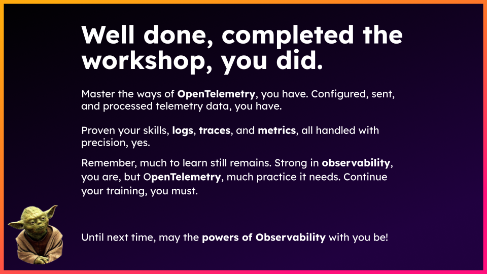

You used Config Builder to filter noisy spans, protect sensitive attributes,
transform logs, and validate the result locally. Cloud-enabled attendees also
verified traces and metrics in Splunk Observability Cloud.

## Take-home exercises

{}

A Splunk Observability Cloud free organization does not include a Splunk
Platform HEC endpoint. Use a separate non-production Splunk Enterprise or
Splunk Cloud Platform environment.

1. Set `SPLUNK_HEC_URL` and `SPLUNK_HEC_TOKEN` for your non-production Splunk
   Platform instance. The configuration already defines the
   [`splunk_hec` exporter](https://help.splunk.com/en/splunk-observability-cloud/manage-data/splunk-distribution-of-the-opentelemetry-collector/get-started-with-the-splunk-distribution-of-the-opentelemetry-collector/collector-components/exporters/splunk-hec-exporter).
2. In the retained `logs` pipeline, replace `nop` with `splunk_hec` and send an
   OTLP or Fluent Forward log. To reuse the quote exercise, add the existing
   `file_log/quotes` receiver and `transform` processor to that pipeline.
3. If your environments meet the requirements, configure
   [Splunk Log Observer Connect](https://help.splunk.com/splunk-observability-cloud/manage-data/view-splunk-platform-logs/introduction-to-splunk-log-observer-connect)
   to investigate logs alongside metrics and traces.

Never use production credentials for workshop data.

{}

{}

Instrument a supported application and follow
[Get data into Splunk APM AlwaysOn Profiling](https://help.splunk.com/en/splunk-observability-cloud/monitor-application-performance/alwayson-profiling/get-data-into-splunk-apm-alwayson-profiling).

{}

{}

- Add an Amex pattern and repeat the redaction test. See the
  [Redaction Processor documentation](https://help.splunk.com/splunk-observability-cloud/manage-data/splunk-distribution-of-the-opentelemetry-collector/get-started-with-the-splunk-distribution-of-the-opentelemetry-collector/collector-components/processors/redaction-processor).
- Add another precise noisy-span condition. See the
  [Filter Processor documentation](https://help.splunk.com/en/splunk-observability-cloud/manage-data/manage-sensitive-data/sanitize-data-with-opentelemetry-collector-processors/filter-processor).

{}

{}
Save the final `agent_config.yaml` without secrets. Review component support,
credentials, network exposure, processor ordering, and data volume before
using it outside the workshop.
{}
