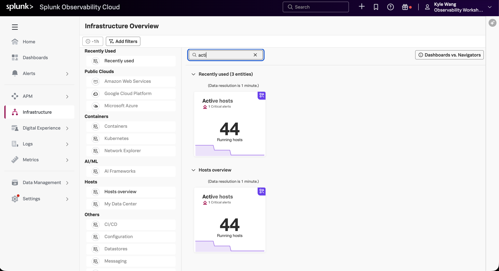
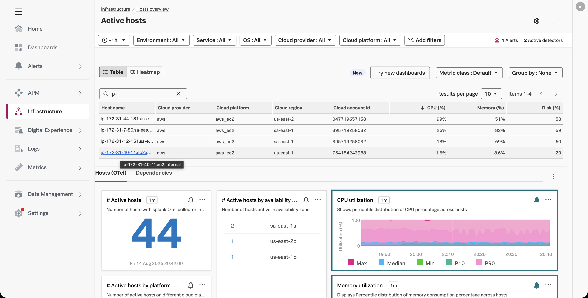
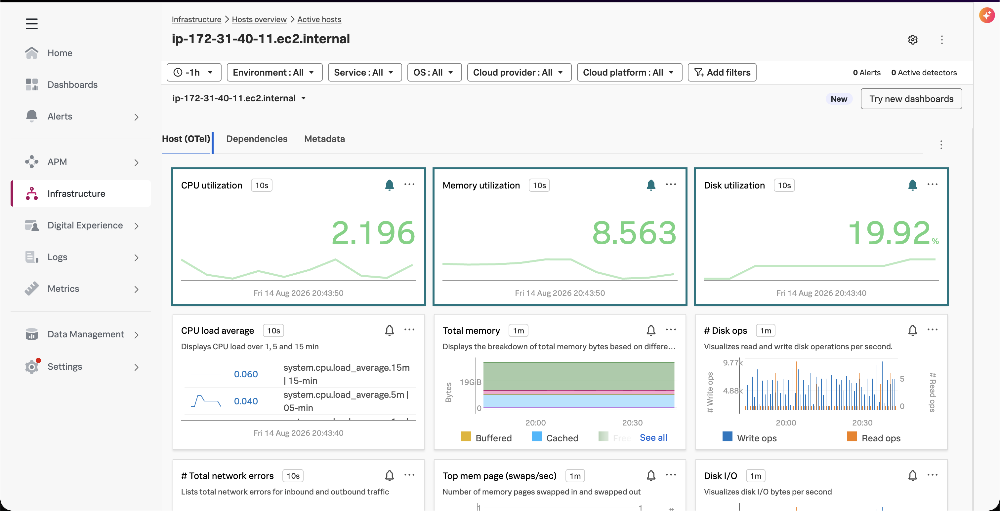

This optional step confirms that the trace and metrics exporters can reach the
Splunk Observability Cloud organization configured during setup.

{}
Skip this step when setup did not enable cloud export. Local validation from
Steps 1.2 through 1.4 is sufficient.
{}

{}

Steps 1.2 and 1.3 already generated the telemetry for this validation. When
cloud export is enabled, the agent continuously sends host metrics and sends
the `/movie-validator` spans generated in Step 1.3. You do not need to run
`loadgen` again. The workshop logs generated in Step 1.4 are validated locally
and are not part of this cloud check.

1. In the **Command terminal**, confirm cloud mode was enabled:

   ```bash
   source ../workshop-env.sh
   echo "${CONF2026_CLOUD_ENABLED}"
   ```

   Continue only when the value is `true` and the agent is running.

2. Print the exact host name detected by the agent:

   ```bash
   jq -r '
     .resourceMetrics[].resource.attributes[]
     | select(.key == "host.name")
     | .value.stringValue
   ' agent-metrics.out | sort -u
   ```

   Copy the resulting host name. The detected host name can differ from the
   name shown in your terminal prompt.

3. In the Splunk Observability Cloud navigation menu, select
   **Infrastructure**. Search for and select the **Active hosts** navigator.

   

4. Paste the detected host name into the search field. Find the exact host in
   the results.

   

5. Select the matching host name. Confirm that the host navigator displays
   recent CPU, memory, disk, load, or network metrics.

   

6. In Splunk Observability Cloud, select **APM > Traces** (Trace Analyzer),
   choose a recent time range such as the last 15 minutes, and select **All
   traces**.
7. Filter for service `cinema-service` and operation `/movie-validator`.
   Open a returned trace and confirm its span attributes include the sample
   `user.*` fields and `otelcol.service.mode=agent`.

Telemetry can take a few minutes to become searchable. If nothing appears,
confirm the trace and workshop CPU metrics are present locally. Then inspect
the **Agent terminal** for `401`, DNS, TLS, or export errors and recheck the realm,
endpoint, and access token's ingest authorization in `workshop-env.sh`.

When both the trace and host metrics appear, the Collector is successfully
sending data to Splunk Observability Cloud.

{}
