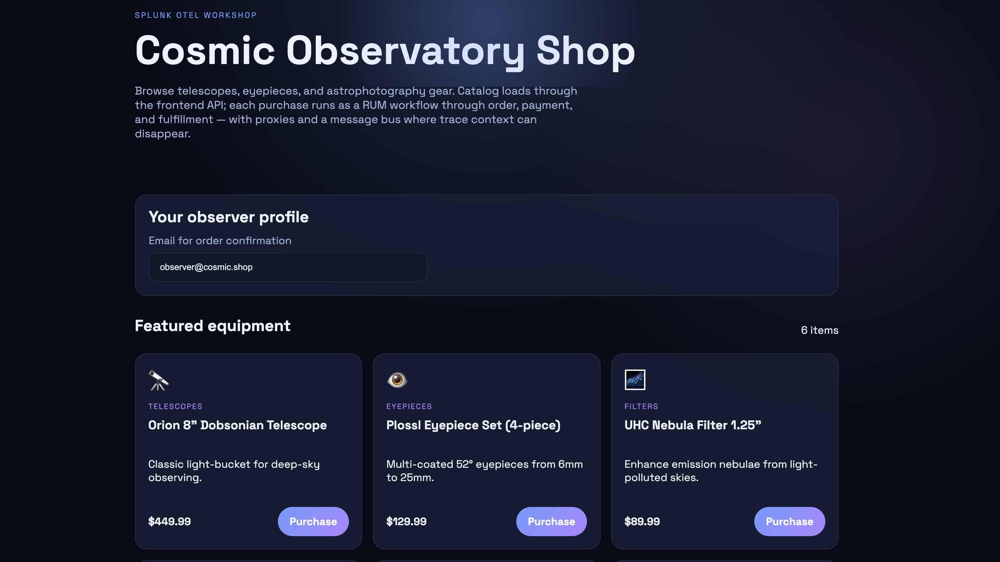
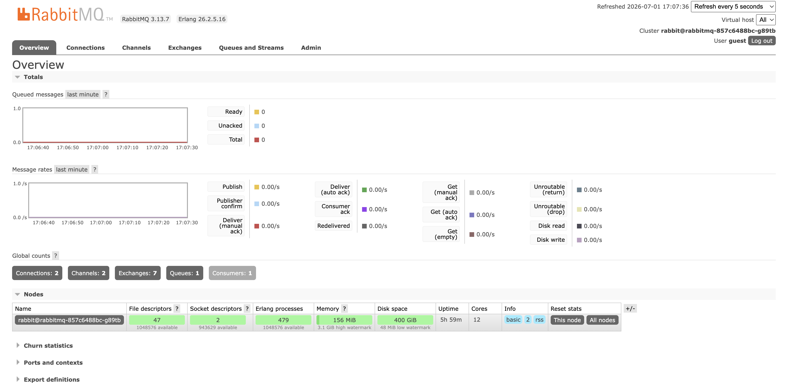

## Access the Application

Open the Cosmic Observatory Shop in your browser:

**http://localhost:30080**

You should see the astronomy equipment catalog with telescopes, eyepieces, and astrophotography gear...



Optional - RabbitMQ management UI:

**http://localhost:15672** (login: `guest` / `guest`)



If the UI does not load, verify the loadbalancer port and use port-forward:

```bash
docker ps --filter name=k3d-cosmic-shop-serverlb --format '{{.Ports}}'
kubectl -n cosmic-shop port-forward svc/rabbitmq 15672:15672
```

---

## Generate Initial Traffic

1. After opening the shop at http://localhost:30080
2. Enter an email address (e.g. `observer@cosmic.shop`)
3. Click **Purchase** on any product
4. Confirm the order in the modal

Repeat a few times to generate trace data.

---
