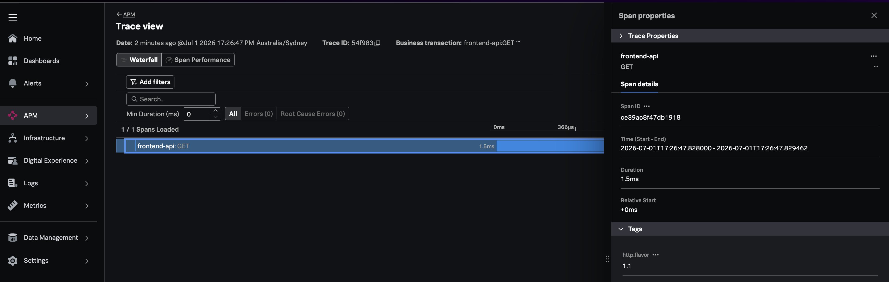

## The APM request path

When you clicked **Place order**, the request flowed through:

```
Browser (RUM span)
  → Frontend NGINX
    → Edge Gateway NGINX     ← break #1: trace headers dropped
      → Order API
        → Catalog API        ← direct HTTP (may share order-api trace)
        → Payment Gateway    ← break #2: strips headers to payment-api (visible in service map)
          → Payment API
            → RabbitMQ       ← break #3: no trace context in message
              → Fulfillment Worker  ← orphan root trace
```

Three breaks occur:

1. **HTTP break #1** at the edge NGINX gateway (browser → order API)
2. **HTTP break #2** at the payment-gateway proxy (order API → payment API)
3. **Messaging break** at RabbitMQ (payment API → fulfillment worker)

---

## Observe in Splunk APM

{}

Allow **2–5 minutes** after generating data for metrics to appear..

{}

### Service map

1. Navigate to **APM → Service Map**
2. Filter environment: `workshop-context-prop`
3. You should see services: `order-api`, `payment-gateway`, `payment-api`, `fulfillment-worker`, `catalog-api`


### Trace search

1. Navigate to **APM → Trace Analyzer**
2. Filter:
   - Environment: `workshop-context-prop`
   - Service: `order-api`
   - Operation: `POST /api/orders` (or `storefront.place_order`)
3. Open a recent trace

**What you'll see (broken state):**

| Span | Service | Parent |
|------|---------|--------|
| Browser fetch | RUM | — (browser root) |
| `POST /api/orders` | order-api | **None** (orphan root) |
| `catalog.get_product` | catalog-api | order-api child ✓ |
| `payment-gateway.proxy_payment` | payment-gateway | May link to order-api |
| `payment.process_payment` | payment-api | **None** (orphan root) |
| `fulfillment.process_job` | fulfillment-worker | **None** (orphan root) |



---

## Generate RUM data

1. Open **http://localhost:30080**
2. Open browser DevTools → **Network** tab
3. Place 3–5 orders for different products
4. In the Network tab, inspect a `POST /api/orders` request
5. Confirm the request includes a `traceparent` header (injected by Splunk RUM)

Example header:

```
traceparent: 00-4bf92f3577b34da6a3ce929d0e0e4736-00f067aa0ba902b7-01
```

The browser is doing its part.

---

{}

Allow **2–5 minutes** after deploy for infrastructure metrics to appear..

{}

## Observe in Splunk RUM

1. Navigate to **RUM → Sessions**
2. Open a recent session
3. Click on a `fetch` resource for `/api/orders`
4. Look for the **Backend Trace** link

**Broken state:** RUM cannot link to the backend APM trace because the gateway stripped the `traceparent` header before it reached `storefront-api`. Splunk RUM relies on `Server-Timing` and matching trace IDs for correlation.

---

## Why NGINX breaks propagation

Our gateway uses a common production NGINX pattern:

```nginx
location /api/ {
    proxy_set_header Host $host;
    proxy_set_header X-Real-IP $remote_addr;
    proxy_set_header X-Forwarded-For $proxy_add_x_forwarded_for;
    proxy_set_header X-Forwarded-Proto $scheme;
    proxy_pass http://storefront_api;
}
```

When **any** `proxy_set_header` directive is present, NGINX stops automatically forwarding client headers to the upstream. Headers like `traceparent`, `tracestate`, and `baggage` are silently dropped unless explicitly configured.

This is one of the most common causes of broken trace correlation in production.

---

## Why RabbitMQ breaks propagation

Our storefront publishes orders like this (broken state):

```javascript
channel.sendToQueue(ordersQueue, Buffer.from(JSON.stringify(order)), {
  persistent: true,
  headers: { 'x-order-id': order.orderId },  // no traceparent
});
```

Unlike HTTP, message brokers don't participate in W3C Trace Context automatically. The producer must **inject** trace context into message headers, and the consumer must **extract** it. Without this, the consumer starts a new root trace.

---
