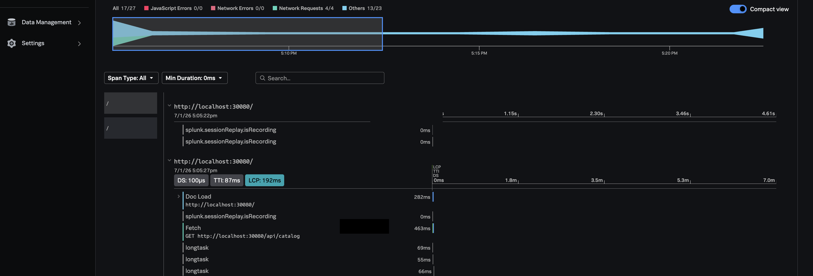

## The RUM request path

1. Open **http://localhost:30080**
2. Open browser DevTools → **Network** tab
3. Place 3–5 orders for different products
4. In the Network tab, inspect a `POST /api/orders` request
5. Confirm the request includes a `traceparent` header (injected by Splunk RUM)

Example header:

```
traceparent: 00-4bf92f3577b34da6a3ce929d0e0e4736-00f067aa0ba902b7-01
```

The browser appears to be correcly instrumented and processing requests as expected.

---

{}

Allow **2–5 minutes** after deploy for RUM data to appear..

{}

## Observe in Splunk RUM

1. Navigate to **Digital Experience → Session Search**
2. Filter **Environment → `workshop-context-prop`**
3. Open a recent session
4. Click on a `fetch` or `Click`resource for `/api/orders`
4. Look for the **Backend Trace** link



**Broken state:** RUM cannot link to the backend APM trace because the gateway stripped the `traceparent` header before it reached `storefront-api`. Splunk RUM relies on `Server-Timing` and matching trace IDs for correlation.

---

### Knowledge Check

1. Why NGINX breaks propagation?


Our gateway uses a common production NGINX pattern:

```nginx
location /api/ {
    proxy_set_header Host $host;
    proxy_set_header X-Real-IP $remote_addr;
    proxy_set_header X-Forwarded-For $proxy_add_x_forwarded_for;
    proxy_set_header X-Forwarded-Proto $scheme;
    proxy_pass http://storefront_api;
}
```

When **any** `proxy_set_header` directive is present, NGINX stops automatically forwarding client headers to the upstream. Headers like `traceparent`, `tracestate`, and `baggage` are silently dropped unless explicitly configured.

This is one of the most common causes of broken trace correlation in production.


---
 
2. Why RabbitMQ breaks propagation


Our storefront publishes orders like this (broken state):

```javascript
channel.sendToQueue(ordersQueue, Buffer.from(JSON.stringify(order)), {
  persistent: true,
  headers: { 'x-order-id': order.orderId },  // no traceparent
});
```

Unlike HTTP, message brokers don't participate in W3C Trace Context automatically. The producer must **inject** trace context into message headers, and the consumer must **extract** it. Without this, the consumer starts a new root trace.


---
