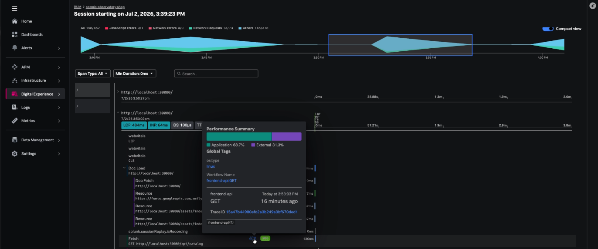
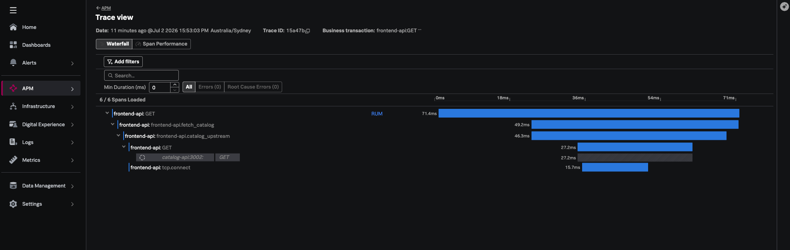

## Check Splunk

### 1. Confirm partial correlation in RUM

You will now see the RUM session with APM correlation

### 2. Confirm partial correlation in Traces

In **APM → Traces** view, open a recent `frontend-api` trace. The frontend span should share a trace ID with the browser/RUM session after this fix.

---
