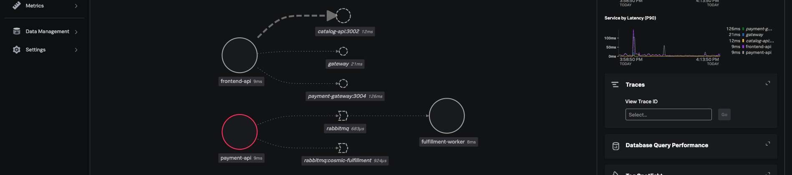
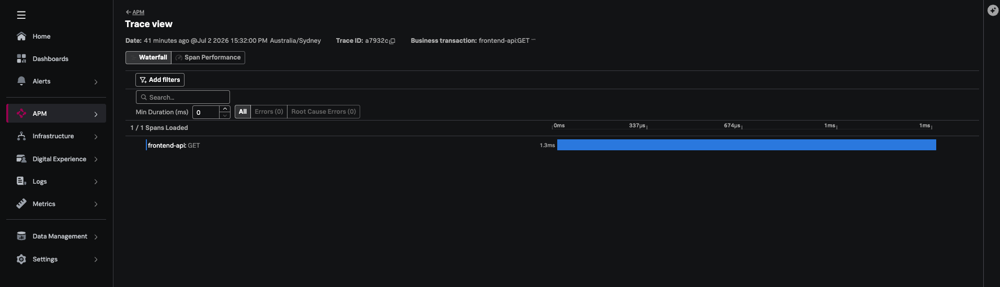
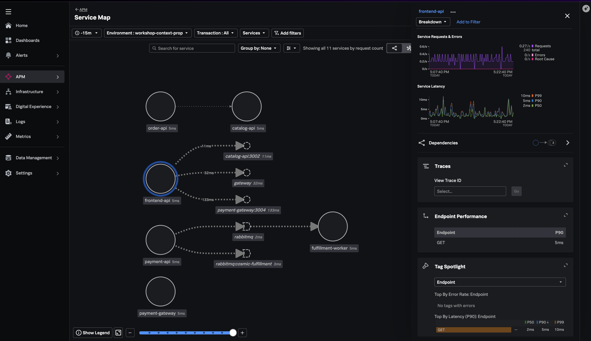

## End-to-End Validation

### Send New Web Request


{}

```bash
curl -s -X POST http://localhost:30080/api/purchases \
  -H "Content-Type: application/json" \
  -d '{"productId":"mount-eq6-pro","quantity":1,"customerEmail":"final-test@cosmic.shop"}' \
  | python3 -m json.tool
```

{}
{}

```json
{
    "message": "Order accepted for fulfillment",
    "order": {
        "orderId": "ORD-1719763200456",
        "productName": "SkyWatcher EQ6-R Pro Mount",
        "total": 1899.0
    },
    "traceHint": {
        "traceId": "4bf92f3577b34da6a3ce929d0e0e4736",
        "spanId": "..."
    }
}
```
{}


Copy the trace ID (the 32-character hex segment) - you'll use it to search in Splunk APM.

### Wait ~2 seconds, then confirm worker fulfillment:


{}

```bash
kubectl -n cosmic-shop logs deployment/order-worker --tail=3
```

{}
{}

```
Fulfilled order ORD-1719763200456 for SkyWatcher EQ6-R Pro Mount
```

{}

---

## Verify in Splunk RUM

1. Navigate to **Digital Experience → Sessions**
2. Find your session (environment `workshop-context-prop`)
3. Click the session timeline
4. Select the `POST /api/orders` fetch event
5. Confirm:
   - Response time is displayed
   - **Backend Trace** link navigates to APM
   - Trace ID matches the browser `traceparent` header

### To Update


---

## Verify in Splunk APM

1. Navigate to **APM → Traces**
2. Filter:
   - Environment: `workshop-context-prop`
   - Minimum duration: any
3. Open the trace linked from RUM (or search by trace ID from the `traceparent` header)

### Expected span hierarchy

```
Trace ID: 4bf92f3577b34da6a3ce929d0e0e4736  (example)

├─ documentLoad / routeChange               [RUM]
├─ HTTP GET /api/catalog                    [RUM → storefront-api]
│   └─ GET /api/catalog                     [storefront-api]
│       └─ catalog.list_products            [catalog-api]
└─ HTTP POST /api/orders                    [RUM → storefront-api]
    └─ POST /api/orders                     [storefront-api]
        ├─ catalog.get_product              [catalog-api]
        ├─ storefront.publish_order         [storefront-api, PRODUCER]
        │   └─ order-worker.process_order   [order-worker, CONSUMER]
        │       ├─ validate_inventory
        │       ├─ prepare_shipment
        │       └─ send_confirmation
        └─ (response 202)
```

### TO UPDATE


---

## Verify Service Map

1. Navigate to **APM → Service Map**
2. Filter environment: `workshop-context-prop`
3. Confirm all services appear with traffic edges:
   - `storefront-api` → `catalog-api`
   - `storefront-api` → `order-worker` (via RabbitMQ)

### TO UPDATE


---
