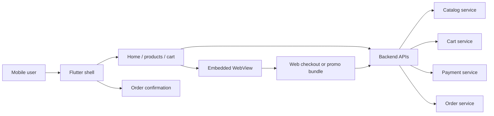

Mobile teams often own more than one front-end surface: native screens, Flutter views, and embedded web experiences delivered through a WebView or a hybrid framework. This workshop uses a small mobile checkout scenario to show how to decide where instrumentation belongs, add Splunk RUM to a Flutter app, instrument a hybrid web layer, and validate the resulting sessions in Splunk Observability Cloud.

The lab is designed for an existing app. If you do not have one available, treat the sample as a reference architecture and use the snippets in:

```text
workshop/flutter-hybrid-rum/
```

## What the App Does

The workshop app represents a retail mobile checkout experience that already works before you add observability:

1. The user opens the mobile app.
2. The **Flutter shell** renders the home screen, product list, cart, and order confirmation.
3. Flutter screens call backend APIs such as `/products`, `/cart`, `/profile`, and `/checkout`.
4. A **hybrid WebView** handles one web-owned step, such as checkout, promo redemption, help, identity, or terms.
5. Backend services process catalog lookup, cart updates, payment authorization, and order creation.



This shape is common in real mobile teams. The mobile team owns the shell and core screens, while another web or commerce team may own an embedded checkout, help, identity, or campaign experience.

Before instrumentation, the app can still complete checkout, but the operations view is thin. You may know that a user complained, an API returned an error, or a crash happened, but you cannot easily reconstruct the user's path through Flutter screens, WebView content, network requests, and backend services.

## How We Add Instrumentation

Instrumentation is added at the runtime boundary where the work happens. The app's product, cart, checkout, and order logic does not change. We add telemetry around that logic.

1. **Flutter RUM initialization** goes into `main.dart` before `runApp()`. This captures app startup, lifecycle, screen navigation, user interactions, network requests, rendering performance, and supported crash signals from the Flutter app.
2. **Flutter context and custom events** are added around business actions such as cart updates and checkout. This makes RUM sessions searchable by version, build flavor, tenant tier, workflow name, and privacy-safe failure reason.
3. **Browser RUM** goes into the WebView's web bundle, not the Flutter shell. This captures the embedded page's route changes, clicks, resource loads, JavaScript errors, and web-owned network calls.
4. **Shared attributes** such as `deployment.environment`, `app.version`, `app.shell`, and `workflow.name` connect the mobile shell, embedded web layer, and backend traces without double-counting the same activity.
5. **Backend APM instrumentation** stays in the backend services. It provides the server-side traces that RUM links to when a mobile request is slow or fails.

| Layer | File or owner | What we add | What Splunk shows |
| ----- | ------------- | ----------- | ----------------- |
| Flutter app startup | `main.dart` | `SplunkRum.instance.install(...)` before `runApp()` | App launches, sessions, lifecycle, screens, supported crashes, and covered mobile network calls. |
| Flutter business actions | Cart and checkout handlers | Global attributes, `cart_item_added`, `checkout`, `checkout_failed` | Searchable sessions and workflow timing tied to the user's action. |
| WebView web bundle | JavaScript loaded by WebView | Browser RUM initialization with WebView-specific attributes | Embedded page views, clicks, resource timing, JavaScript errors, and web API calls. |
| Backend APIs | API services or gateway | Splunk APM/OpenTelemetry and trace header preservation | Server-side spans that explain why a mobile request was slow or failed. |

After instrumentation, the same checkout flow produces an end-to-end troubleshooting path: start from a user session in RUM, inspect the Flutter screens and WebView events, open the slow or failed network request, and follow the linked backend trace in APM.

## Workshop Goals

By the end of the workshop, you will be able to:

- Choose the right RUM agent path for Flutter, WebView, Capacitor, Cordova, Ionic, or React Native surfaces.
- Add the Splunk RUM Flutter agent to an Android/iOS Flutter application.
- Configure app name, environment, version, user tracking mode, global attributes, and custom workflow events.
- Add browser RUM to a hybrid web layer without double-counting the native shell.
- Preserve privacy by redacting sensitive URLs, headers, user identifiers, and replayable content.
- Validate mobile RUM data, troubleshoot common setup failures, and connect front-end sessions to backend APM traces.

## Workshop Flow

| # | Topic | Time |
| - | ----- | ---- |
| 1 | Plan the app and instrumentation path | 10 min |
| 2 | Configure Flutter RUM | 15 min |
| 3 | Add Flutter context and custom events | 15 min |
| 4 | Instrument a hybrid WebView layer | 15 min |
| 5 | Connect mobile sessions to APM | 10 min |
| 6 | Validate and troubleshoot | 8 min |
| 7 | Wrap up | 2 min |

{}
Use the Flutter RUM agent for Flutter screens that run on Android or iOS. Use browser RUM for browser-based web applications and mobile WebViews. If your app is React Native, use the React Native RUM path instead of treating it as a generic WebView app.
{}

## References

- [Instrument Flutter applications for Splunk RUM](https://help.splunk.com/en/splunk-observability-cloud/manage-data/new-splunk-rum-agents/instrument-flutter-applications-for-splunk-rum)
- [Configure the Splunk RUM Flutter agent](https://help.splunk.com/en/splunk-observability-cloud/manage-data/available-data-sources/supported-integrations-in-splunk-observability-cloud/rum-instrumentation/instrument-mobile-and-web-applications-for-splunk-real-user-monitoring-rum/instrument-flutter-applications-for-splunk-rum/configure-the-splunk-rum-flutter-agent)
- [splunk_otel_flutter package](https://pub.dev/packages/splunk_otel_flutter)
- [Instrument browser applications for Splunk RUM](https://help.splunk.com/en/splunk-observability-cloud/manage-data/instrument-front-end-applications/instrument-mobile-and-web-applications-for-splunk-real-user-monitoring-rum/instrument-browser-applications-for-splunk-rum)
- [Instrument React Native applications for Splunk RUM](https://help.splunk.com/en/splunk-observability-cloud/manage-data/new-splunk-rum-agents/instrument-react-native-agent-applications-for-splunk-rum/instrument-react-native-applications-for-splunk-rum)
