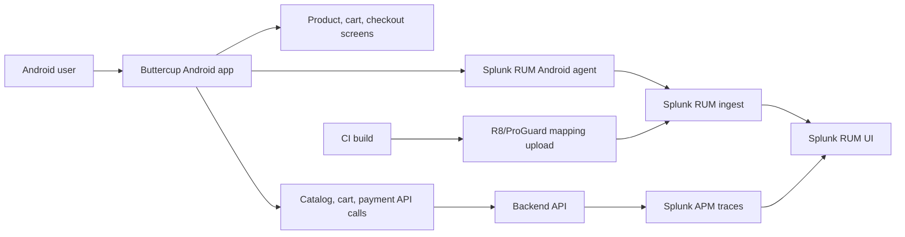

Mobile users experience reliability through the device in their hand: app startup,
screen transitions, crashes, frozen frames, network latency, and backend errors all
blend into one journey. Splunk Real User Monitoring (RUM) for Android captures that
journey from native Android apps and connects it to Splunk Observability Cloud.

In this workshop you will add the Splunk RUM Android agent to a native Android app,
generate mobile telemetry, and verify that the data is usable for troubleshooting.
The workshop is written for Kotlin projects, with Java notes where the configuration
differs.

## The App We Are Monitoring

The workshop examples use a fictional Android shopping app called **Buttercup**. The
app has the same shape as many production mobile apps:

- A user opens the app and lands on a product list.
- The user opens a product detail screen.
- The user adds an item to the cart.
- The user moves through checkout screens for shipping, payment, and confirmation.
- The app calls backend APIs for catalog, cart, shipping, payment, and order creation.
- Some failures are visible crashes, while others are handled errors that leave the
  user blocked or confused.

You do not need this exact app to run the workshop. If you bring your own Android app,
map the Buttercup flow to one important journey in your app, such as login, search,
booking, checkout, claim submission, or account update.

The first module explains this app model in detail before you configure RUM.

## How We Add Instrumentation

Instrumentation is added in layers:

1. **Install the SDK** in Gradle so the Android app can load the Splunk RUM agent.
2. **Initialize the agent** once in `Application.onCreate()` with the realm, RUM token,
   app name, environment, and version.
3. **Enable automatic modules** for lifecycle, rendering, crashes, ANRs, interactions,
   and supported HTTP clients.
4. **Add manual context** where the app knows more than the SDK can infer, such as
   screen names, checkout steps, handled exceptions, and business workflows.
5. **Verify the resulting telemetry** in Splunk RUM and correlate mobile API calls to
   backend traces in Splunk APM.

## What You Will Build

- A native Android app configured with a Splunk RUM access token, realm, app name, app
  version, and deployment environment.
- Automatic capture of application lifecycle, crashes, ANRs, slow or frozen renders,
  user interactions, and supported network requests.
- Manual navigation, custom workflow, and handled-exception events that give business
  context to mobile sessions.
- Optional session replay setup with privacy controls.
- A production-readiness checklist for R8/ProGuard mapping files, token handling,
  sampling, privacy, and troubleshooting.

## Workshop Flow

| Module | Time |
| --- | --- |
| [1. Understand the App and Instrumentation Plan](1-understand-the-app/) | 10 min |
| [2. Prerequisites and Architecture](2-prerequisites-and-architecture/) | 10 min |
| [3. Create the RUM Token](3-create-rum-token/) | 10 min |
| [4. Add the Android Agent](4-add-android-agent/) | 15 min |
| [5. Initialize and Configure RUM](5-initialize-and-configure-rum/) | 20 min |
| [6. Capture Mobile Journeys](6-capture-mobile-journeys/) | 15 min |
| [7. Add Session Replay](7-add-session-replay/) | 10 min |
| [8. Prepare Production Builds](8-prepare-production-builds/) | 10 min |
| [9. Verify and Troubleshoot](9-verify-and-troubleshoot/) | 10 min |
| [10. Wrap Up](10-wrap-up/) | 5 min |

## Reference Architecture

## Version Note

The examples use the Splunk RUM Android 2.x API. At the time this workshop was
written, the public `signalfx/splunk-otel-android` repository listed `2.3.1` as the
latest release. For a live class, confirm the current supported version in the
official documentation or repository before publishing the lab image.

## References

- [Install the Splunk RUM Android agent](https://help.splunk.com/en/splunk-observability-cloud/manage-data/instrument-front-end-applications/instrument-mobile-and-web-applications-for-splunk-real-user-monitoring-rum/instrument-android-applications-for-splunk-rum/splunk-rum-android-agent-version-2.0.0-and-above/install-the-splunk-rum-android-agent)
- [Configure the Splunk RUM Android agent](https://help.splunk.com/en/splunk-observability-cloud/manage-data/instrument-front-end-applications/instrument-mobile-and-web-applications-for-splunk-real-user-monitoring-rum/instrument-android-applications-for-splunk-rum/splunk-rum-android-agent-version-2.0.0-and-above/configure-the-splunk-rum-android-agent)
- [Manually instrument Android applications](https://help.splunk.com/en/splunk-observability-cloud/manage-data/instrument-front-end-applications/instrument-mobile-and-web-applications-for-splunk-real-user-monitoring-rum/instrument-android-applications-for-splunk-rum/splunk-rum-android-agent-version-2.0.0-and-above/manually-instrument-android-applications)
- [Record Android sessions](https://help.splunk.com/en/splunk-observability-cloud/digital-experience-monitoring/real-user-monitoring/replay-user-sessions/record-android-sessions)
- [Add a mapping file](https://help.splunk.com/en/splunk-observability-cloud/manage-data/instrument-front-end-applications/instrument-mobile-and-web-applications-for-splunk-real-user-monitoring-rum/instrument-android-applications-for-splunk-rum/splunk-rum-android-agent-version-2.0.0-and-above/add-a-mapping-file)
- [Troubleshoot Android instrumentation](https://help.splunk.com/en/splunk-observability-cloud/manage-data/instrument-front-end-applications/instrument-mobile-and-web-applications-for-splunk-real-user-monitoring-rum/instrument-android-applications-for-splunk-rum/splunk-rum-android-agent-version-2.0.0-and-above/troubleshoot-android-instrumentation)
- [Splunk OpenTelemetry Instrumentation for Android](https://github.com/signalfx/splunk-otel-android)
